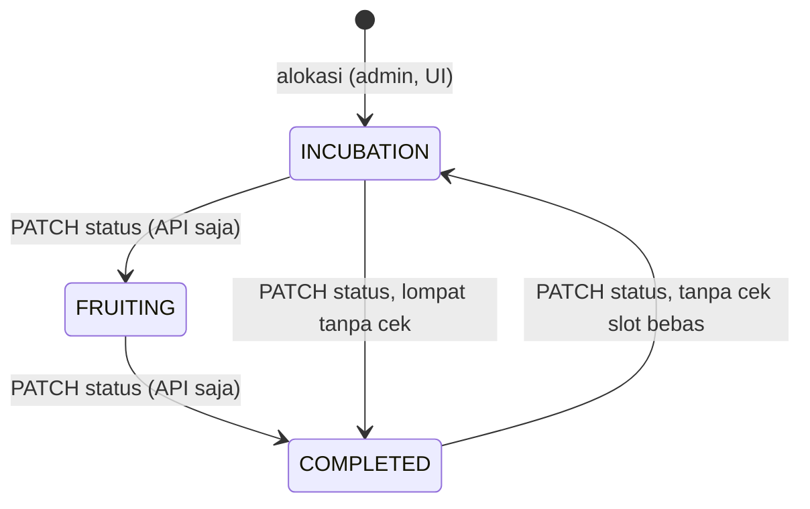
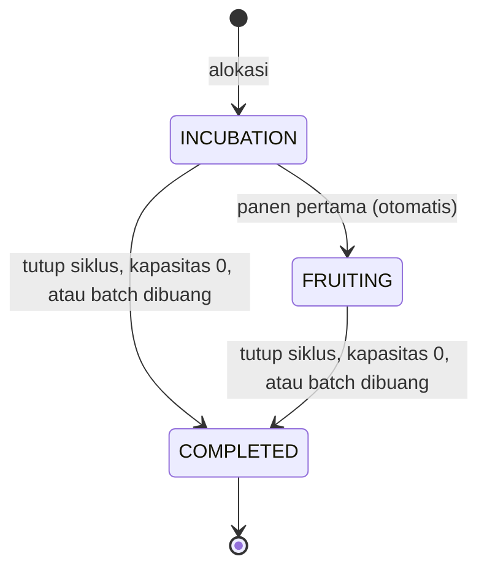

# Analisis Logika Alur Baglog & Modul Rak (WMS) — Smart Shroom SCM

- **Basis:** `github.com/Kaz0342/TA`, branch `develop`, commit `8187915` (2026-09-27)
- **Disusun:** 1 Oktober 2026
- **Cakupan:** seluruh siklus hidup baglog: datang → didaftarkan → diberi nomor → ditempatkan di rak → masalah dicatat → panen dicatat → baglog tidak produktif lagi → slot dibebaskan, ditambah semua yang bergantung padanya (KPI dashboard, badge, heatmap, HPP, penjualan).
- **Terpisah dari:** `RENCANA_PERBAIKAN_LOGIKA.md` (kontrol IoT, kanal command, keamanan). Dokumen ini hanya modul WMS dan alur baglog.

---

## 0. Cara baca, dan batas analisis

| Tanda | Arti |
|---|---|
| **[CODE]** | Dibaca dari backend (Laravel). Belum dieksekusi. |
| **[UI]** | Dibaca dari source frontend (React/TSX). Aplikasi belum dijalankan di browser. |
| **[DOC]** | Dari dokumen proyek (PRD, ERD, dashboard-documentation, README). Dipakai sebagai **spesifikasi** pembanding. |

**Batas yang harus kamu tahu:**
- Berbeda dengan analisis kontrol IoT (yang dijalankan di simulator), analisis ini **murni pembacaan kode**. PHP/Laravel dan browser tidak tersedia di lingkungan analisis, jadi tidak ada tes yang dijalankan. Semua snippet di §7 **belum dijalankan**; uji di lokal.
- Temuan bertanda **[UI]** (mis. warna badge tidak muncul) sebaiknya kamu konfirmasi dengan screenshot sebelum dijadikan klaim di skripsi.
- Angka ambang (7 flush, 110/120 hari) berasal dari kode dan dokumen kamu, **belum divalidasi** ke praktik budidaya jamur kuping.

---

## 1. Jawaban singkat

**Alur sampai "baglog sudah tidak bisa berproduksi" belum tertutup.** Tahap awal (daftar batch, tempatkan di slot, catat afkir) berjalan dengan pengaman dasar yang benar. Tapi tiga hal membuat siklus hidup tidak pernah selesai di sistem nyata:

1. **Form panen di UI tidak mengirim `slot_code`, `flush_number`, dan `quality_grade`** (padahal PRD FR-3.1 menyebutnya dan dokumentasi menandainya "✅ Selesai"). Akibatnya semua analitik per-slot (badge flush, heatmap, total panen slot, deteksi baglog tua berdasarkan flush) tidak punya data dari jalur UI.
2. **Tidak ada mekanisme akhir hidup.** Tidak ada transisi otomatis, tidak ada tombol di UI untuk menutup siklus slot, status batch `completed` tidak ada di enum, dan tidak ada `completed_at`. Slot yang sudah tua/kosong tetap "terisi" selamanya.
3. **KPI dihitung dari angka yang tidak mengikuti siklus hidup**: "Baglog Aktif" = jumlah batch (bukan baglog hidup), "afkir" punya dua definisi yang tidak direkonsiliasi, dan penempatan slot tidak dicocokkan dengan jumlah batch.

### Peta alur: spesifikasi vs backend vs UI

| # | Tahap | Spesifikasi | Backend | UI | Verdikt |
|---|---|---|---|---|---|
| 1 | Baglog datang, didaftarkan | FR-2.4 | Jalan; `entry_date` tanpa batas; harga default `0` | Harga kosong diam-diam jadi `3000` | ⚠ Jalan, data mudah kotor |
| 2 | Penomoran batch | `BL-YYYYMMDD-XXX` | Jalan; race → error 500; tanggal kode = hari pendaftaran | – | ⚠ |
| 3 | Penempatan ke slot | FR-2.2 | Larangan slot ganda ada; **tidak** cocokkan Σ dengan jumlah batch; `max_capacity` tidak dipakai | Selalu 10/slot (hard-coded) | ⚠ Tidak bisa direkonsiliasi |
| 4 | Catat masalah (afkir) | FR-2.5 | Guard kapasitas ada; tanpa lock; tanpa cek tanggal; tidak ada alasan "habis produksi" | Kode slot diketik manual | ⚠ |
| 5 | Catat panen | FR-3.1 (batch, **slot**, berat, **flush 1–7**) | Insert polos tanpa validasi | **Tanpa slot, flush, grade** | ❌ Spek tidak terpenuhi |
| 6 | Transisi fase (INCUBATION→FRUITING→COMPLETED) | ERD | Hanya manual, bebas ke status apa pun, admin-only | **Tidak ada tombol** | ❌ |
| 7 | Baglog habis → slot bebas | Implisit | Tidak ada | Tidak ada | ❌ |
| 8 | KPI / badge / heatmap | FR-1.1, 2.3, 3.2 | Dihitung dari data yang tidak lengkap | Kontrak badge tidak cocok | ❌ |

---

## 2. Yang sudah benar (supaya seimbang)

- **Larangan slot ganda** pada alokasi (`BatchSlotAssignmentController.php:53–64`) dan duplikat dalam satu request (L47–50), dengan transaksi saat insert (L68). Ada tes (`Phase3ApiTest::test_batch_slot_assignment_flow`).
- **Guard kapasitas afkir**: tidak boleh membuang lebih dari sisa baglog di slot (`BaglogCullController.php:94–101`), ada tes.
- **Prinsip ledger**: populasi berkurang hanya lewat jurnal afkir, bukan edit angka (ERD §1) — rumus `kapasitasAktif()` konsisten dengan prinsip itu.
- **Integritas referensial**: FK ke `slots` dan `baglog_batches`, `batch_code` unik, hapus alokasi diblokir jika sudah punya riwayat (`destroy` L126).
- **Uang** dihitung dengan `bcmath` (`BaglogBatch.php:241`, `SaleService.php:27`).
- **Peran**: worker boleh mencatat panen dan afkir, hanya admin yang mengalokasikan (`routes/api.php:64,81,104–106`).

---

## 3. Penomoran

### 3.1 Kode batch `BL-YYYYMMDD-XXX`

Sumber: `BaglogBatch::generateBatchCode()` (`BaglogBatch.php:218–235`). Zona waktu `Asia/Jakarta` di-hardcode di `config/app.php:68`, jadi tanggal kode memakai WIB (tidak ada masalah UTC).

| Aspek | Perilaku | Penilaian |
|---|---|---|
| Urutan | cari kode terakhir hari itu, ambil 3 digit, +1 | Benar untuk satu pengguna |
| Sumber tanggal | `now()` (hari **pendaftaran**), bukan `entry_date` | ⚠ Seeder memakai tanggal masuk (`BL-20260710-001` ↔ `entry_date 2026-07-10`), generator memakai hari pendaftaran. Batch yang didaftarkan terlambat punya kode yang tidak cocok dengan tanggal masuknya |
| Konkurensi | baca-lalu-tulis, tanpa retry. Dua pendaftaran bersamaan → unique violation → 500 | ⚠ Risiko rendah (admin hanya 1), tapi ada |
| >999 per hari | suffix jadi 4 digit; urutan string membuat `…-999` terus terbaca terakhir → kode duplikat | Tidak realistis, abaikan |
| Tes | 3 tes unit (urutan, kode pertama, reset harian) | Cukup untuk jalur normal |

### 3.2 Kode slot `Row-Bay-Tier`

`sprintf('%s-%02d-%02d')` di `SlotSeeder` → `A-01-01` … `C-10-10` = **300 slot × 10 baglog = 3.000 baglog**. Sehat: PK string, FK dari assignment/cull/harvest.

- `exists:slots,slot_code` dievaluasi pada input **mentah**, sedangkan `strtoupper` baru dipanggil setelah validasi (`BatchSlotAssignmentController.php:32,72`; `BaglogCullController.php:69,81`). Di PostgreSQL (sensitif huruf besar-kecil) kode huruf kecil ditolak walau maksudnya dinormalisasi. UI selalu mengirim huruf besar, jadi dampak praktis kecil.
- Baris `A/B/C` di-hardcode di UI (`KumbungGrid.tsx:17,234`).
- **Tidak ada pemetaan tier → tinggi sensor.** Zona A/B/C di firmware (atas/tengah/bawah) tidak terhubung ke `tier`, sehingga hasil panen per slot tidak bisa dikaitkan ke iklim zonanya. Bukan bug; keterbatasan analitik.

### 3.3 Nomor flush (siklus panen)

- Spesifikasi: **1–7** (PRD FR-3.1, README L66, dashboard-doc §8).
- Skema: `tinyint NOT NULL DEFAULT 1` (`..._000004_add_slot_and_flush_to_harvests_table.php`). ERD menyebut "nullable" (tidak cocok).
- Validator: `nullable|integer|min:1|max:10` (`StoreHarvestRequest.php:24`) — batas 10, bukan 7.
- Badge: peringatan di flush 5, "Tua" di ≥6 (`BatchSlotAssignment.php:171–186`).
- **Dibuat manual oleh pencatat, tidak pernah dihitung otomatis.** Tidak ada pengecekan "flush ke-N harus setelah ke-(N−1)" atau duplikat. Dan form UI tidak mengirimnya sama sekali (W-01), sehingga selalu `1`.

### 3.4 Identitas per baglog

**Tidak ada.** Sistem melacak *kohort*: jumlah baglog per (batch, slot), bukan baglog individual. Konsekuensi: tidak bisa menjawab "baglog nomor berapa yang flush-nya paling banyak". Untuk skala TA ini wajar, tetapi sebutkan sebagai batasan desain di Bab 3/5 (label QR per baglog = biaya dan kerja besar, tidak disarankan).

---

## 4. Jejak satu batch dari datang sampai habis

Skenario: 95 baglog datang 1 Okt 2026, Rp 3.500/baglog, ditempatkan di 10 slot, dan dipakai sampai habis. Ini apa yang **sistem catat** bila semuanya dikerjakan lewat UI.

| Langkah | Aksi lewat UI | Yang tercatat | Masalah |
|---|---|---|---|
| 1 | Daftar batch: tanggal 1 Okt, qty 95, harga 3.500 | `BL-20261001-001`, status `active` | Harga kosong → UI mengirim `3000` tanpa peringatan; API langsung → `0.00` |
| 2 | Alokasi ke 10 slot | 10 assignment × **10** = **100** baglog tercatat | UI hard-code 10/slot; backend tidak menolak 100 > 95 |
| 3 | Hari ke-10: 3 baglog di A-01-01 kena Trichoderma → modal afkir (kode slot **diketik**), alasan TRICHODERMA | cull 3, kapasitas slot 7/10 | Berjalan benar. Tapi tidak bisa dibuka dari slot, harus tahu kodenya |
| 4 | Hari ke-35: panen pertama → form panen: tanggal, batch, berat | harvest dengan **`slot_code = NULL`, `flush_number = 1`, `grade = A`** | Tidak terhubung ke slot manapun |
| 5 | Hari ke-60: panen "flush ke-3" → form yang sama | harvest baru, **tetap flush 1, slot NULL** | Flush tidak pernah naik |
| 6 | Cek badge slot A-01-01 | Tidak ada panen terkait slot → badge memakai **umur kalender** dari `assigned_at` | Badge flush ("Truth-based", Audit #4) tidak pernah aktif dari UI |
| 7 | Hari ke-120: baglog habis. Admin ingin mengosongkan slot | **Tidak ada tombol.** Catat afkir sisa 7 sebagai `LAINNYA` (kapasitas → 0) | Slot **tetap terisi**; alasan `LAINNYA` mencemari angka mortalitas |
| 8 | Batch berikutnya ingin pakai A-01-01 | UI: "Slot ini sudah terisi batch aktif" | **Slot terblokir permanen** |
| 9 | Dashboard "Baglog Aktif" | `SUM(quantity)` batch `active` = **95** | Tidak mengurangi afkir; batch tidak pernah otomatis selesai |
| 10 | Heatmap produktivitas | Kosong (`whereNotNull('slot_code')`) | Fitur FR-3.2 tidak punya data |

---

## 5. Temuan

Prioritas: **P0** = alur putus atau data tak bisa dipercaya · **P1** = logika salah/berisiko · **P2** = kelemahan terukur · **P3** = rapikan. Effort adalah perkiraan kasar.

### P0

#### W-01 — Form panen tidak mengirim slot, flush, grade (spek FR-3.1 tidak terpenuhi) · P0 · 3–4 jam

**Bukti.**
- [UI] `HarvestManagement.tsx:201` tipe payload `{harvest_date, weight_kg, baglog_batch_id?, notes?}`; `:252–257` hanya mengirim itu. Form (`:805–886`) hanya punya Tanggal, Batch, Berat, Catatan.
- [DOC] PRD FR-3.1, README L66, dashboard-documentation §8 L102 ("form input panen mencatat `slot_code` … serta `flush_number` 1–7"), dan tabel FR L176 menandainya ✅ Selesai.
- [CODE] `HarvestService::createHarvest` hanya `store()` (`HarvestService.php:20–25`); `StoreHarvestRequest.php:22–25` semuanya `nullable`; DB default `flush_number=1`, `quality_grade='A'`.

**Dampak.** `slot_code` selalu NULL → `badgeStatus()` (flush asli), `/slots/heatmap`, total panen per slot, dan pengaman hapus-alokasi tidak pernah melihat data panen. Deteksi "baglog tua" via flush mati. Mortalitas dan HPP tingkat batch tetap berfungsi (karena batch terkirim).

**Perbaikan.** Lihat §7.1. Inti: (1) UI: pilih slot (hanya slot yang ditempati batch terpilih dan masih punya baglog hidup), flush **disarankan otomatis** (maks + 1, boleh diubah), grade; (2) backend: bila `slot_code` ada, wajib cocok dengan assignment aktif batch tersebut, tanggal ≥ `assigned_at`, flush tidak duplikat dan ≤ batas konfigurasi, dan pencegah kirim ganda.

**Verifikasi.** Tes API: panen dengan slot yang bukan milik batch → 422; flush otomatis naik 1→2→3; panen pada slot kapasitas 0 → 422; badge slot berubah sesuai flush; heatmap terisi.

> **Keputusan dibutuhkan (§8-1):** apakah di lapangan panen ditimbang **per slot**, per bay/baris, atau total per batch? Menimbang per slot untuk 300 slot bisa tidak praktis; jawabannya menentukan apakah slot wajib atau opsional di form.

#### W-02 — Tidak ada akhir siklus: slot tidak pernah bebas, batch tidak pernah selesai · P0 · 4–5 jam

**Bukti.**
- [CODE] Tidak ada observer atau event (`grep` kosong). Status assignment hanya berubah lewat `updateStatus` (`BatchSlotAssignmentController.php:91–112`), admin-only (`routes/api.php:105`).
- [UI] `slotService.ts` hanya punya `assignBatch`; **tidak ada** panggilan `PATCH /batch-slot-assignments/{id}/status` maupun `DELETE` di seluruh frontend. `SlotDetailModal.tsx` tidak punya tombol aksi apa pun.
- [CODE] Enum status batch: `active|contaminated|disposed` (migrasi `..._000003:59`, validator `BaglogBatchController.php:43`, `StoreBaglogRequest.php:24`). `'completed'` **hanya** dirujuk di `BaglogBatch.php:295` dan ERD L83/L240, tetapi tidak bisa pernah tersimpan.
- [CODE] Tidak ada kolom `completed_at`; "kapan baglog berhenti produksi" tidak bisa dihitung.

**Dampak.** Siklus hidup tidak punya akhir. Slot terblokir (lihat §4 langkah 7–8), dropdown "Batch Aktif" di grid, form panen, dan modal afkir terus bertambah, `Baglog Aktif` menggelembung. Data lifetime (durasi produksi, jumlah flush akhir) tidak pernah terekam.

**Perbaikan.** Lihat §7.2: (a) migrasi: status batch `completed`, kolom `completed_at` dan `completed_reason` pada assignment; (b) **aksi "Tutup siklus"** (endpoint + tombol admin di modal slot) yang mencatat sisa baglog sebagai afkir `HABIS_PRODUKSI`, set `COMPLETED`, isi `completed_at`; (c) aturan otomatis yang aman: panen pertama → `FRUITING`; kapasitas hidup = 0 → `COMPLETED`; flush ≥ batas atau umur > ambang → **tampilkan prompt** "Tutup siklus?" (jangan tutup otomatis, karena salah input berat/flush akan menutup slot prematur); (d) batch otomatis `completed` ketika semua assignment selesai dan tidak ada sisa belum ditempatkan.

**Verifikasi.** Tes: afkir sisa terakhir → assignment otomatis `COMPLETED`; tutup siklus → slot muncul di `status=empty` dan bisa dialokasi ulang; semua assignment batch selesai → batch `completed` dan hilang dari dropdown aktif.

#### W-03 — KPI "Baglog Aktif" dan "afkir" tidak mengikuti siklus hidup · P0 · 1,5–2 jam

**Bukti.**
- [CODE] `DashboardService.php:31`: `BaglogBatch::active()->sum('quantity')` — jumlah **seluruh baglog di batch berstatus active**. Tidak mengurangi afkir, siklus selesai, atau baglog yang belum ditempatkan.
- [UI] `BaglogManagement.tsx:105–133` melakukan hal serupa dan menghitung "Total Afkir" = `quantity` batch `contaminated + disposed` (status **seluruh batch**), sedangkan `CullHistoryTable` dan `mortality_rate` memakai jurnal afkir (**per baglog**). Dua definisi "afkir" yang tidak pernah direkonsiliasi: menandai batch `disposed` tidak membuat catatan afkir, dan mencatat afkir tidak mengubah status batch.
- [UI] `capacityPercentage` memakai konstanta `maxCapacity = 3000` (L113).

**Dampak.** Angka di kartu dashboard tidak sama dengan jumlah baglog hidup di rak; mortalitas di HPP (`BaglogBatch.php:277`) memakai pembilang yang berbeda dari KPI halaman Baglog.

**Perbaikan.** Definisikan satu set angka dan pakai di mana-mana:
- `hidup` = Σ assignment aktif (`initial_quantity` − afkir slot itu)
- `belum_ditempatkan` = `quantity` batch − Σ `initial_quantity` assignment (− reject saat datang, bila W-07a diambil)
- `mortalitas_gagal` = afkir selain `HABIS_PRODUKSI` ÷ Σ ditempatkan; `habis_produksi` dilaporkan terpisah

#### W-04 — Penempatan slot tidak direkonsiliasi dengan jumlah batch · P0 · 2–3 jam

**Bukti.**
- [CODE] `BatchSlotAssignmentController.php:28–35`: `initial_quantity` `min:1|max:20`; tidak ada pengecekan Σ ≤ `baglog_batches.quantity`; batch bisa dialokasikan berkali-kali. `slots.max_capacity` (default 10) **tidak pernah dipakai** dalam logika (hanya ditampilkan; grep `max_capacity` di `app/`). Validator mengizinkan 20 padahal kapasitas slot 10. Status batch tidak dicek (batch `disposed` pun bisa dialokasikan).
- [UI] `KumbungGrid.tsx:65`: `initial_quantity: 10` hard-coded untuk setiap slot. Dropdown batch hanya menampilkan total (`:427`), bukan sisa belum ditempatkan.
- [CODE] Cek keterisian (L53–64) dilakukan **di luar** transaksi (L68) dan tanpa lock; tidak ada unique index parsial di DB (hanya pengaman level aplikasi).

**Dampak.** Batch 95 baglog bisa tercatat 100 di rak (§4). Jumlah baglog "di rak" tidak bisa dicocokkan dengan jumlah yang dibeli. Audit #6 (kuantitas fleksibel) hanya terpenuhi di backend; UI tidak memberi cara memasukkan jumlah selain 10.

**Perbaikan.** §7.3: di dalam satu transaksi dengan lock pada batch: batch harus `active`; Σ(sudah ditempatkan + baru) ≤ `quantity`; tiap `initial_quantity` ≤ `slots.max_capacity`; cek keterisian diulang di dalam transaksi; tambahkan **unique index parsial** (satu assignment aktif per slot). UI: input jumlah per slot dengan penghitung "sisa belum ditempatkan".

### P1

#### W-05 — Model umur dan "baglog tua" tidak konsisten, mengabaikan tahap miselium · P1 · 2 jam

**Bukti.** Tiga model umur untuk satu konsep:

| Tempat | Titik awal | Ambang | Sumber |
|---|---|---|---|
| Badge batch di UI | `entry_date` | <30 Tumbuh, ≤90 Produktif, >90 "Tua (Dibuang)" | `BaglogManagement.tsx:246–268` |
| Badge slot | `assigned_at` | ≤14 / ≤90 / ≤110 / >110 | `BatchSlotAssignment.php:207–240` |
| HPP "siklus" | `entry_date` | 120 hari | `BaglogBatch.php:272` |

- [CODE] `badgeStatus()` memakai **flush saja** jika ada panen (L169–204) dan **umur saja** jika belum ada panen (L207). Slot dengan flush 2 yang sudah berumur 200 hari tetap hijau "Aktif".
- [CODE] Slot kosong kapasitas (`kapasitasAktif()==0`) tetap mendapat badge seperti biasa.
- `initial_mycelium_stage` (LEVEL_1–3) hanya disimpan; tidak dipakai di perhitungan mana pun. Baglog LEVEL_3 (>80% miselium) di hari ke-0 tetap berlabel "Masa Tumbuh".
- `entry_date` ambigu: UI menulis "Tanggal tanam" (`BaglogManagement.tsx:224`), ERD menulis "Tanggal baglog masuk kumbung". Umur baglog sejak inokulasi di supplier tidak sama dengan umur sejak datang.

**Perbaikan.** §7.4: satu `config/baglog.php` (max flush, hari siklus, ambang umur); status tampilan = yang **lebih lanjut** antara tahap menurut flush dan tahap menurut umur; kapasitas 0 → status `KOSONG`; offset awal dari `initial_mycelium_stage` atau kolom tanggal inokulasi (keputusan §8-4).

#### W-06 — Kontrak badge UI↔backend tidak cocok; "Hasil Panen" slot selalu 0 · P1 · 2 jam

**Bukti.**
- [CODE] `SlotController.php:66` mengirim badge `{color, label, description, flush, age_days, needs_po_alert}`.
- [UI] `slotService.ts:25–31` mengharapkan `{label, class, dot, ...}`. `KumbungGrid.tsx:125–126` memakai `badge.dot`; `SlotDetailModal.tsx:54` memakai `badge.dot || 'bg-emerald-500'`. Backend tidak pernah mengirim `dot`/`class` → **pewarnaan siklus (abu/biru/hijau/kuning/merah) tidak muncul**; grid memakai warna default, modal selalu hijau. `needs_po_alert` tidak dipakai di mana pun di frontend.
- [UI] `SlotDetailModal.tsx:99` menampilkan `slot.assignment.total_harvest_kg || 0`, tetapi `/slots` tidak mengirim field itu (`SlotController.php:59–67`) → selalu **"0 Kg"**. (Dan, per W-01, panen UI tidak punya `slot_code`.)

**Perbaikan.** Pilih satu: backend mengirim `dot`/`class` (Tailwind) berdasarkan `color`, atau UI memetakan `color`→kelas. Tambahkan `total_harvest_kg` (dan `last_flush`) pada payload `/slots` lewat agregat (lihat W-15). Tampilkan `needs_po_alert` sebagai penanda.

#### W-07 — Pencatatan masalah (afkir): lima celah · P1 · 2–3 jam

| Celah | Bukti | Perbaikan |
|---|---|---|
| **(a) Tidak bisa mencatat reject saat datang** (sebelum ditempatkan) | `slot_code` NOT NULL (migrasi `..._000003`) dan cull wajib punya assignment aktif (`BaglogCullController.php:85–92`) | Tambah `rejected_on_arrival` pada batch, atau izinkan cull `slot_code` NULL dengan `stage='ARRIVAL'` (keputusan §8-3). Penting untuk klaim garansi supplier |
| **(b) Tidak ada alasan "habis produksi"** | enum alasan: TRICHODERMA, BUSUK_BASAH, HAMA, KERING, LAINNYA | Tambah `HABIS_PRODUKSI` (ubah enum→string seperti pola migrasi `operational_expenses`); pisahkan dari mortalitas gagal |
| **(c) Tanggal tanpa batas** | `cull_date` hanya `required|date` (L70) | `before_or_equal:today` dan ≥ `assigned_at` |
| **(d) Cek-lalu-tulis tanpa lock** | cek kapasitas L94 → insert L103 tanpa transaksi. Dua pekerja bersamaan masing-masing membuang 6 dari sisa 10 → total 12 (`max(0,…)` menutupinya) | transaksi + `lockForUpdate()` pada assignment |
| **(e) Alur UI** | kode slot diketik bebas, modal tidak dibuka dari slot; kuantitas `max=1000` padahal ≤20 (`RecordCullModal.tsx:191–192`) | tombol "Catat afkir" di modal slot dengan batch+slot terisi otomatis; `max` = kapasitas hidup slot |

#### W-08 — Backend panen: validasi minimal · P1 · 2 jam (digabung W-01)

[CODE] `HarvestService`/`HarvestRepository::store` insert polos. Tidak ada: kecocokan slot–batch–assignment aktif; pengecekan slot kosong/selesai; auto-flush atau duplikat/urutan flush; batas tanggal (sebelum `assigned_at`, di masa depan, mundur dari flush sebelumnya); idempotensi (klik ganda di ponsel = dua rekaman = berat terhitung dua kali); batas kewajaran berat (ketik `250` untuk `2.5` lolos, kolom muat hingga 999.999,99); panen `REJECT` ikut dihitung ke hasil di HPP dan BEP (`BaglogBatch::totalHarvestKg()` menjumlah semua grade).

#### W-09 — Tidak ada koreksi: salah input permanen · P1 · 3 jam

[CODE] Rute `harvests`, `baglog-culls`, `sales` hanya GET/POST (`routes/api.php:63–66,69–72,80–81,113`); tidak ada update/hapus/void. Hapus alokasi diblokir begitu ada satu panen/afkir (`destroy` L126). Salah ketik kuantitas, slot, atau flush **tidak bisa diperbaiki** dan permanen mempengaruhi statistik serta memblokir pembatalan alokasi. (Hanya `operational-expenses` yang bisa dihapus.)

**Perbaikan.** Void dengan jejak audit (`voided_at`, `voided_by`, `void_reason`) + global scope yang mengecualikan rekaman void dari semua agregat. Jangan hard-delete (sesuai prinsip ledger ERD).

#### W-10 — Transisi status bebas, bisa membuka kembali, batch dan slot tidak sinkron · P1 · 2 jam

**Bukti.**
- [CODE] `updateStatus` (L91–112) menerima status apa pun ke status apa pun: `INCUBATION→COMPLETED` (lewat FRUITING), dan **`COMPLETED→INCUBATION`** tanpa memeriksa apakah slot sudah diisi batch lain → dua assignment aktif pada satu slot. `Slot::activeAssignment()` (`latestOfMany`) hanya menampilkan satu; rekaman satunya tersembunyi tetapi panen/afkirnya tercampur pada `slot_code` yang sama.
- [CODE] Mengubah status **batch** menjadi `contaminated`/`disposed` (`BaglogService::changeStatus`) tidak menyentuh assignment-nya: slot tetap `is_occupied`, sisa baglog tidak masuk jurnal afkir (§4 / W-03).

**Perbaikan.** Matriks transisi (§7.2), cek slot bebas saat membuka kembali, dan kaskade: batch `contaminated/disposed` → tutup semua assignment aktifnya (catat sisa sebagai afkir, alasan sesuai) dalam satu transaksi.

### P2

| ID | Temuan | Bukti | Perbaikan | Effort |
|---|---|---|---|---|
| **W-11** | **Validasi tanggal tidak ada** di seluruh alur: `entry_date`, `assigned_at`, `cull_date`, `harvest_date` bebas (masa depan atau urutan terbalik). Carbon 3.13 mengembalikan selisih hari **bertanda dan pecahan** (dugaan, cek dengan 1 tes), sehingga tanggal masa depan menghasilkan umur negatif | `StoreBaglogRequest.php:20`; `BatchSlotAssignmentController.php:30`; `BaglogCullController.php:70`; `StoreHarvestRequest.php:20` | Terapkan invarian: `entry_date ≤ assigned_at ≤ harvest/cull ≤ completed_at ≤ hari ini` | 1 jam |
| **W-12** | **Kode batch**: tanggal = hari pendaftaran (bukan `entry_date`); race → 500 | §3.1 | Pakai `entry_date` untuk prefiks (cocok dengan seeder dan ERD); bungkus dalam transaksi + retry `UniqueConstraintViolationException` (§7.5) | 45 mnt |
| **W-13** | **Harga modal bisa diam-diam salah**: UI `parseFloat(...) \|\| 3000` (`BaglogManagement.tsx:234`); API default `0.00`. HPP memakai nilai itu tanpa tanda | `BaglogManagement.tsx:234`; migrasi `..._000005` | Hapus fallback 3000; kirim `null` bila kosong; HPP mengembalikan `price_missing: true` dan UI menampilkan "HPP belum lengkap" | 30 mnt |
| **W-14** | **Overhead dibagi rata ke seluruh batch** (`COUNT(*)` all-time), angka batch lama berubah tiap ada batch baru | `BaglogBatch.php:259–261` | Bagi per periode/proporsi baglog aktif, atau tulis "dibagi rata" sebagai batasan | 1,5 jam |
| **W-15** | **N+1 pada `/slots`**: per slot terisi memanggil `kapasitasAktif()` dan `badgeStatus()` (2+ query). Penuh = ±600 query per muat grid di Vercel→Supabase | `SlotController.php:62,66` | Hitung agregat afkir dan flush maksimum dalam 2 query `GROUP BY`, kirim ke model sebagai parameter opsional (§7.6) | 1,5 jam |
| **W-16** | **Heatmap** = kg mentah per slot (seluruh waktu, semua batch, termasuk `REJECT`), tidak dinormalisasi per baglog atau umur → slot yang lebih lama/lebih penuh tampak "lebih produktif" | `SlotController.php:139–156` | Tampilkan kg per baglog awal untuk siklus berjalan; kecualikan `REJECT`; filter per siklus | 1 jam |
| **W-17** | **Penjualan tanpa validasi stok**; `unsold_kg` mingguan salah lintas minggu (stok bergulir) dan menghitung panen `REJECT` | `SaleService.php:22–30,60`; `StoreSaleRequest.php` | Hitung stok kumulatif (panen layak jual − penjualan) dan tolak/ingatkan penjualan melebihi stok | 1,5 jam |

### P3 (rapikan)

- **Dashboard** menampilkan `age_days` mentah dari `Carbon::diffInDays` (`DashboardService.php:55`; `Dashboard.tsx:1342,1422`) tanpa pembulatan (Carbon 3 → pecahan). Model `BaglogBatch::getAgeDaysAttribute` sudah `(int)`. Selain itu `Dashboard.tsx:1342` menampilkan `|| 4` Hari saat tidak ada batch (angka dummy).
- **`BatchSlotAssignment::culls()` dan `harvests()`** memakai `$this->baglog_batch_id` di dalam definisi relasi (L90–92, L101–103). Aman untuk lazy-load, tetapi hasil **salah bila di-eager-load** (`with('culls')`). Latent; ganti dengan query eksplisit bila nanti diperlukan.
- `SlotController::show` memuat relasi `assignments.baglogBatch` tetapi tidak menampilkannya; total panen/afkir di sana adalah **seumur hidup slot** (semua batch), sedangkan `active_assignment` adalah siklus berjalan — beri label agar tidak menyesatkan.
- Panen/afkir/penjualan berstatus ledger tapi `OperationalExpense` boleh hard-delete (`OperationalExpenseController::destroy`) — inkonsisten dengan prinsip audit.

---

## 6. State machine

**Sekarang** (tanpa pemicu otomatis, tanpa UI untuk transisi):



**Usulan:**



Aturan: `COMPLETED` final (koreksi lewat void, bukan membuka kembali). Menutup siklus mencatat sisa baglog sebagai afkir `HABIS_PRODUKSI` (atau alasan batch), mengisi `completed_at`, dan memicu pengecekan penyelesaian batch.

**Invarian tanggal:** `entry_date ≤ assigned_at ≤ tanggal panen/afkir ≤ completed_at ≤ hari ini`.

**Invarian jumlah:** `Σ initial_quantity (batch) ≤ quantity batch`; `initial_quantity ≤ slots.max_capacity`; `afkir slot ≤ initial_quantity`; satu assignment aktif per slot.

---

## 7. Perbaikan konkret (semua **belum dijalankan**)

### 7.1 W-01/W-08 — Panen terhubung ke slot, flush otomatis

Backend (`app/Services/HarvestService.php`):

```php
use App\Models\BatchSlotAssignment;
use Illuminate\Support\Facades\DB;
use Illuminate\Validation\ValidationException;

public function createHarvest(array $data, int $userId): Harvest
{
    $data['user_id'] = $userId;

    return DB::transaction(function () use ($data) {
        if (! empty($data['slot_code'])) {
            $slot = strtoupper($data['slot_code']);
            $a = BatchSlotAssignment::where('baglog_batch_id', $data['baglog_batch_id'] ?? 0)
                ->where('slot_code', $slot)->active()->lockForUpdate()->first();

            if (! $a) {
                throw ValidationException::withMessages(['slot_code' => "Batch ini tidak sedang menempati slot {$slot}."]);
            }
            if ($a->kapasitasAktif() === 0) {
                throw ValidationException::withMessages(['slot_code' => 'Slot tidak punya baglog hidup.']);
            }
            if ($data['harvest_date'] < $a->assigned_at->toDateString()) {
                throw ValidationException::withMessages(['harvest_date' => 'Tanggal panen sebelum tanggal masuk rak.']);
            }

            $last = Harvest::where('baglog_batch_id', $a->baglog_batch_id)->where('slot_code', $slot)->max('flush_number') ?? 0;
            $data['flush_number'] = $data['flush_number'] ?? ($last + 1);
            if ($data['flush_number'] > config('baglog.max_flush', 7)) {
                throw ValidationException::withMessages(['flush_number' => 'Melebihi batas flush; tutup siklus slot ini.']);
            }
            if ($a->current_status === BatchSlotAssignment::STATUS_INCUBATION) {
                $a->update(['current_status' => BatchSlotAssignment::STATUS_FRUITING]);   // transisi otomatis yang aman
            }
        }

        return $this->repository->store($data);
    });
}
```

`StoreHarvestRequest::rules()`: `harvest_date` → `required|date|before_or_equal:today`; `weight_kg` → tambah `max:` batas kewajaran (mis. 3× jumlah baglog hidup × hasil wajar per baglog, **angka dari data panen nyata**); `flush_number` → `max:7` (ambil dari config). Pencegah kirim ganda: tolak bila ada panen dengan batch, slot, tanggal, dan berat sama dalam 2 menit terakhir (HTTP 409).

UI (`HarvestManagement.tsx`): tambahkan state `slotCode`, `flushNumber`, `grade`. Opsi slot = slot terisi oleh batch terpilih dengan kapasitas hidup > 0, dari `slotService.getSlots({status:'occupied'})`:

```tsx
const slotOptions = (slots ?? []).filter(s =>
  s.assignment && s.active_batch?.id === Number(selectedBatchId) && s.assignment.active_capacity > 0);
// payload
createMutation.mutate({
  harvest_date: harvestDate, weight_kg: numWeight, baglog_batch_id: Number(selectedBatchId),
  slot_code: slotCode || undefined,
  flush_number: flushNumber ? Number(flushNumber) : undefined,   // kosong = otomatis
  quality_grade: grade, notes: notes.trim() || undefined,
});
```

### 7.2 W-02/W-10 — Mesin siklus hidup

Migrasi (pola yang sama dengan `update_category_enum_in_operational_expenses`, yaitu enum → string):

```php
Schema::table('baglog_batches', fn (Blueprint $t) => $t->string('status', 20)->default('active')->change());
Schema::table('baglog_culls',   fn (Blueprint $t) => $t->string('reason', 20)->change());   // + 'HABIS_PRODUKSI'
Schema::table('batch_slot_assignments', function (Blueprint $t) {
    $t->date('completed_at')->nullable()->after('assigned_at');
    $t->string('completed_reason', 20)->nullable()->after('completed_at');   // EXHAUSTED|CONTAMINATED|DISPOSED|MANUAL
});
```

Validator batch dan alasan afkir di-update untuk menerima `completed` dan `HABIS_PRODUKSI`. Model `BatchSlotAssignment`:

```php
public const TRANSITIONS = [
    self::STATUS_INCUBATION => [self::STATUS_FRUITING, self::STATUS_COMPLETED],
    self::STATUS_FRUITING   => [self::STATUS_COMPLETED],
    self::STATUS_COMPLETED  => [],
];

public function complete(string $reason, ?string $date = null): void
{
    DB::transaction(function () use ($reason, $date) {
        $date ??= now()->toDateString();
        $sisa = $this->kapasitasAktif();
        if ($sisa > 0) {   // prinsip ledger: populasi turun hanya lewat jurnal afkir
            BaglogCull::create([
                'baglog_batch_id' => $this->baglog_batch_id, 'slot_code' => $this->slot_code,
                'cull_date' => $date, 'quantity' => $sisa,
                'reason' => $reason === 'EXHAUSTED' ? 'HABIS_PRODUKSI' : ($reason === 'CONTAMINATED' ? 'LAINNYA' : 'LAINNYA'),
                'notes' => "Penutupan siklus slot ({$reason})",
            ]);
        }
        $this->update(['current_status' => self::STATUS_COMPLETED, 'completed_at' => $date, 'completed_reason' => $reason]);
        $this->baglogBatch->refreshLifecycle();
    });
}
```

Model `BaglogBatch`:

```php
public function refreshLifecycle(): void
{
    if ($this->status !== self::STATUS_ACTIVE) return;
    $placed = (int) $this->assignments()->sum('initial_quantity');
    $adaAktif = $this->assignments()->active()->exists();
    if ($placed > 0 && ! $adaAktif && $placed >= $this->quantity) {
        $this->update(['status' => 'completed']);
    }
}
```

Endpoint baru (admin): `POST /batch-slot-assignments/{id}/complete` (`reason`, opsional `date`) memanggil `complete()`. `updateStatus` memakai `TRANSITIONS` dan menolak lompatan/pembukaan kembali. `BaglogService::changeStatus`: bila batch menjadi `contaminated`/`disposed`, panggil `complete()` untuk semua assignment aktifnya dalam satu transaksi. Di `BaglogCullController::store`, setelah insert, bila `kapasitasAktif()==0` → `complete('EXHAUSTED')`.

UI: tombol admin **"Tutup siklus / kosongkan slot"** di `SlotDetailModal` (konfirmasi + pilih alasan), dan prompt jika badge menyatakan `needs_po_alert`.

### 7.3 W-04 — Alokasi yang bisa direkonsiliasi

Di dalam `DB::transaction` pada `store()`:

```php
$batch = BaglogBatch::lockForUpdate()->findOrFail($batchId);
if (! $batch->isActive()) {
    throw ValidationException::withMessages(['baglog_batch_id' => 'Batch tidak aktif.']);
}
$sudah  = (int) BatchSlotAssignment::where('baglog_batch_id', $batchId)->sum('initial_quantity');
$baru   = (int) collect($slotEntries)->sum(fn ($e) => (int) ($e['initial_quantity'] ?? 10));
if ($sudah + $baru > $batch->quantity) {
    throw ValidationException::withMessages(['slots' => "Σ penempatan ($sudah + $baru) melebihi jumlah batch ({$batch->quantity})."]);
}
$maxPerSlot = Slot::whereIn('slot_code', $slotCodes)->pluck('max_capacity', 'slot_code');
foreach ($slotEntries as $e) {
    if (($e['initial_quantity'] ?? 10) > ($maxPerSlot[strtoupper($e['slot_code'])] ?? 10)) {
        throw ValidationException::withMessages(['slots' => "Jumlah di {$e['slot_code']} melebihi kapasitas slot."]);
    }
}
// cek keterisian dipindah ke sini (di dalam transaksi), baru insert
```

Unique index parsial (SQLite dan PostgreSQL; **tidak** untuk MySQL):

```php
DB::statement("CREATE UNIQUE INDEX uq_one_active_assignment_per_slot
               ON batch_slot_assignments (slot_code)
               WHERE current_status IN ('INCUBATION','FRUITING')");
```

UI (`KumbungGrid.tsx`): ganti `initial_quantity: 10` dengan input per slot (default = min(10, sisa)), tampilkan "sisa belum ditempatkan: N", dan blokir kirim bila melebihi.

### 7.4 W-05 — Satu sumber ambang

`config/baglog.php`:

```php
return [
    'max_flush'   => 7,
    'cycle_days'  => 120,                                           // dipakai HPP dan badge
    'age'         => ['growing' => 14, 'productive' => 90, 'late' => 110],
    'flush'       => ['declining' => 5, 'old' => 6],
];
```

`badgeStatus()`: hitung `tahapFlush` (bila ada panen) dan `tahapUmur`, ambil yang **lebih lanjut**; bila `kapasitasAktif()==0` → `KOSONG`. Pakai konstanta yang sama di `marginKontribusi()` dan UI (`renderAgeBadge`). Ambang di atas harus divalidasi ke data panen nyata sebelum dikunci.

### 7.5 W-12 — Kode batch aman

```php
public static function createWithCode(array $data): self
{
    for ($i = 0; $i < 5; $i++) {
        try {
            return DB::transaction(fn () => static::create(
                $data + ['batch_code' => static::generateBatchCode($data['entry_date'] ?? null)]
            ));
        } catch (\Illuminate\Database\UniqueConstraintViolationException) {
            usleep(50_000);   // retry dengan nomor berikutnya
        }
    }
    throw new \RuntimeException('Gagal membuat kode batch unik.');
}
// generateBatchCode(?string $date = null): $today = ($date ? Carbon::parse($date) : now())->format('Ymd');
```

### 7.6 W-15 — Hilangkan N+1 pada `/slots`

```php
$culled = BaglogCull::selectRaw('baglog_batch_id, slot_code, SUM(quantity) AS q')
    ->groupBy('baglog_batch_id', 'slot_code')->get()
    ->keyBy(fn ($r) => $r->baglog_batch_id.'|'.$r->slot_code);
$flush = Harvest::selectRaw('baglog_batch_id, slot_code, MAX(flush_number) AS f, SUM(weight_kg) AS kg')
    ->whereNotNull('slot_code')->groupBy('baglog_batch_id', 'slot_code')->get()
    ->keyBy(fn ($r) => $r->baglog_batch_id.'|'.$r->slot_code);
// kapasitasAktif(?int $culled = null) dan badgeStatus(?int $maxFlush = null): pakai parameter bila diberikan,
// query sendiri hanya bila null. Sekaligus kirim total_harvest_kg dan last_flush ke payload /slots.
```

---

## 8. Keputusan yang dibutuhkan darimu

1. **Cara menimbang panen di lapangan:** per slot, per bay/baris, atau total per batch? (menentukan apakah `slot_code` wajib di W-01 dan arti heatmap).
2. **Definisi akhir hidup:** flush maksimum (spek bilang 1–7), umur, atau penurunan hasil? Siapa yang boleh menutup siklus: admin saja atau worker juga?
3. **Baglog rusak saat datang:** dicatat sebagai afkir (butuh `rejected_on_arrival`/cull pra-penempatan) atau dikeluarkan dari batch sejak awal?
4. **`entry_date`** = tanggal datang ke kumbung, atau tanggal inokulasi/produksi di supplier? (menentukan umur baglog sebenarnya dan offset dari tahap miselium).
5. **Identitas per baglog**: tetap kohort per slot (disarankan), atau perlu pelacakan individual?

---

## 9. Urutan pengerjaan

Prinsipnya: **tangkap data lengkap dulu → mesin siklus hidup → angka turunan → koreksi dan rapikan.** KPI dan badge tidak ada gunanya diperbaiki sebelum data yang masuk benar.

| Fase | Isi | Alasan urutan | Effort |
|---|---|---|---|
| **A. Data masuk benar** | W-01+W-08 (form panen + validasi), W-04 (alokasi), W-11 (tanggal), W-07 b–d (alasan, tanggal, lock) | Tanpa slot/flush/kuantitas yang benar, semua turunan salah | 1–1,5 hari |
| **B. Mesin siklus hidup** | migrasi enum/kolom, W-10 (matriks transisi + kaskade), W-02 (tutup siklus + otomatis + UI) | Butuh data fase A; membebaskan slot | 1 hari |
| **C. Angka turunan** | W-05 (config + badge), W-03 (KPI), W-06 (kontrak badge + total panen), W-15 (N+1), W-16, W-17 | Bergantung pada status dan data yang sudah benar | 1 hari |
| **D. Koreksi dan rapikan** | W-09 (void), W-12, W-13, W-14, P3 | Aman ditunda; W-09 sebaiknya sebelum pengujian dengan pengguna nyata | 0,5–1 hari |

**Total kasar:** 3,5–4,5 hari kerja. Satu F-xx/W-xx = satu commit.

**Tes yang perlu ditambah** (saat ini tidak ada): alokasi melebihi jumlah batch; kuantitas > `max_capacity`; panen pada slot milik batch lain/slot kosong; flush otomatis dan duplikat; afkir terakhir menutup siklus; slot bebas bisa dialokasi ulang; batch menjadi `completed`; kaskade batch `disposed`; dua permintaan bersamaan (alokasi dan afkir); tanggal di luar invarian; `/slots` ≤ N query.

**Bila hanya sehari:** W-01 (form panen + validasi pasangan slot), W-02 bagian (b) (aksi "Tutup siklus" + `COMPLETED`), dan W-04 (Σ ≤ jumlah batch). Tiga hal itu menutup lubang terbesar: data panen tidak terhubung, slot tidak pernah bebas, dan jumlah di rak tidak cocok dengan jumlah dibeli.

---

## 10. Koreksi atas analisis sebelumnya

Pada tabel "Status 9 temuan audit" di percakapan sebelumnya, saya menulis **#4 (badge vs flush) "Beres"** dan **#6 (`initial_quantity`) "Beres"**. Itu hanya benar di **backend**: badge berbasis flush tidak pernah menerima data dari jalur UI (W-01), dan UI selalu mengirim 10 per slot sementara `max_capacity` tidak pernah ditegakkan (W-04). Status yang akurat: *terimplementasi di backend, belum terhubung end-to-end*.

---

## 11. Ditunda (kesesuaian dokumen)

Sesuai instruksimu, dicatat saja: PRD menyebut label tier `T-01…T-10` sedangkan kode memakai `A-01-01`; ERD menyebut `flush_number` nullable dan status batch `completed` (tidak ada di migrasi); `docs/dashboard-documentation.md` menandai FR-3.1 "Selesai" padahal form belum memuat slot/flush (W-01) — setelah W-01 selesai, dokumen menjadi benar tanpa diubah.
