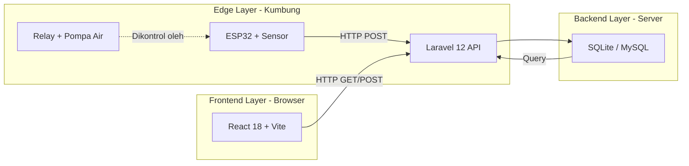
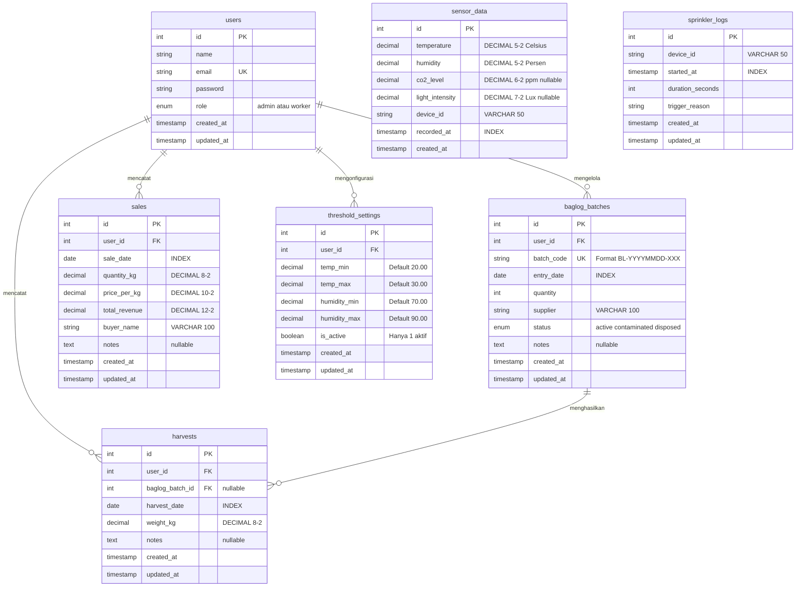
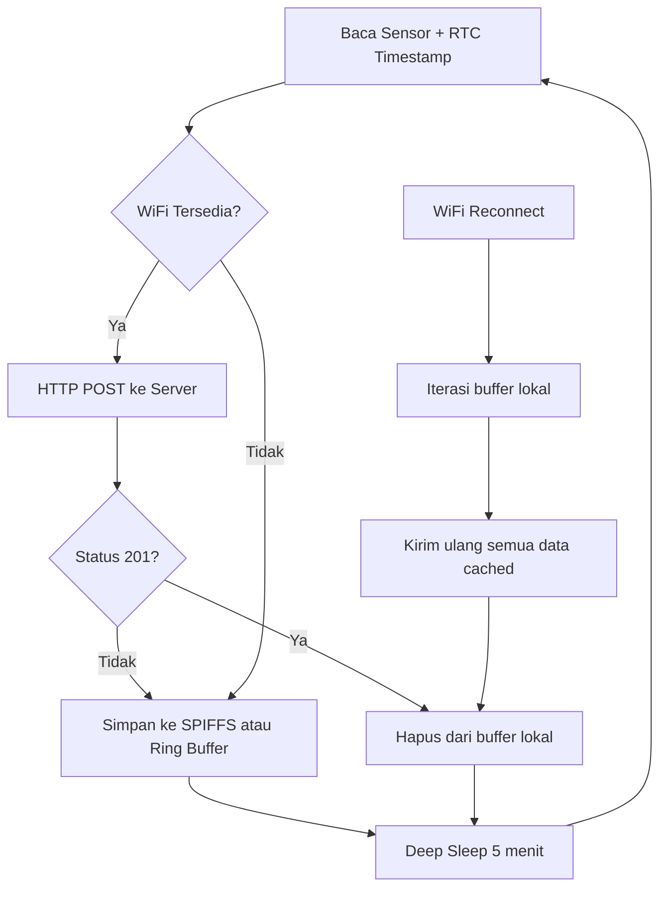

# PRD — Smart Shroom Supply Chain Management (SCM)

**Versi Dokumen:** 1.0 (Reverse-Engineered from Codebase)
**Tanggal:** 26 Agustus 2026
**Penyusun:** Benedictus Vio
**Konteks:** Tugas Akhir — Program Studi Sistem Informasi

---

## Daftar Isi

1. [Ringkasan Eksekutif](#1-ringkasan-eksekutif)
2. [Latar Belakang & Rumusan Masalah](#2-latar-belakang--rumusan-masalah)
3. [Tujuan Sistem](#3-tujuan-sistem)
4. [Target Pengguna & Peran (Aktor)](#4-target-pengguna--peran-aktor)
5. [Arsitektur Sistem & Tech Stack](#5-arsitektur-sistem--tech-stack)
6. [Desain Database (ERD)](#6-desain-database-erd)
7. [Kebutuhan Fungsional (FR)](#7-kebutuhan-fungsional-fr)
8. [Kebutuhan Non-Fungsional (NFR)](#8-kebutuhan-non-fungsional-nfr)
9. [Kontrak API (REST Endpoints)](#9-kontrak-api-rest-endpoints)
10. [Spesifikasi IoT & Perangkat Keras](#10-spesifikasi-iot--perangkat-keras)
11. [Desain Halaman UI/UX](#11-desain-halaman-uiux)
12. [Strategi Pengujian](#12-strategi-pengujian)
13. [Rencana Pengembangan Lanjutan (Roadmap)](#13-rencana-pengembangan-lanjutan-roadmap)

---

## 1. Ringkasan Eksekutif

**Smart Shroom SCM** adalah sistem informasi berbasis web dan IoT yang dirancang untuk mendigitalisasi proses monitoring lingkungan dan manajemen rantai pasok budidaya jamur tiram. Sistem ini mengintegrasikan perangkat keras sensor (ESP32) dengan dashboard web interaktif untuk memberikan kemampuan pemantauan iklim mikro kumbung secara *real-time*, pengelolaan siklus hidup media tanam (baglog), pencatatan panen harian, dan pelacakan keuangan penjualan.

---

## 2. Latar Belakang & Rumusan Masalah

### 2.1 Latar Belakang

Budidaya jamur tiram (*Pleurotus ostreatus*) memerlukan pengendalian lingkungan yang ketat, khususnya suhu, kelembapan, kadar CO2, dan intensitas cahaya. Mayoritas petani jamur di Indonesia masih mengandalkan pencatatan manual dan intuisi dalam mengelola kumbung mereka, sehingga rentan terhadap:
- **Kerugian akibat iklim** — Kegagalan mendeteksi perubahan suhu/kelembapan secara cepat yang menyebabkan kematian baglog.
- **Data yang tidak terstruktur** — Pencatatan di buku tulis yang sulit dianalisis secara historis.
- **Pengambilan keputusan yang lambat** — Tidak ada mekanisme peringatan dini (*early warning*).

### 2.2 Rumusan Masalah

> *"Bagaimana merancang dan mengimplementasikan sistem informasi berbasis web dan IoT untuk mendigitalisasi proses monitoring dan manajemen rantai pasok budidaya jamur tiram?"*

---

## 3. Tujuan Sistem

| No. | Tujuan | Modul Terkait |
|-----|--------|---------------|
| T1 | Memantau iklim mikro kumbung (suhu, kelembapan, CO2, cahaya) secara *real-time* menggunakan sensor IoT | Dashboard, IoT |
| T2 | Mengelola siklus hidup baglog — dari pencatatan batch masuk, pemantauan umur, hingga deteksi kontaminasi | Baglog Management |
| T3 | Mencatat dan menganalisis data panen harian, termasuk tren produksi 14 hari terakhir | Harvest Management |
| T4 | Mengelola transaksi penjualan — pencatatan pembeli, harga, kuantitas, dan perhitungan revenue otomatis | Sales Management |
| T5 | Memberikan peringatan dini (*early warning*) jika parameter iklim keluar dari ambang batas optimal | Dashboard Alert System |
| T6 | Mengontrol aktuator penyiraman otomatis (sprinkler) berdasarkan data sensor | IoT Actuator |

---

## 4. Target Pengguna & Peran (Aktor)

Sistem menerapkan **Role-Based Access Control (RBAC)** dengan dua peran utama:

| Peran | Deskripsi | Hak Akses |
|-------|-----------|-----------|
| **Admin** | Pemilik kumbung / pengelola utama | Akses penuh: Dashboard, Baglog (CRUD), Panen (CRUD), Penjualan (CRUD), Settings (Threshold) |
| **Worker** | Buruh tani / pekerja lapangan | Akses terbatas: Dashboard (view), Baglog (view), Panen (create & view) |

Implementasi RBAC menggunakan middleware `RoleCheck` custom yang mendukung multi-role per route (contoh: `role:admin,worker`).

---

## 5. Arsitektur Sistem & Tech Stack

### 5.1 Diagram Arsitektur



### 5.2 Tech Stack

| Layer | Teknologi | Justifikasi |
|-------|-----------|-------------|
| **Frontend** | React 18 + TypeScript + Vite | SPA cepat, type-safe, hot-reload |
| **UI Framework** | TailwindCSS (Neubrutalism Theme) | Desain modern, konsisten, dan responsif |
| **State Management** | Zustand (Auth & Toast) + TanStack Query (Server State) | Lightweight, tidak memerlukan Redux |
| **Backend** | Laravel 12 (PHP 8.x) | Framework MVC terlengkap, Eloquent ORM, Sanctum Auth |
| **Database** | SQLite (Dev) / MySQL/PostgreSQL (Prod) | Ringan saat development, scalable saat deploy |
| **Autentikasi** | Laravel Sanctum (Token-based SPA Auth) | Token disimpan di `localStorage` via Zustand, dikirim via header `Authorization: Bearer` |
| **IoT Hardware** | ESP32 + DHT22 + MQ-135 + BH1750 | Wi-Fi built-in, multi-sensor, murah |
| **IoT Communication** | HTTP REST API (bukan MQTT) | Tidak memerlukan message broker tambahan |

### 5.3 Pola Arsitektur Backend

```
Controller → Service → Repository → Model (Eloquent ORM)
```

- **Controller**: Menerima HTTP request, memanggil Service, mengembalikan JSON response standar via `ApiResponse` trait.
- **Service**: Business logic murni (perhitungan `bcmul`, agregasi, pengecekan threshold).
- **Repository**: Abstraksi akses database. Di-*bind* via `RepositoryServiceProvider` menggunakan Laravel Service Container.
- **Model**: Representasi tabel + definisi relasi + scope query + accessor.

---

## 6. Desain Database (ERD)

### 6.1 Entity Relationship Diagram



### 6.2 Prinsip Desain Database

| Prinsip | Implementasi |
|---------|--------------|
| **Presisi Uang & Pengukuran** | Seluruh kolom uang (`total_revenue`, `price_per_kg`) dan pengukuran (`temperature`, `humidity`, `weight_kg`) menggunakan tipe `DECIMAL`, bukan `FLOAT`, untuk menghindari *floating-point error*. |
| **Immutability Data Sensor** | Tabel `sensor_data` tidak memiliki kolom `updated_at`. Data sensor bersifat *append-only* dan tidak pernah dimutasi. |
| **Composite Index** | Index gabungan `[device_id, recorded_at]` pada `sensor_data` dan `[user_id, harvest_date]` pada `harvests` untuk mengoptimasi query yang sering dijalankan. |
| **Auto-Generated Code** | `batch_code` pada `baglog_batches` di-generate otomatis oleh backend dengan format `BL-YYYYMMDD-XXX` (3 digit sequential per hari). |

---

## 7. Kebutuhan Fungsional (FR)

### Modul 1: Dashboard & Monitoring Iklim

| Kode | Kebutuhan | Deskripsi | Sumber Data |
|------|-----------|-----------|-------------|
| **FR-1.1** | Real-time Climate Cards | Menampilkan 4 card indikator: Suhu (°C), Kelembapan (%), Baglog Aktif, Revenue Bulan Ini. Card suhu & kelembapan refresh setiap 30 detik. | `GET /sensor-data/latest`, `GET /dashboard/stats` |
| **FR-1.2** | Climate Chart 24 Jam | Menampilkan 2 grafik terpisah (Line Chart): suhu (kuning) dan kelembapan (biru) selama 24 jam terakhir. Refresh 5 menit. | `GET /sensor-data/chart?hours=24` |
| **FR-1.3** | Quick Stats & Alert | Menampilkan ringkasan bisnis (panen hari ini, revenue bulanan) dan banner peringatan merah jika parameter iklim melampaui threshold. | `GET /dashboard/stats` → `checkViolations()` |
| **FR-1.4** | Panen Hari Ini (Big Number) | Card angka besar menampilkan total berat panen hari ini dalam Kg. | `SUM(weight_kg) WHERE harvest_date = today` |
| **FR-1.5** | Grafik Panen 14 Hari | Bar Chart hijau menampilkan tren panen harian selama 14 hari terakhir. Hari tanpa panen ditampilkan dengan nilai 0. | `GET /harvests/chart?days=14` |
| **FR-1.6** | Tabel Batch Aktif | Menampilkan 3 batch baglog aktif terbaru (kode batch, tanggal tanam, umur hari, jumlah, supplier). Indikator warna berdasarkan umur. | `BaglogBatch::active()->latest(3)` |
| **FR-1.7** | Log Sprinkler | Menampilkan 5 log aktivitas penyiraman terakhir (waktu, durasi, pemicu). | `SprinklerLog::latest(5)` |

### Modul 2: Baglog Lifecycle Management

| Kode | Kebutuhan | Deskripsi | Akses |
|------|-----------|-----------|-------|
| **FR-2.1** | Input Batch Baglog | Admin dapat menambahkan batch baru: tanggal masuk, jumlah, supplier, catatan. Kode batch auto-generated. | Admin |
| **FR-2.2** | Status Lifecycle | Admin dapat mengubah status batch: `active` → `contaminated` → `disposed`. | Admin |
| **FR-2.3** | Lihat Semua Batch | Menampilkan tabel semua batch dengan filter status (Active / Contaminated / Disposed). Umur dihitung otomatis dari `entry_date`. | Admin, Worker |

### Modul 3: Harvest & Sales

| Kode | Kebutuhan | Deskripsi | Akses |
|------|-----------|-----------|-------|
| **FR-3.1** | Input Panen | Admin/Worker dapat menginput panen harian: tanggal, pilih batch (dropdown), berat (Kg), catatan. | Admin, Worker |
| **FR-3.2** | Input Penjualan | Admin dapat menginput transaksi: tanggal, kuantitas (Kg), harga per Kg, nama pembeli. Revenue dihitung otomatis di backend via `bcmul()`. | Admin |
| **FR-3.3** | Laporan Mingguan | Card ringkasan menampilkan total Panen Masuk (Kg), Terjual (Kg), dan Sisa Stok (Kg) per minggu. Mendukung pemilihan minggu sebelumnya via dropdown (offset 0–4). | Admin |

### Modul 4: IoT & Aktuator

| Kode | Kebutuhan | Deskripsi |
|------|-----------|-----------|
| **FR-4.1** | Endpoint Penerimaan Data IoT | Endpoint publik `POST /api/sensor-data` menerima payload JSON dari ESP32. Validasi ketat via `StoreSensorDataRequest`. |
| **FR-4.2** | Logging Sprinkler | Endpoint publik `POST /api/sprinkler-logs` mencatat aktivitas aktuator penyiraman (durasi, alasan trigger). |
| **FR-4.3** | Konfigurasi Threshold | Admin dapat mengatur batas suhu/kelembapan via halaman Settings. Threshold aktif dibaca oleh ESP32 via `GET /api/thresholds/active`. |
| **FR-4.4** | Kontrol Sprinkler Otomatis | ESP32 menjalankan logika proporsional: durasi penyiraman dihitung berdasarkan delta suhu/kelembapan terhadap threshold. Terdapat *safety check* — pompa ditahan jika suhu tinggi tapi kelembapan sudah maksimal. |

---

## 8. Kebutuhan Non-Fungsional (NFR)

| Kode | Kebutuhan | Implementasi |
|------|-----------|--------------|
| **NFR-1** | Autentikasi & Otorisasi | Laravel Sanctum (token-based). Middleware `RoleCheck` membatasi akses berdasarkan peran. |
| **NFR-2** | Rate Limiting | Endpoint publik IoT dibatasi 20 request/menit per IP via middleware `throttle:20,1`. Response `429 Too Many Requests` jika melebihi batas. |
| **NFR-3** | Validasi Input | Setiap endpoint menggunakan `FormRequest` class terpisah (`StoreSensorDataRequest`, `StoreBaglogRequest`, dll.) untuk validasi ketat. |
| **NFR-4** | Presisi Data Keuangan | Kalkulasi revenue menggunakan `bcmul()` (arbitrary-precision arithmetic). Tipe data database: `DECIMAL(12,2)`. |
| **NFR-5** | Automated Testing | PHPUnit test suite (Feature + Unit) yang 100% pass, mencakup: autentikasi, injeksi keamanan, rate limiting, logika bisnis baglog, kalkulasi penjualan, pengecekan threshold, dan helper sensor. |
| **NFR-6** | Data Immutability | Data sensor yang masuk ke database tidak pernah diubah (`UPDATED_AT = null`). Anomali data diperbaiki di sisi algoritma filter, bukan manipulasi raw data. |
| **NFR-7** | IoT Fault Tolerance (Blackbox) | ESP32 dilengkapi mekanisme *local caching* (Ring Buffer di RAM / SPIFFS). Jika WiFi terputus, data disimpan lokal dengan timestamp RTC dan dikirim ulang secara *bulk* saat koneksi pulih. |
| **NFR-8** | Responsivitas UI | Sidebar collapsible (icon-only mode), state disimpan di `localStorage`. Di mobile berubah menjadi overlay hamburger menu. |
| **NFR-9** | Real-time UX | Jam WIB real-time di header (update per detik). TanStack Query dengan `refetchInterval` untuk auto-refresh data sensor dan dashboard. |

---

## 9. Kontrak API (REST Endpoints)

### 9.1 Public Endpoints (Tanpa Auth)

| Method | Endpoint | Deskripsi | Rate Limit |
|--------|----------|-----------|------------|
| `POST` | `/api/login` | Login user, return token | — |
| `POST` | `/api/register` | Register user baru | — |
| `POST` | `/api/sensor-data` | Terima data sensor dari ESP32 | 20/menit |
| `POST` | `/api/sprinkler-logs` | Terima log sprinkler dari ESP32 | 20/menit |
| `GET` | `/api/thresholds/active` | Baca threshold aktif (untuk ESP32) | — |

### 9.2 Protected Endpoints (Auth: Sanctum)

| Method | Endpoint | Deskripsi | Role |
|--------|----------|-----------|------|
| `GET` | `/api/me` | Data user yang login | All |
| `POST` | `/api/logout` | Logout & revoke token | All |
| `GET` | `/api/sensor-data/latest` | Data sensor terbaru | All |
| `GET` | `/api/sensor-data/chart?hours=24` | Data chart sensor X jam | All |
| `GET` | `/api/dashboard/stats` | Quick stats + alerts | All |
| `GET` | `/api/baglogs` | List semua batch baglog | All |
| `POST` | `/api/baglogs` | Buat batch baru | Admin |
| `PATCH` | `/api/baglogs/{id}/status` | Ubah status batch | Admin |
| `GET` | `/api/harvests` | List riwayat panen | All |
| `POST` | `/api/harvests` | Input data panen | All |
| `GET` | `/api/harvests/today-total` | Total panen hari ini | All |
| `GET` | `/api/harvests/chart?days=14` | Chart panen harian | All |
| `GET` | `/api/sales` | List riwayat penjualan | All |
| `POST` | `/api/sales` | Input transaksi penjualan | Admin |
| `GET` | `/api/sales/weekly-report?offset=0` | Laporan mingguan (offset = minggu ke belakang) | All |
| `GET` | `/api/thresholds` | Baca konfigurasi threshold | Admin |
| `PUT` | `/api/thresholds` | Update konfigurasi threshold | Admin |

### 9.3 Format Payload IoT (Sensor Data)

```json
{
  "device_id": "ESP32-KUMBUNG-01",
  "temperature": 27.50,
  "humidity": 82.00,
  "co2_level": 450.50,
  "light_intensity": 120.50,
  "recorded_at": "2026-08-17T09:00:00Z"
}
```

### 9.4 Format Response Standar

```json
{
  "success": true,
  "data": { },
  "message": "Data retrieved successfully"
}
```

---

## 10. Spesifikasi IoT & Perangkat Keras

### 10.1 Daftar Komponen

| Komponen | Spesifikasi | Fungsi | Estimasi Harga |
|----------|-------------|--------|----------------|
| ESP32 DevKit V1 | 30/38-pin, Type-C | Mikrokontroler utama (Wi-Fi built-in) | Rp 50.000–70.000 |
| DHT22 | Sensor Suhu & Kelembapan | Membaca suhu (°C) dan kelembapan relatif (%) | Rp 45.000–60.000 |
| BH1750 | Digital Light Sensor (I2C) | Membaca intensitas cahaya (Lux) | Rp 15.000–20.000 |
| MQ-135 | Gas Sensor Module | Deteksi kualitas udara / CO2 estimasi | Rp 20.000–30.000 |
| RTC DS3231 | Real-Time Clock | Menjaga waktu akurat saat offline (untuk Blackbox) | Rp 15.000–25.000 |
| Relay Module | 1-Channel 5V | Saklar otomatis untuk pompa air | Rp 10.000–15.000 |
| Mini Water Pump | 5V/12V | Aktuator penyiraman otomatis | Rp 15.000–30.000 |
| Breadboard + Jumper | MB-102, Dupont cables | Prototyping | Rp 30.000 |
| Power Supply | Adaptor 5V 2A | Catu daya stabil untuk ESP32 | Rp 30.000 |

**Total Estimasi: Rp 200.000–300.000** (opsi hemat, tanpa MH-Z19B)

### 10.2 Logika Kontrol Aktuator (Sprinkler)

```
JIKA suhu > temp_max DAN kelembapan < humidity_max:
    durasi = min((delta_suhu x 30) + 30, 180) detik
    → NYALAKAN POMPA

JIKA suhu > temp_max DAN kelembapan >= humidity_max:
    → TAHAN POMPA (cegah busuk karena terlalu basah)

JIKA kelembapan < humidity_min:
    durasi = min((delta_kelembapan x 5) + 30, 120) detik
    → NYALAKAN POMPA
```

Durasi penyiraman bersifat **proporsional** (bukan biner on/off), dihitung berdasarkan besarnya selisih (delta) terhadap threshold. Ini menunjukkan penerapan kontrol adaptif yang lebih cerdas dibanding logika on/off sederhana.

### 10.3 Mekanisme Fault Tolerance (Blackbox)



---

## 11. Desain Halaman UI/UX

### 11.1 Routing Frontend

| Path | Halaman | Komponen React | Akses |
|------|---------|----------------|-------|
| `/login` | Login | `Login.tsx` | Guest |
| `/` | Dashboard (Beranda) | `Dashboard.tsx` | All |
| `/baglogs` | Baglog Management | `BaglogManagement.tsx` | All |
| `/harvests` | Harvest Management | `HarvestManagement.tsx` | All |
| `/sales` | Sales Management | `SalesManagement.tsx` | Admin |
| `/settings` | Settings (Threshold) | `Settings.tsx` | Admin |

### 11.2 Tema Visual

- **Style:** Neubrutalism — border hitam tebal (4px), shadow offset `[6px_6px_0px]`, warna solid dan kontras tinggi.
- **Palet Warna:**
  - Hijau aksen: `#28e085`
  - Kuning badge: TailwindCSS `yellow-400`
  - Biru badge: TailwindCSS `blue-400` (`#60a5fa`)
  - Background: putih bersih
  - Teks: hitam pekat
- **Font:** Sistem font TailwindCSS default dengan `font-black` (900 weight) untuk heading.
- **Sidebar:** Collapsible (icon-only mode), role-aware (menu Sales & Settings tersembunyi untuk Worker).
- **Modals:** Menggunakan `createPortal()` ke `document.body` untuk overlay form input.

### 11.3 Komponen UI Reusable

| Komponen | Lokasi | Deskripsi |
|----------|--------|-----------|
| `Card` | `components/ui/index.tsx` | Container card dengan border tebal dan shadow Neubrutalism |
| `Button` | `components/ui/index.tsx` | Tombol aksi dengan efek hover naik dan active ditekan |
| `ToastContainer` | `components/ui/ToastContainer.tsx` | Notifikasi toast (success/error) dengan state global Zustand |
| `DashboardLayout` | `components/DashboardLayout.tsx` | Layout utama dengan sidebar, header jam real-time, dan Outlet |
| `ThemeProvider` | `components/ThemeProvider.tsx` | Provider konteks tema (Dark Mode support) |

---

## 12. Strategi Pengujian

### 12.1 Automated Testing (PHPUnit)

| Kategori | File Test | Cakupan |
|----------|-----------|---------|
| **Feature: Auth** | `SecurityAuthTest.php` | Login, logout, akses tanpa token, akses dengan role salah |
| **Feature: Injection** | `SecurityInjectionTest.php` | SQL injection attempt, XSS payload, input sanitization |
| **Feature: Rate Limit** | `SecurityRateLimitTest.php` | Endpoint publik IoT melebihi 20 request/menit → 429 |
| **Unit: Baglog** | `BaglogBatchLogicTest.php` | Generate batch code, lifecycle status transition, age calculation |
| **Unit: Sale** | `SaleCalculationTest.php` | Kalkulasi revenue via `bcmul()`, presisi DECIMAL |
| **Unit: Sensor** | `SensorDataHelperTest.php` | Helper methods `isTemperatureAbove()`, `isHumidityBelow()`, dll. |
| **Unit: Threshold** | `ThresholdViolationTest.php` | `checkViolations()` — skenario suhu kritis, kelembapan rendah, semua normal |

### 12.2 IoT Simulator

File `iot_simulator.py` (Python) menyimulasikan perilaku ESP32 tanpa perangkat keras fisik:
- Mengirim data sensor acak setiap 10 detik ke `POST /api/sensor-data`.
- Membaca threshold aktif dari `GET /api/thresholds/active`.
- Menjalankan logika kontrol sprinkler proporsional.
- Mengirim log sprinkler ke `POST /api/sprinkler-logs`.

---

## 13. Rencana Pengembangan Lanjutan (Roadmap)

| Phase | Fitur | Deskripsi |
|-------|-------|-----------|
| **Phase 2** | AI Analytics | Model regresi/Random Forest untuk prediksi panen berdasarkan data historis iklim dan panen. |
| **Phase 2** | Multi-Kumbung | Dukungan multiple `device_id` dengan dashboard per-kumbung. Infrastruktur sudah disiapkan (field `device_id`, scope `forDevice()`). |
| **Phase 2** | Notifikasi Push | Integrasi dengan WhatsApp API / Telegram Bot untuk kirim alert langsung ke HP petani. |
| **Phase 3** | Mobile App | Versi mobile native (React Native / Flutter) untuk akses di lapangan. |
| **Phase 3** | Marketplace Integration | Integrasi dengan platform e-commerce untuk penjualan langsung dari sistem. |

---

> **Catatan:** Dokumen PRD ini di-*reverse engineer* dari *source code* aktual pada repository [Kaz0342/TA](https://github.com/Kaz0342/TA). Seluruh kebutuhan fungsional dan non-fungsional telah divalidasi terhadap implementasi kode yang ada.
