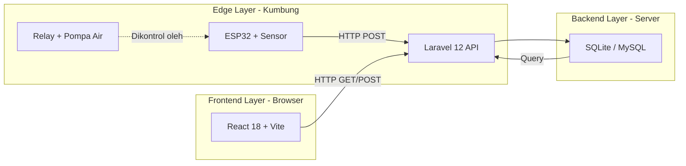
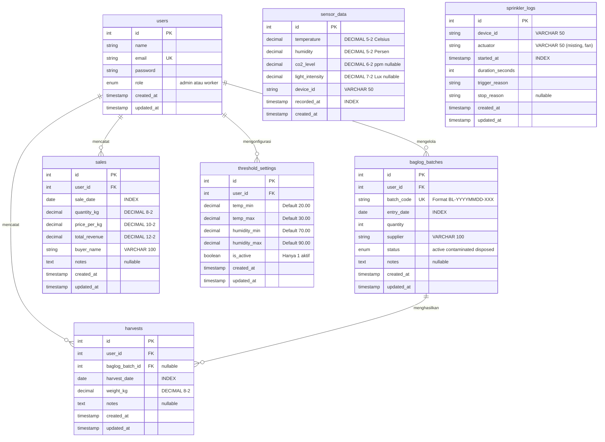
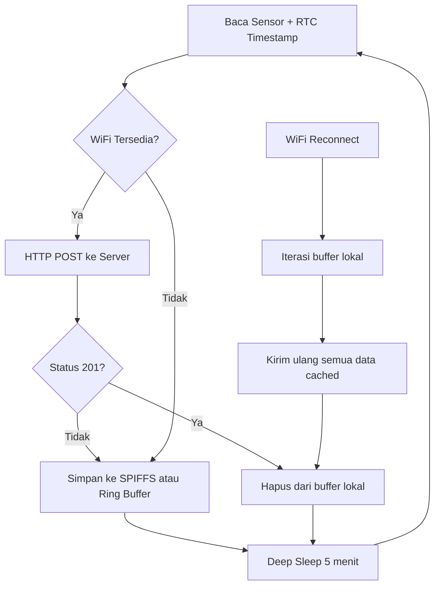

# PRD — Smart Shroom Supply Chain Management (SCM)

**Versi Dokumen:** 1.0 (Reverse-Engineered from Codebase)
**Tanggal:** 26 Agustus 2026
**Penyusun:** Benedictus Vio
**Konteks:** Tugas Akhir — Program Studi Sistem Informasi

---

## Daftar Isi

1. [Ringkasan Eksekutif](#1-ringkasan-eksekutif)
2. [Latar Belakang & Rumusan Masalah](#2-latar-belakang--rumusan-masalah)
3. [Tujuan Sistem](#3-tujuan-sistem)
4. [Target Pengguna & Peran (Aktor)](#4-target-pengguna--peran-aktor)
5. [Arsitektur Sistem & Tech Stack](#5-arsitektur-sistem--tech-stack)
6. [Desain Database (ERD)](#6-desain-database-erd)
7. [Kebutuhan Fungsional (FR)](#7-kebutuhan-fungsional-fr)
8. [Kebutuhan Non-Fungsional (NFR)](#8-kebutuhan-non-fungsional-nfr)
9. [Kontrak API (REST Endpoints)](#9-kontrak-api-rest-endpoints)
10. [Spesifikasi IoT & Perangkat Keras](#10-spesifikasi-iot--perangkat-keras)
11. [Desain Halaman UI/UX](#11-desain-halaman-uiux)
12. [Strategi Pengujian](#12-strategi-pengujian)
13. [Rencana Pengembangan Lanjutan (Roadmap)](#13-rencana-pengembangan-lanjutan-roadmap)

---

## 1. Ringkasan Eksekutif

**Smart Shroom SCM** adalah sistem informasi berbasis web dan IoT yang dirancang untuk mendigitalisasi proses monitoring lingkungan dan manajemen rantai pasok budidaya jamur kuping. Sistem ini mengintegrasikan perangkat keras sensor (ESP32) dengan dashboard web interaktif untuk memberikan kemampuan pemantauan iklim mikro kumbung secara *real-time*, pengelolaan siklus hidup media tanam (baglog), pencatatan panen harian, dan pelacakan keuangan penjualan.

---

## 2. Latar Belakang & Rumusan Masalah

### 2.1 Latar Belakang

Budidaya jamur kuping (*Auricularia auricula-judae*) memerlukan pengendalian lingkungan yang ketat, khususnya suhu, kelembapan, kadar CO2, dan intensitas cahaya. Mayoritas petani jamur di Indonesia masih mengandalkan pencatatan manual dan intuisi dalam mengelola kumbung mereka, sehingga rentan terhadap:
- **Kerugian akibat iklim** — Kegagalan mendeteksi perubahan suhu/kelembapan secara cepat yang menyebabkan kematian baglog.
- **Data yang tidak terstruktur** — Pencatatan di buku tulis yang sulit dianalisis secara historis.
- **Pengambilan keputusan yang lambat** — Tidak ada mekanisme peringatan dini (*early warning*).

### 2.2 Rumusan Masalah

> *"Bagaimana merancang dan mengimplementasikan sistem informasi berbasis web dan IoT untuk mendigitalisasi proses monitoring dan manajemen rantai pasok budidaya jamur kuping?"*

---

## 3. Tujuan Sistem

| No. | Tujuan | Modul Terkait |
|-----|--------|---------------|
| T1 | Memantau iklim mikro kumbung (suhu, kelembapan, CO2, cahaya) secara *real-time* menggunakan sensor IoT | Dashboard, IoT |
| T2 | Mengelola siklus hidup baglog — dari pencatatan batch masuk, pemantauan umur, hingga deteksi kontaminasi | Baglog Management |
| T3 | Mencatat dan menganalisis data panen harian, termasuk tren produksi 14 hari terakhir | Harvest Management |
| T4 | Mengelola transaksi penjualan — pencatatan pembeli, harga, kuantitas, dan perhitungan revenue otomatis | Sales Management |
| T5 | Memberikan peringatan dini (*early warning*) jika parameter iklim keluar dari ambang batas optimal | Dashboard Alert System |
| T6 | Mengontrol aktuator penyiraman otomatis (sprinkler) berdasarkan data sensor | IoT Actuator |

---

## 4. Target Pengguna & Peran (Aktor)

Sistem menerapkan **Role-Based Access Control (RBAC)** dengan dua peran utama:

| Peran | Deskripsi | Hak Akses |
|-------|-----------|-----------|
| **Admin** | Pemilik kumbung / pengelola utama | Akses penuh: Dashboard, Baglog (CRUD), Panen (CRUD), Penjualan (CRUD), Settings (Threshold) |
| **Worker** | Buruh tani / pekerja lapangan | Akses terbatas: Dashboard (view), Baglog (view), Panen (create & view) |

Implementasi RBAC menggunakan middleware `RoleCheck` custom yang mendukung multi-role per route (contoh: `role:admin,worker`).

---

## 5. Arsitektur Sistem & Tech Stack

### 5.1 Diagram Arsitektur



### 5.2 Tech Stack

| Layer | Teknologi | Justifikasi |
|-------|-----------|-------------|
| **Frontend** | React 18 + TypeScript + Vite | SPA cepat, type-safe, hot-reload |
| **UI Framework** | TailwindCSS (Harmonious Modern Sage Green & Dark Mode) | Desain ergonomis modern, palet hijau pastel `#244b37`, border halus `#d6e9df`, support Dark Mode lengkap |
| **Micro-Animations** | RAF & Hardware-Accelerated CSS Transitions | Count-up 60 FPS (`AnimatedNumber`), GPU needle sweep (`SemiCircleGauge`), dynamic progress (`AnimatedProgressBar`) |
| **State Management** | Zustand (Auth & Toast) + TanStack Query (Server State) | Lightweight, performa tinggi, tidak memerlukan Redux |
| **Backend** | Laravel 12 (PHP 8.x) | Framework MVC terlengkap, Eloquent ORM, Sanctum Auth |
| **Database** | SQLite (Dev) / PostgreSQL / Supabase (Prod) | Ringan & zero-config saat development, terbukti ACID-compliant & scalable |
| **Autentikasi** | Laravel Sanctum (Token-based SPA Auth) | Token disimpan di `localStorage` via Zustand, dikirim via header `Authorization: Bearer` |
| **IoT Hardware** | ESP32 DevKit V1 + 3x DHT22 + BH1750 + MQ-135 | Formasi Segitiga Diagonal, Weighted Sensor Fusion, Wi-Fi built-in |
| **IoT Communication** | HTTP REST API (Stateless) | Efisien, mudah didebug, tidak memerlukan message broker tambahan |

### 5.3 Pola Arsitektur Backend

```
Controller → Service → Repository → Model (Eloquent ORM)
```

- **Controller**: Menerima HTTP request, memanggil Service, mengembalikan JSON response standar via `ApiResponse` trait.
- **Service**: Business logic murni (perhitungan `bcmul`, agregasi, pengecekan threshold).
- **Repository**: Abstraksi akses database. Di-*bind* via `RepositoryServiceProvider` menggunakan Laravel Service Container.
- **Model**: Representasi tabel + definisi relasi + scope query + accessor.

---

## 6. Desain Database (ERD)

### 6.1 Entity Relationship Diagram



### 6.2 Prinsip Desain Database

| Prinsip | Implementasi |
|---------|--------------|
| **Presisi Uang & Pengukuran** | Seluruh kolom uang (`total_revenue`, `price_per_kg`) dan pengukuran (`temperature`, `humidity`, `weight_kg`) menggunakan tipe `DECIMAL`, bukan `FLOAT`, untuk menghindari *floating-point error*. |
| **Immutability Data Sensor** | Tabel `sensor_data` tidak memiliki kolom `updated_at`. Data sensor bersifat *append-only* dan tidak pernah dimutasi. |
| **Composite Index** | Index gabungan `[device_id, recorded_at]` pada `sensor_data` dan `[user_id, harvest_date]` pada `harvests` untuk mengoptimasi query yang sering dijalankan. |
| **Auto-Generated Code** | `batch_code` pada `baglog_batches` di-generate otomatis oleh backend dengan format `BL-YYYYMMDD-XXX` (3 digit sequential per hari). |

---

## 7. Kebutuhan Fungsional (FR)

### Modul 1: Dashboard & Monitoring Iklim

| Kode | Kebutuhan | Deskripsi | Sumber Data |
|------|-----------|-----------|-------------|
| **FR-1.1** | Real-time Climate Cards | Menampilkan 4 card indikator: Suhu (°C, dengan `SemiCircleGauge` needle sweep), Kelembapan (%, dengan `SemiCircleGauge`), Baglog Aktif (Unit, dengan `AnimatedProgressBar`), dan Panen Hari Ini (KG, dengan `AnimatedProgressBar`). Seluruh angka metrik bergerak dinamis via `AnimatedNumber` (60 FPS count-up). Auto-refresh 30 detik. | `GET /api/sensor-data/latest`, `GET /api/dashboard/stats` |
| **FR-1.2** | Riwayat Iklim Multirentang | Area Chart mikroklimat interaktif dengan tombol rentang waktu (6h / 12h / 24h / 7d). Rentang 6 jam menggunakan interval time-bucketing 5 menit (~72 data point), 12h per 10 menit, 24h per 15 menit, dan 7d per 60 menit via `SensorDataRepository` SQL aggregation. | `GET /api/sensor-data/chart?hours=6\|12\|24\|168` |
| **FR-1.3** | Quick Stats & Alert | Menampilkan widget status fase pertumbuhan, live WIB clock, dan banner peringatan merah jika parameter iklim melampaui threshold. | `GET /api/dashboard/stats` → `checkViolations()` |
| **FR-1.4** | Panen Hari Ini (Metrik KPI) | Card metrik menampilkan realisasi panen hari ini (KG) terhadap target harian 15 KG dengan progress bar teranimasi. | `SUM(weight_kg) WHERE harvest_date = today` |
| **FR-1.5** | Grafik Tren Panen 14 Hari | Area Chart hijau menampilkan tren panen harian selama 14 hari terakhir untuk memantau ritme produktivitas petik jamur. | `GET /api/harvests/chart?days=14` |
| **FR-1.6** | Tabel Batch Aktif | Menampilkan batch baglog aktif terbaru (kode batch, tanggal tanam, progress umur hari, jumlah, supplier) dengan visualisasi status warna. | `BaglogBatch::active()->latest(5)` |
| **FR-1.7** | Log Aktuator (Sprinkler & Fan) | Menampilkan riwayat aktivitas pompa misting dan kipas ventilasi (waktu, durasi detik, pemicu otomatis/manual, stop reason). | `SprinklerLog::latest(5)` |

### Modul 2: Baglog Lifecycle Management

| Kode | Kebutuhan | Deskripsi | Akses |
|------|-----------|-----------|-------|
| **FR-2.1** | Input Batch Baglog | Admin dapat menambahkan batch baru: tanggal masuk, jumlah baglog, supplier bibit, lokasi rak, catatan. Kode batch auto-generated (`BL-YYYYMMDD-XXX`). | Admin |
| **FR-2.2** | Status Lifecycle | Admin dapat mengubah status siklus: `active` → `contaminated` → `disposed`. | Admin |
| **FR-2.3** | Manajemen Data & Pagination | Tabel batch baglog interaktif dilengkapi **Pagination per 10 baris**, filter status tab (Semua, Aktif, Kontaminasi, Dibuang), dan pencarian real-time berdasarkan kode batch/supplier. Umur baglog dihitung dinamis dari `entry_date`. | Admin, Worker |

### Modul 3: Harvest & Sales

| Kode | Kebutuhan | Deskripsi | Akses |
|------|-----------|-----------|-------|
| **FR-3.1** | Input Panen | Admin/Worker dapat mencatat panen: tanggal petik, pemilihan batch baglog aktif (dropdown), berat bersih (KG), dan catatan grade jamur. | Admin, Worker |
| **FR-3.2** | Rekap Panen & Pagination | Tabel riwayat panen dilengkapi **Pagination per 10 baris**, filter tanggal/batch, dan kartu metrik (Panen Hari Ini, Total Panen Bulan Ini, Estimasi Nilai Panen, Rata-rata per Sesi). | Admin, Worker |
| **FR-3.3** | Input Transaksi Penjualan | Admin dapat mencatat penjualan: tanggal transaksi, nama mitra pembeli (dengan chip rekomendasi cepat), volume (KG), dan harga per KG. Total revenue dihitung otomatis di backend via `bcmul()`. | Admin |
| **FR-3.4** | Rekap Penjualan & Pagination | Tabel transaksi penjualan dengan **Pagination per 10 baris**, kartu KPI omzet & volume bulanan, serta grafik tren penjualan dual-axis. | Admin |

### Modul 4: IoT & Aktuator

| Kode | Kebutuhan | Deskripsi |
|------|-----------|-----------|
| **FR-4.1** | Endpoint Penerimaan Data IoT | Endpoint publik `POST /api/sensor-data` menerima payload JSON dari ESP32. Validasi ketat via `StoreSensorDataRequest`. Dilengkapi feedback alert jika melanggar threshold. |
| **FR-4.2** | Logging Aktuator | Endpoint publik `POST /api/sprinkler-logs` mencatat durasi, jenis aktuator (`misting` atau `fan`), dan alasan aktivasi/terminasi. |
| **FR-4.3** | Konfigurasi Threshold & Preset | Admin dapat mengatur batas suhu/kelembapan secara manual atau memilih preset 1-klik (Inkubasi, Primordia, Fruiting). Threshold aktif dibaca ESP32 via `GET /api/thresholds/active`. |
| **FR-4.4** | Kontrol Otomatisasi Cerdas (Firmware v3.5) | ESP32 mengevaluasi Weighted Sensor Fusion 3x DHT22 (35% A, 40% B, 25% C) dengan histeresis dinamis, Universal Guard (30 menit delay antar aktuator), 150s misting cooldown, 900s fan homogenize, Emergency Safety Override (> 34°C), dan Night Purge vs Periodic Flush. |

---

## 8. Kebutuhan Non-Fungsional (NFR)

| Kode | Kebutuhan | Implementasi |
|------|-----------|--------------|
| **NFR-1** | Autentikasi & Otorisasi | Laravel Sanctum (token-based). Middleware `RoleCheck` membatasi akses berdasarkan peran. |
| **NFR-2** | Rate Limiting | Endpoint publik IoT dibatasi 20 request/menit per IP via middleware `throttle:20,1`. Response `429 Too Many Requests` jika melebihi batas. |
| **NFR-3** | Validasi Input | Setiap endpoint menggunakan `FormRequest` class terpisah (`StoreSensorDataRequest`, `StoreBaglogRequest`, dll.) untuk validasi ketat. |
| **NFR-4** | Presisi Data Keuangan | Kalkulasi revenue menggunakan `bcmul()` (arbitrary-precision arithmetic). Tipe data database: `DECIMAL(12,2)`. |
| **NFR-5** | Automated Testing | PHPUnit test suite (Feature + Unit) yang 100% pass, mencakup: autentikasi, injeksi keamanan, rate limiting, logika bisnis baglog, kalkulasi penjualan, pengecekan threshold, dan helper sensor. |
| **NFR-6** | Data Immutability | Data sensor yang masuk ke database tidak pernah diubah (`UPDATED_AT = null`). Anomali data diperbaiki di sisi algoritma filter, bukan manipulasi raw data. |
| **NFR-7** | IoT Fault Tolerance (Blackbox) | ESP32 dilengkapi mekanisme *local caching* (Ring Buffer di RAM / SPIFFS). Jika WiFi terputus, data disimpan lokal dengan timestamp RTC dan dikirim ulang secara *bulk* saat koneksi pulih. |
| **NFR-8** | Responsivitas UI | Sidebar collapsible (icon-only mode), state disimpan di `localStorage`. Di mobile berubah menjadi overlay hamburger menu. |
| **NFR-9** | Real-time UX | Jam WIB real-time di header (update per detik). TanStack Query dengan `refetchInterval` untuk auto-refresh data sensor dan dashboard. |

---

## 9. Kontrak API (REST Endpoints)

### 9.1 Public Endpoints (Tanpa Auth)

| Method | Endpoint | Deskripsi | Rate Limit |
|--------|----------|-----------|------------|
| `POST` | `/api/login` | Login user, return token | — |
| `POST` | `/api/register` | Register user baru | — |
| `POST` | `/api/sensor-data` | Terima data sensor dari ESP32 | 20/menit |
| `POST` | `/api/sprinkler-logs` | Terima log sprinkler dari ESP32 | 20/menit |
| `GET` | `/api/thresholds/active` | Baca threshold aktif (untuk ESP32) | — |

### 9.2 Protected Endpoints (Auth: Sanctum)

| Method | Endpoint | Deskripsi | Role |
|--------|----------|-----------|------|
| `GET` | `/api/me` | Data user yang login | All |
| `POST` | `/api/logout` | Logout & revoke token | All |
| `GET` | `/api/sensor-data/latest` | Data sensor terbaru | All |
| `GET` | `/api/sensor-data/chart?hours=24` | Data chart sensor X jam | All |
| `GET` | `/api/dashboard/stats` | Quick stats + alerts | All |
| `GET` | `/api/baglogs` | List semua batch baglog | All |
| `POST` | `/api/baglogs` | Buat batch baru | Admin |
| `PATCH` | `/api/baglogs/{id}/status` | Ubah status batch | Admin |
| `GET` | `/api/harvests` | List riwayat panen | All |
| `POST` | `/api/harvests` | Input data panen | All |
| `GET` | `/api/harvests/today-total` | Total panen hari ini | All |
| `GET` | `/api/harvests/chart?days=14` | Chart panen harian | All |
| `GET` | `/api/sales` | List riwayat penjualan | All |
| `POST` | `/api/sales` | Input transaksi penjualan | Admin |
| `GET` | `/api/sales/weekly-report?offset=0` | Laporan mingguan (offset = minggu ke belakang) | All |
| `GET` | `/api/thresholds` | Baca konfigurasi threshold | Admin |
| `PUT` | `/api/thresholds` | Update konfigurasi threshold | Admin |

### 9.3 Format Payload IoT (Sensor Data)

```json
{
  "device_id": "ESP32-KUMBUNG-01",
  "temperature": 27.50,
  "humidity": 82.00,
  "co2_level": 450.50,
  "light_intensity": 120.50,
  "recorded_at": "2026-08-17T09:00:00Z"
}
```

### 9.4 Format Response Standar

```json
{
  "success": true,
  "data": { },
  "message": "Data retrieved successfully"
}
```

---

## 10. Spesifikasi IoT & Perangkat Keras

### 10.1 Daftar Komponen

| Komponen | Spesifikasi | Fungsi | Estimasi Harga |
|----------|-------------|--------|----------------|
| ESP32 DevKit V1 | 30/38-pin, Type-C | Mikrokontroler utama edge computing (Wi-Fi built-in) | Rp 50.000–70.000 |
| 3x DHT22 | Sensor Suhu & Kelembapan Presisi | Formasi Segitiga Diagonal (Atas GPIO 4, Tengah GPIO 15, Bawah GPIO 2) | Rp 135.000–180.000 |
| BH1750 | Digital Light Sensor (I2C) | Membaca intensitas cahaya kumbung (Lux) | Rp 15.000–20.000 |
| MQ-135 | Gas Sensor Module | Deteksi kualitas udara & CO2 estimasi | Rp 20.000–30.000 |
| RTC DS3231 | Real-Time Clock | Menjaga akurasi timestamp saat offline (Blackbox FIFO) | Rp 15.000–25.000 |
| Relay Module | 2-Channel 5V Optocoupler | Saklar terisolasi untuk pompa misting & kipas ventilasi | Rp 15.000–25.000 |
| High-Pressure Misting Pump | 12V DC + Nozzle Kabut | Pengabutan halus untuk menaikkan RH tanpa tetesan besar | Rp 80.000–120.000 |
| Exhaust Fan | 12V / 220V Ventilasi | Sirkulasi homogenisasi udara & pembuangan akumulasi CO2 | Rp 40.000–70.000 |
| Power Supply | Adaptor 12V 5A + Stepdown 5V | Catu daya stabil mikrokontroler dan seluruh aktuator | Rp 45.000–60.000 |

### 10.2 Algoritma Kendali Aktuator (Firmware v3.5)

Sistem menggunakan kendali umpan-balik tertutup (*closed-loop control*) dengan **Weighted Sensor Fusion (35% A, 40% B, 25% C)** dan histeresis dinamis:

1. **Formula Sensor Fusion:**
   $$T_{\text{avg}} = 0.35 \cdot T_A + 0.40 \cdot T_B + 0.25 \cdot T_C$$
   $$RH_{\text{avg}} = 0.35 \cdot RH_A + 0.40 \cdot RH_B + 0.25 \cdot RH_C$$
   *(Jika terjadi sensor fail/NaN, bobot dinormalisasi ulang secara otomatis).*

2. **Logika Misting:**
   - **START:** Saat $RH_{\text{avg}} < \text{humMin}$ atau $T_{\text{avg}} > \text{tempMax}$.
   - **STOP:** Saat $RH_{\text{avg}} \ge \min(\text{humMax} - 4, \text{humMin} + 5)$. Rentang deadband 5% mencegah osilasi gigi gergaji (*sawtooth wave*).
   - **Proteksi:** Interlock kipas, Emergency Timeout 60s, Evaporation Cooldown 150s, Night Lockout (17:00–06:00 WIB).

3. **Logika Exhaust Fan:**
   - **Pendinginan Siang:** ON jika $T_{\text{avg}} > \text{tempMax}$, OFF jika $T \le \text{tempMax} - 1.5^\circ\text{C}$ (Max 180s).
   - **Homogenisasi Sirkulasi:** ON 30s jika disparitas $|RH_A - RH_C| > 12\%$, cooldown 900s.
   - **Emergency Safety Override:** Jika sensor atas $> 34^\circ\text{C}$, bypass seluruh cooldown dan paksa fan ON segera.
   - **Night Purge & Flush:** Siklus presisi 45s untuk kelembapan jenuh ($RH \ge 96\%$) dan pembilasan CO2 berkala tiap 60 menit.

4. **Universal Guard:** Jeda minimum 30 menit antar aktuator untuk menjaga kestabilan mikroklimat.

### 10.3 Mekanisme Fault Tolerance (Blackbox)



---

## 11. Desain Halaman UI/UX

### 11.1 Routing Frontend

| Path | Halaman | Komponen React | Akses |
|------|---------|----------------|-------|
| `/login` | Login | `Login.tsx` | Guest |
| `/` | Dashboard (Beranda) | `Dashboard.tsx` | All |
| `/baglogs` | Baglog Management | `BaglogManagement.tsx` | All |
| `/harvests` | Harvest Management | `HarvestManagement.tsx` | All |
| `/sales` | Sales Management | `SalesManagement.tsx` | Admin |
| `/settings` | Settings (Threshold) | `Settings.tsx` | Admin |

### 11.2 Tema Visual & Design Tokens

- **Gaya Desain:** Harmonious Modern Sage Green & Dark Mode (Ergonomis, Bersih, Kontras Lembut).
- **Palet Warna:**
  - Brand Primary: Emerald Deep `#244b37` (Hover `#1b3a2b`, Active `#142c20`)
  - Canvas Background: `#edf5f0` (Light) / `#111f17` (Dark)
  - Card & Surface: `#ffffff` dengan border halus `#d6e9df` (Light) / `#1a2e23` dengan border `#2a4435` (Dark)
  - Status Optimal: Hijau Daun `#499b70` / `#15803d`
  - Status Waspada: Amber Soft `#f59e0b` / `#b45309`
  - Status Kritis / Bahaya: Coral Red `#e05345` / `#991b1b`
- **Tipografi:** Google Font `'Plus Jakarta Sans'`, `'Inter'`, dan `'JetBrains Mono'`.
- **Interaksi:** Micro-animation 60 FPS pada angka metrik, gauge sweep animasi jarum SVG rotasi CSS, serta transisi smooth progress bar.

### 11.3 Komponen UI Reusable

| Komponen | Lokasi | Deskripsi |
|----------|--------|-----------|
| `SemiCircleGauge` | `components/SemiCircleGauge.tsx` | Gauge setengah lingkaran dengan jarum putar terakselerasi GPU (`transform: rotate`, 50ms mount buffer) |
| `AnimatedNumber` | `components/AnimatedNumber.tsx` | Counter angka 60 FPS menggunakan `requestAnimationFrame` + `easeOutCubic` |
| `AnimatedProgressBar` | `components/AnimatedProgressBar.tsx` | Progress bar visual kapasitas dan target panen dengan transisi CSS |
| `Card` | `components/ui/index.tsx` | Card surface modular dengan border halus dan bayangan lembut |
| `ToastContainer` | `components/ui/ToastContainer.tsx` | Notifikasi toast interaktif tersinkronisasi Zustand |
| `DashboardLayout` | `components/DashboardLayout.tsx` | Shell navigasi dengan sidebar responsif dan live WIB clock |
| `ThemeProvider` | `components/ThemeProvider.tsx` | Pengelola Dark Mode / Light Mode otomatis |

---

## 12. Strategi Pengujian

### 12.1 Automated Testing (PHPUnit) — 115 Tests Passing (299 Assertions)

Pengujian otomatis mengadopsi Extreme Programming (XP) dengan 100% kelulusan (115 tests, 299 assertions):

| Kategori | File Test Utama | Cakupan Pengujian |
|----------|-----------------|-------------------|
| **Feature: Auth & RBAC** | `SecurityAuthTest.php`, `RolePermissionTest.php` | Login, token Sanctum, proteksi endpoint, role guard admin vs worker |
| **Feature: Security** | `SecurityInjectionTest.php`, `SecurityRateLimitTest.php` | Proteksi SQL injection, XSS escaping, rate limit 20 req/menit |
| **Feature: API Endpoints** | `SensorDataApiTest.php`, `BaglogApiTest.php`, `HarvestApiTest.php`, `SaleApiTest.php` | Pengujian respons HTTP, validasi FormRequest, status code 200/201/422 |
| **Unit: Business Logic** | `SaleCalculationTest.php`, `BaglogBatchLogicTest.php` | Kalkulasi revenue presisi `bcmul()`, siklus status baglog, hitung umur |
| **Unit: Climate & Downsampling** | `SensorDataRepositoryTest.php`, `ThresholdViolationTest.php` | Verifikasi SQL time-bucketing 5m/10m/15m/60m, filter pelanggaran threshold |

### 12.2 IoT Simulator v3.5 (`iot_simulator.py`)

File `iot_simulator.py` menyimulasikan operasional kumbung nyata secara akurat tanpa perangkat fisik:
- Menjalankan model termal-kelembapan berbasis siklus diurnal matahari (panas siang, dingin malam).
- Weighted Sensor Fusion 3x DHT22 (A=35%, B=40%, C=25%).
- Logika kendali pompa misting & fan sesuai spesifikasi Firmware v3.5 termasuk Universal Guard (30 menit delay).
- Sinkronisasi otomatis ke backend Laravel lokal (`POST /api/sensor-data` dan `POST /api/sprinkler-logs`).

---

## 13. Rencana Pengembangan Lanjutan (Roadmap)

| Phase | Fitur | Deskripsi |
|-------|-------|-----------|
| **Phase 2** | AI Analytics | Model regresi/Random Forest untuk prediksi panen berdasarkan data historis iklim dan panen. |
| **Phase 2** | Multi-Kumbung | Dukungan multiple `device_id` dengan dashboard per-kumbung. Infrastruktur sudah disiapkan (field `device_id`, scope `forDevice()`). |
| **Phase 2** | Notifikasi Push | Integrasi dengan WhatsApp API / Telegram Bot untuk kirim alert langsung ke HP petani. |
| **Phase 3** | Mobile App | Versi mobile native (React Native / Flutter) untuk akses di lapangan. |
| **Phase 3** | Marketplace Integration | Integrasi dengan platform e-commerce untuk penjualan langsung dari sistem. |

---

> **Catatan:** Dokumen PRD ini di-*reverse engineer* dari *source code* aktual pada repository [Kaz0342/TA](https://github.com/Kaz0342/TA). Seluruh kebutuhan fungsional dan non-fungsional telah divalidasi terhadap implementasi kode yang ada.
