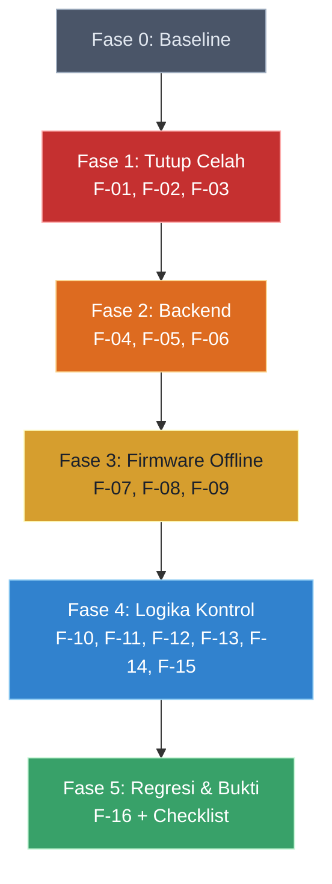

# Analisis Audit Logika & Simulasi — Smart Shroom SCM

> **Sumber:** [`RENCANA_PERBAIKAN_LOGIKA.md`](file:///d:/DevTools/Antigravity/Projects/TA_vio/docs/file%20dari%20luar/RENCANA_PERBAIKAN_LOGIKA.md) dan [`sim_harness.py`](file:///d:/DevTools/Antigravity/Projects/TA_vio/docs/file%20dari%20luar/sim_harness.py)
> **Basis:** branch `develop`, commit `8187915` (27 Sep 2026)
> **Dianalisis oleh:** Anti-Gravity · 1 Oktober 2026

---

## 1. Apa Ini?

Dua file dari luar ini adalah hasil **audit logika menyeluruh** terhadap seluruh stack TA (ESP32 firmware, Laravel backend, IoT simulator). Audit ini bukan cuma ngomongin "kode lu salah", tapi disusun layaknya **post-mortem engineering report** dengan tingkat bukti yang jelas:

| Tanda | Arti |
|---|---|
| **[RUN]** | Dibuktikan lewat simulasi headless (`sim_harness.py`) — angkanya bisa direproduksi |
| **[CODE]** | Dibaca dari kode, belum dieksekusi |
| **[ENV]** | Bergantung konfigurasi deploy (Vercel/Supabase) — perlu diverifikasi langsung |

**Batas penting:** PHP dan Arduino **tidak** dikompilasi/dijalankan di environment audit. Semua snippet PHP/C++ harus di-test lokal dan Wokwi sebelum deploy.

---

## 2. Peta Temuan (16 Item, 5 Fase)

Dokumen mengidentifikasi **16 temuan (F-01 s.d. F-16)** yang diurutkan dalam 5 fase berdasarkan prinsip:
1. **Tutup celah keamanan** sebelum fitur baru aktif
2. **Backend dulu**, baru firmware (firmware bergantung kontrak API)
3. **Keselamatan fisik** sebelum optimasi (pompa nyangkut = bahaya)
4. **Bug dulu**, baru tuning parameter
5. Samakan sim & firmware sebelum ambil angka final Bab 4

### 2.1 Ringkasan Per Prioritas

| Prioritas | Jumlah | Temuan | Estimasi Total |
|---|---|---|---|
| **P0 (Kritis)** | 4 | F-01, F-02, F-04, F-07 | ~3-4 jam |
| **P1 (Penting)** | 7 | F-03, F-05, F-06, F-08, F-09, F-10, F-11, F-12 | ~6-8 jam |
| **P2 (Sedang)** | 2 | F-13, F-14 | ~1 jam |
| **P3 (Minor)** | 2 | F-15, F-16 | ~1.5 jam |

**Estimasi total:** ±1,5–2,5 hari kerja.

---

## 3. Temuan Kritis yang HARUS Segera Ditangani

### 3.1 F-01 & F-02 — Celah Keamanan API (P0)

**Masalah:**
- **`/migrate-db`** terdaftar di **2 tempat** (`api.php:233` dan `web.php:64`) tanpa autentikasi selain query param `?secret=` yang nilai default-nya (`ta-shroom-migrate-2026`) ada di repo publik. Siapa pun bisa memicu migrasi DB produksi.
- **`/register`** publik tanpa autentikasi → siapa pun bisa bikin akun worker → dapet token → bisa trigger `POST /device/pause` → sabotase jarak jauh (pompa & fan mati).

**Solusi:**
- Hapus route `/migrate-db` dari kedua file; migrasi lewat CLI lokal.
- Pindahkan `/register` ke dalam grup `middleware('role:admin')`.

### 3.2 F-04 — Cache Array di Vercel = PAUSE Tidak Pernah Berfungsi (P0)

**Ini yang paling kritis, King.**

`vercel.json` mengatur `CACHE_STORE=array`. Di Vercel (serverless), setiap request = proses PHP baru → cache array selalu kosong. Artinya:
- **PAUSE/RESUME tidak pernah sampai ke ESP32** (cache kosong di request berikutnya)
- **Rate limiter (`throttle:*`) tidak membatasi apa pun**
- 133 test hijau karena PHPUnit jalan di satu proses → **yang dites bukan yang di-deploy!**

**Solusi:** Ubah `CACHE_STORE` ke `database`; pastikan tabel `cache` dan `cache_locks` ada di Supabase.

### 3.3 F-07 — WiFi Mati = Kontrol & Watchdog Mati Total (P0)

**Masalah fisik berbahaya.** Saat WiFi putus:
- `loop()` langsung `return` → sensor, kontrol, DAN semua watchdog/timeout **berhenti total**
- Pompa/solenoid/fan yang sedang ON **tetap ON tanpa batas** (baglog tergenang, motor jalan terus)
- `setup()` menunggu WiFi tanpa batas → boot tanpa WiFi tidak pernah sampai ke `loop()`

**Solusi:** WiFi reconnect non-blocking; kontrol dan watchdog tetap jalan offline; log diantre di RAM dan dikirim saat WiFi kembali.

---

## 4. Temuan Logika Kontrol (Dibuktikan Simulasi)

### 4.1 F-10 — Safety Override: Relay Chatter (P1)

Histeresis stop Safety Override (suhu kritis) hanya ada di jalur **siang**. Saat **malam**, suhu yang berfluktuasi di sekitar 34°C membuat fan (relay 220V) start-stop tiap detik.

**Bukti simulasi (panas ekstrem, 2 hari):**

| Kondisi | Sebelum Fix | Sesudah F-10a |
|---|---|---|
| Ambient 27-36°C: Toggle fan/hari | **649** | **49** |
| Ambient 28-39°C: Toggle fan/hari | **661** | **41** |

> 649 toggle/hari = relay switching tiap ~133 detik. Ini bisa **merusak relay fisik**.

### 4.2 F-11 — Ambang Darurat Hard-Coded (P1, Baru)

Tier-2 misting pakai ambang tetap `criticalLowRh = 75.0` yang cocok buat Fruiting (humMin 85) tapi **tidak cocok buat preset lain**. Pada **Inkubasi** (humMin 65, humMax 75):
- RH rata-rata ~70% sudah di bawah 75 → pulse Tier-2 menyala terus-menerus

**Bukti simulasi (Inkubasi, ambient kering):**

| Kondisi | Sebelum | Sesudah F-11 |
|---|---|---|
| Pulse Tier-2/hari | **168,8** | **3,5** |
| Pompa mnt/hari | **84,5** | **38,8** |

### 4.3 F-12 — Timeout 60s Jadi Pengontrol Sebenarnya (P1)

97% siklus misting (Fruiting) berhenti karena "Safety timeout" 60s, bukan karena "Target tercapai". Timeout menjadi pengontrol sebenarnya, dan klaim "histeresis kurva landai ±90%" **tidak terbukti di model**.

**Bukti simulasi (Fruiting 85/95):**

| Kondisi | Timeout % | Siklus/hari |
|---|---|---|
| Sebelum (stop 90%, timeout 60s) | **97%** | 36,0 |
| Sesudah F-11+F-12 (stop 88%, timeout 90s) | **0%** | 37,5 |

---

## 5. Tentang `sim_harness.py`

### 5.1 Apa Fungsinya

Ini adalah **test harness headless** yang menjalankan `iot_simulator.py` tanpa network, tanpa sleep, dan dengan jam palsu. 2 hari simulasi selesai dalam ~4-5 detik.

### 5.2 Arsitektur

```
sim_harness.py
├── load_sim()      → Muat iot_simulator.py sebagai module, apply patch via string-replace
├── run_case()      → Jalankan simulasi N hari dengan parameter tertentu
├── PATCHES{}       → Definisi fix sebagai string replacement (F-10a, F-10b, F-11, F-12, F-12b)
├── PRESETS{}       → Preset threshold (fruiting, primordia, incubation, seed_default)
└── suite_*()       → Suite test spesifik (misting, heat, incubation, gain, cadence)
```

### 5.3 Fitur Kunci

- **Patching non-destruktif:** File `iot_simulator.py` asli **TIDAK disentuh**. Patch diterapkan ke salinan temporer via string-replace.
- **Reprodusibel:** Deterministik per seed. Variasi antar seed/bulan dirata-ratakan (4 run).
- **6 suite tes:**
  - `misting` — Validasi deadband dan timeout (F-11/F-12)
  - `heat` — Validasi Safety Override dan relay chatter (F-10)
  - `incubation` — Bukti ambang hard-coded (F-11)
  - `gain` — Sensitivitas terhadap koefisien misting (0.10–0.35)
  - `cadence` — Paritas evaluasi 1s (sim) vs 5s (firmware) (F-13)
  - `all` — Semua di atas (~5 menit)

### 5.4 Batasan Penting

- Koefisien fisik (misting gain 0.16, fan 0.04/0.08, recovery rate) adalah **asumsi, bukan hasil ukur**
- Fan di sim kemungkinan **puluhan kali lebih efektif** dari kipas nyata (model well-mixed optimistis)
- Misting gain cukup masuk akal secara orde besar (cross-check dengan RAB nozzle)
- Kalibrasi fisik (Lampiran A.5 di dokumen asli) **wajib** sebelum angka sim dijadikan klaim di skripsi

---

## 6. Catatan Desain Terbuka (Keputusan, Bukan Bug)

Dokumen juga mengidentifikasi 6 **keputusan desain** yang bukan bug tapi perlu lo putuskan:

| # | Isu | Status |
|---|---|---|
| 1 | Interlock fan↔misting saat panas → RH turun | Opsi: biarkan, jendela bergantian, atau evaporative cooling |
| 2 | `humidity_max` bukan batas yang ditegakkan (RH > humMax 38-68% waktu) | Putuskan: dehumidifikasi masuk scope atau ubah makna di dokumen |
| 3 | Override dipicu 1 pembacaan 1 sensor → butuh debounce | Saran: ≥2 pembacaan berturut-turut (~10s) |
| 4 | Pause tanpa pengawasan suhu | Saran: auto-resume jika `maxTemp > tempMax + 4°C` ×2 pembacaan |
| 5 | Preset Primordia: tempMax 28°C vs iklim nyata | Suhu > 28°C selama 15.6% waktu di sim |
| 6 | Semua sensor gagal → state aman belum didefinisikan | Saran: pompa OFF, alarm LCD+log |

---

## 7. Hal yang Ditunda (§9 Dokumen Asli)

- Kesesuaian dokumen vs firmware (sensor di dokumen ≠ sensor di kode)
- Single-zone vs status per-slot, kapasitas 300 slot vs target produksi
- Overhead shared di `marginKontribusi()` (logika bisnis, bukan kontrol)
- Kredensial README vs seeder, keamanan device API key

---

## 8. Rekomendasi Urutan Kerja



> [!WARNING]
> **Fase 0 (Baseline) WAJIB dikerjakan duluan.** Tanpa bukti "sebelum", tabel perbandingan di Bab 4 skripsi tidak bisa dibuat. Jalankan `sim_harness.py --suite all` dan simpan hasilnya sebelum mengubah apapun.

---

## 9. Cara Reproduksi Angka Simulasi

```bash
# Dari root repo (sim_harness.py harus ada di root atau path disesuaikan)
python sim_harness.py --sim iot_simulator.py --suite all          # semua tabel (~5 menit)
python sim_harness.py --sim iot_simulator.py --suite misting      # F-11/F-12
python sim_harness.py --sim iot_simulator.py --suite heat         # F-10
python sim_harness.py --sim iot_simulator.py --suite incubation   # F-11
python sim_harness.py --sim iot_simulator.py --suite gain         # sensitivitas koefisien
python sim_harness.py --sim iot_simulator.py --suite cadence      # F-13
python sim_harness.py --sim iot_simulator.py --suite misting --fast   # cek cepat (~1 menit)
```

---

## 10. Kesimpulan

Audit ini **serius dan berkualitas tinggi**. Bukan sekadar code review dangkal — ini audit engineering dengan bukti simulasi yang reproducible. Yang paling krusial:

1. **4 temuan P0** (F-01, F-02, F-04, F-07) adalah **showstopper** yang harus segera ditangani sebelum demo/sidang.
2. **PAUSE tidak pernah berfungsi di production** (F-04) — ini berarti fitur utama FR-4.6 (jeda panen) **broken di deploy** meskipun 133 test hijau.
3. **Firmware mati total saat WiFi putus** (F-07) — ini masalah **keselamatan fisik** (pompa/fan nyangkut tanpa batas).
4. Simulasi membuktikan logika kontrol punya bug laten yang muncul di kondisi ekstrem (relay chatter 649×/hari, timeout jadi pengontrol 97% siklus).
5. Koefisien sim perlu dikalibrasi sebelum dijadikan klaim kuantitatif di Bab 4.
