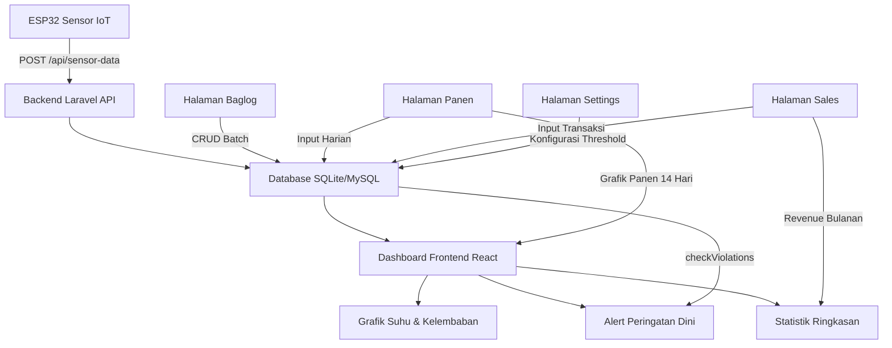

# Dokumentasi Sistem: Smart Shroom Supply Chain Management (SCM)

## Daftar Isi
1. [Pendahuluan](#1-pendahuluan)
2. [Arsitektur Sistem](#2-arsitektur-sistem)
3. [Metodologi Pengembangan (SDLC)](#3-metodologi-pengembangan-sdlc)
4. [Halaman Login & Otorisasi](#4-halaman-login--otorisasi)
5. [Halaman Dashboard (Beranda)](#5-halaman-dashboard-beranda)
6. [Halaman Baglog Management](#6-halaman-baglog-management)
7. [Halaman Harvests (Rekap Panen)](#7-halaman-harvests-rekap-panen)
8. [Halaman Sales (Penjualan)](#8-halaman-sales-penjualan)
9. [Halaman Settings (Pengaturan Threshold)](#9-halaman-settings-pengaturan-threshold)
10. [Sidebar & Navigasi](#10-sidebar--navigasi)
11. [Hubungan Antar Modul & Relevansi TA](#11-hubungan-antar-modul--relevansi-ta)
12. [Ringkasan Fitur & Kebutuhan Fungsional (FR)](#12-ringkasan-fitur--kebutuhan-fungsional-fr)

---

## 1. Pendahuluan

### 1.1 Nama Sistem
**Smart Shroom SCM** — Sistem Manajemen Rantai Pasok Jamur Tiram Berbasis IoT

### 1.2 Tujuan Sistem
Sistem ini dibangun sebagai produk utama **Tugas Akhir (TA)** bidang Sistem Informasi, dengan tujuan:
1. **Memantau iklim mikro kumbung** (suhu, kelembapan, CO2, cahaya) secara *real-time* menggunakan sensor IoT (ESP32).
2. **Mengelola siklus hidup baglog** — dari pencatatan batch masuk, pemantauan umur, hingga deteksi kontaminasi.
3. **Mencatat dan menganalisis data panen harian** — termasuk tren produksi 2 minggu terakhir.
4. **Mengelola transaksi penjualan** — pencatatan pembeli, harga, kuantitas, dan perhitungan *revenue* otomatis.
5. **Memberikan peringatan dini (early warning)** — jika parameter iklim keluar dari ambang batas optimal yang sudah dikonfigurasi.

### 1.3 Konteks TA
Sistem ini menjawab rumusan masalah utama dalam TA, yaitu:
> *"Bagaimana merancang dan mengimplementasikan sistem informasi berbasis web dan IoT untuk mendigitalisasi proses monitoring dan manajemen rantai pasok budidaya jamur tiram?"*

---

## 2. Arsitektur Sistem

### 2.1 Tech Stack

| Layer | Teknologi | Alasan Pemilihan |
|---|---|---|
| **Frontend** | React 18 + TypeScript + Vite | SPA cepat, type-safe, hot-reload untuk pengembangan |
| **UI Framework** | TailwindCSS (Neubrutalism Theme) | Desain modern, konsisten, responsif |
| **State Management** | Zustand (Auth & Toast) + TanStack Query (Server State) | Lightweight, tidak perlu Redux |
| **Backend** | Laravel 12 (PHP) | Framework MVC terlengkap, Eloquent ORM, Sanctum Auth |
| **Database** | SQLite (Dev) → MySQL/PostgreSQL (Production) | Ringan saat development, scalable saat deploy |
| **IoT Hardware** | ESP32 + DHT22 + MQ-135 + BH1750 | Wi-Fi built-in, multi-sensor, murah |
| **Komunikasi IoT** | HTTP REST API (bukan MQTT) | Tidak butuh message broker tambahan |

### 2.2 Pola Arsitektur Backend

```
Controller → Service → Repository → Model (Eloquent)
```

*   **Controller**: Menerima HTTP request, memanggil Service, mengembalikan JSON response.
*   **Service**: Berisi business logic (perhitungan, validasi lanjutan, agregasi data).
*   **Repository**: Abstraksi akses database (query builder, Eloquent).
*   **Model**: Representasi tabel database, definisi relasi, dan helper methods.

### 2.3 Diagram Alur Data

```
ESP32 (Sensor) ──HTTP POST──→ Laravel API ──Validasi──→ Database (SQLite/MySQL)
                                    ↓
                              React Frontend ←──HTTP GET──→ REST API Endpoints
                                    ↓
                              Dashboard (Grafik, Tabel, Notifikasi)
```

---

## 3. Metodologi Pengembangan (SDLC)

Sistem ini dikembangkan menggunakan metodologi **Agile Software Development** (khususnya pendekatan *Iterative & Incremental*). Pemilihan metode Agile didasarkan pada kebutuhan pengembangan yang adaptif dan berfokus pada kualitas kode (*Clean Code*). 

Karakteristik SDLC Agile yang diterapkan pada project TA ini:
1. **Iterative Development:** Fitur dikembangkan secara bertahap (sprint/iterasi). Misalnya: Modul IoT diselesaikan terlebih dahulu, kemudian modul Baglog, dilanjutkan dengan visualisasi Chart di Dashboard.
2. **Test-Driven / Automated Testing:** Mengadopsi prinsip *Extreme Programming (XP)* di mana setiap logika bisnis (seperti pengecekan threshold atau kalkulasi revenue) divalidasi menggunakan *Automated Testing* (terdapat 82 skenario *PHPUnit test* yang 100% *pass*).
3. **Adaptive to Change:** Saat ada perubahan *requirement* (contoh: pemisahan grafik suhu dan kelembapan agar UX lebih baik), perubahan dapat langsung diimplementasikan tanpa merusak modul lain berkat arsitektur yang *decoupled* (terpisah).

---

## 4. Halaman Login & Otorisasi

### 4.1 Tujuan
Mengamankan akses ke sistem agar hanya pengguna terotorisasi yang bisa mengelola data budidaya.

### 4.2 Mekanisme
*   Menggunakan **Laravel Sanctum** (Token-based SPA Authentication).
*   Setelah login berhasil, token disimpan di `localStorage` melalui Zustand store.
*   Setiap request API dilampiri header `Authorization: Bearer <token>`.

### 4.3 Peran (Role)

| Role | Hak Akses |
|---|---|
| **Admin** | Akses penuh: Dashboard, Baglog, Panen, Penjualan, Settings (Threshold) |
| **Worker** | Akses terbatas: Dashboard, Baglog (view only), Panen (input & view) |

### 4.4 Hubungan dengan TA
Membuktikan implementasi **keamanan sistem informasi** melalui autentikasi dan otorisasi berbasis role. Ini menjawab kebutuhan non-fungsional: *"Sistem harus membatasi akses berdasarkan peran pengguna."*

---

## 5. Halaman Dashboard (Beranda)

Halaman utama sistem yang merangkum seluruh kondisi kumbung dan performa bisnis dalam satu tampilan.

### 5.1 Komponen: Indikator Real-time (4 Card)

| Card | Warna | Sumber Data | Interval Refresh | Deskripsi |
|---|---|---|---|---|
| 🌡️ **Suhu Saat Ini** | Kuning | `GET /sensor-data/latest` | 30 detik | Suhu terakhir yang dibaca sensor (°C) |
| 💧 **Kelembaban** | Biru | `GET /sensor-data/latest` | 30 detik | Kelembapan relatif terakhir (%) |
| 📦 **Baglog Aktif** | Hijau | `GET /dashboard/stats` | 1 menit | Total unit baglog berstatus "active" |
| 💰 **Revenue Bulan Ini** | Ungu | `GET /dashboard/stats` | 1 menit | Total pendapatan penjualan bulan berjalan (Rp) |

**Hubungan dengan TA:** Ke-4 card ini memenuhi **FR-1.1** (Real-time Climate Cards) dan **FR-1.3** (Quick Stats). Menunjukkan bahwa sistem mampu menampilkan data iklim mikro dan ringkasan bisnis secara *real-time*.

### 5.2 Komponen: Banner Peringatan (Alert System)

*   **Tujuan:** Jika suhu/kelembapan melampaui batas threshold, banner merah muncul di atas Dashboard.
*   **Logika:** Backend memanggil `ThresholdSetting::checkViolations()` yang membandingkan data sensor terbaru dengan parameter yang dikonfigurasi Admin.
*   **Skenario:**
    *   Suhu > 30°C → `Suhu Kritis! XX°C melebihi batas 30°C`
    *   Kelembaban < 70% → `Kelembaban Rendah! XX% di bawah batas 70%`
*   **Endpoint:** Data alert disisipkan dalam response `GET /dashboard/stats`.

**Hubungan dengan TA:** Implementasi **Early Warning System (EWS)** — menjawab: *"Sistem dapat memberikan notifikasi dini saat parameter lingkungan menyimpang dari standar budidaya."*

### 5.3 Komponen: Grafik Suhu (24 Jam)

*   **Tipe:** Line Chart (warna kuning).
*   **Sumber:** `GET /sensor-data/chart?hours=24` — data sensor 24 jam terakhir.
*   **Interval Refresh:** 5 menit.
*   **Sumbu Y:** Suhu dalam °C, domain otomatis.
*   **Keterangan Bawah:** *"Batas optimal: 20°C — 30°C"*

**Hubungan dengan TA:** Memenuhi **FR-1.2** (Climate Chart 24 Jam). Membantu petani melihat pola fluktuasi suhu harian untuk menentukan waktu ventilasi yang tepat.

### 5.4 Komponen: Grafik Kelembaban (24 Jam)

*   **Tipe:** Line Chart (warna biru).
*   **Sumber:** `GET /sensor-data/chart?hours=24` — data yang sama, field berbeda.
*   **Sumbu Y:** Kelembapan dalam %, domain 50-100.
*   **Keterangan Bawah:** *"Batas optimal: 70% — 90%"*

**Hubungan dengan TA:** Memenuhi **FR-1.2**. Dipisah dari grafik suhu agar pembacaan lebih jelas — sesuai prinsip *Presentational Split* pada panduan ECC.

### 5.5 Komponen: Panen Hari Ini (Big Number Card)

*   **Tipe:** Card angka besar (5xl font).
*   **Sumber:** Agregasi `SUM(weight_kg)` dari tabel `harvests` dimana `harvest_date = today`.
*   **Keterangan Bawah:** Timestamp terakhir update.

**Hubungan dengan TA:** Menampilkan KPI utama harian petani — *"Berapa total berat panen hari ini?"*

### 5.6 Komponen: Grafik Panen Harian (14 Hari Terakhir)

*   **Tipe:** Bar Chart (warna hijau).
*   **Sumber:** `GET /harvests/chart?days=14` — agregasi `GROUP BY harvest_date, SUM(weight_kg)`.
*   **Logika:** Hari tanpa panen tetap ditampilkan dengan nilai 0 agar konteks waktu tidak hilang.
*   **Keterangan Bawah:** *"Data diambil dari modul Harvest (FR-3.1)"*

**Hubungan dengan TA:** Memenuhi **FR-3.1** (Harvest Analytics). Memberikan *insight* tren produktivitas mingguan — apakah panen cenderung naik, turun, atau stabil.

### 5.7 Komponen: Tabel Batch Penanaman Aktif

*   **Kolom:** Kode Batch, Tanggal Tanam, Umur (Hari), Jumlah Baglog, Supplier.
*   **Sumber:** `BaglogBatch::where('status', 'active')` (3 batch terakhir).
*   **Indikator Umur:** Hijau jika < 30 hari, Kuning jika ≥ 30 hari (mendekati masa panen).

**Hubungan dengan TA:** Memenuhi **FR-2.1** (Baglog Lifecycle). Membantu petani memantau umur baglog tanpa harus buka halaman terpisah.

### 5.8 Komponen: Log Aktivitas Sprinkler

*   **Kolom:** Waktu Kejadian, Durasi Nyala (detik), Pemicu (Trigger).
*   **Sumber:** Tabel `sprinkler_logs` (5 log terakhir).
*   **Trigger:** Bisa `manual`, `scheduled`, atau `threshold` (otomatis saat kelembapan rendah).

**Hubungan dengan TA:** Memenuhi **FR-4.2** (Actuator Logging). Mencatat jejak aktivitas sistem penyiraman otomatis untuk audit dan evaluasi.

---

## 6. Halaman Baglog Management

### 6.1 Tujuan
Mengelola siklus hidup baglog (media tanam) mulai dari kedatangan hingga pembuangan.

### 6.2 Fitur

| Fitur | Deskripsi | Role |
|---|---|---|
| **Lihat Semua Batch** | Tabel baglog dengan filter status (Active/Contaminated/Disposed) | Admin, Worker |
| **Tambah Batch Baru** | Form input: tanggal masuk, jumlah, supplier, catatan | Admin only |
| **Ubah Status** | Tombol aksi: "Tandai Kontaminasi" atau "Tandai Dibuang" | Admin only |
| **Kode Batch Otomatis** | Format: `BL-YYYYMMDD-XXX` (auto-generated di backend) | System |

### 6.3 Lifecycle Status

```
Active → Contaminated → Disposed
  ↓
 (Panen berhasil)
  ↓
Disposed
```

### 6.4 Hubungan dengan TA
Memenuhi **FR-2.x** (Baglog Lifecycle Management). Menjawab: *"Bagaimana mendigitalisasi pencatatan dan pelacakan status media tanam jamur?"*

---

## 7. Halaman Harvests (Rekap Panen)

### 7.1 Tujuan
Mencatat hasil panen harian dari setiap batch baglog yang aktif.

### 7.2 Fitur

| Fitur | Deskripsi | Role |
|---|---|---|
| **Lihat Riwayat Panen** | Tabel panen: tanggal, kode batch, berat (Kg), pencatat | Admin, Worker |
| **Input Panen** | Form: tanggal panen, pilih batch (dropdown), berat (Kg), catatan | Admin, Worker |
| **Auto-Invalidate** | Setelah input, otomatis refresh data Dashboard (panen hari ini + chart) | System |

### 7.3 Hubungan dengan TA
Memenuhi **FR-3.x** (Harvest Data Collection). Menjawab: *"Bagaimana mencatat data panen secara akurat dan mengintegrasikannya dengan modul lain?"*

---

## 8. Halaman Sales (Penjualan)

### 8.1 Tujuan
Mencatat transaksi penjualan jamur tiram ke pembeli, termasuk ringkasan keuangan mingguan.

### 8.2 Fitur

| Fitur | Deskripsi | Role |
|---|---|---|
| **Ringkasan Minggu Ini** | Card: Panen Masuk (Kg), Terjual (Kg), Sisa Stok (Kg) | Admin |
| **Lihat Riwayat Penjualan** | Tabel: tanggal, nama pembeli, kuantitas, harga/Kg, total pendapatan | Admin |
| **Input Penjualan** | Form: tanggal, kuantitas, harga per Kg, nama pembeli | Admin only |

### 8.3 Perhitungan Revenue
```
total_revenue = quantity_kg × price_per_kg
```
*   Menggunakan fungsi `bcmul()` (arbitrary-precision arithmetic) agar tidak ada *floating-point error*.
*   Tipe data di database: `DECIMAL(12,2)`.

### 8.4 Hubungan dengan TA
Memenuhi **FR-3.x** (Sales Management). Menjawab: *"Bagaimana sistem menyediakan informasi keuangan (revenue) secara akurat untuk pengambilan keputusan bisnis?"*

---

## 9. Halaman Settings (Pengaturan Threshold)

### 9.1 Tujuan
Mengonfigurasi batas ambang (threshold) parameter iklim yang menjadi dasar sistem peringatan dini (EWS).

### 9.2 Parameter yang Dikonfigurasi

| Parameter | Default | Satuan | Penjelasan |
|---|---|---|---|
| `temp_min` | 20.00 | °C | Suhu minimum untuk jamur tiram |
| `temp_max` | 30.00 | °C | Suhu maksimum |
| `humidity_min` | 70.00 | % | Kelembapan minimum |
| `humidity_max` | 90.00 | % | Kelembapan maksimum |

### 9.3 Mekanisme
1. Admin mengubah nilai threshold melalui form di halaman Settings.
2. Backend menyimpan ke tabel `threshold_settings`.
3. Setiap kali Dashboard di-refresh, `DashboardService` memanggil `checkViolations()` yang membandingkan data sensor terbaru dengan threshold aktif.
4. Jika ada pelanggaran, alert ditampilkan di Dashboard.

### 9.4 Hubungan dengan TA
Memenuhi **FR-1.4** (Configurable Threshold). Menjawab: *"Bagaimana Admin dapat mengatur parameter optimal iklim tanpa harus mengubah kode program?"*

---

## 10. Sidebar & Navigasi

### 10.1 Fitur Sidebar
*   **Collapsible:** Sidebar bisa di-*collapse* (icon-only mode) untuk memperluas area konten. State disimpan di `localStorage`.
*   **Responsive:** Di mobile, sidebar berubah menjadi overlay yang diakses melalui tombol hamburger (☰).
*   **Role-aware:** Menu "Sales" dan "Settings" hanya muncul untuk role Admin.

### 10.2 Komponen Header
*   **Jam Real-time:** Menampilkan waktu WIB terkini (update per detik) dengan format: `HH:MM:SS - Hari, DD Bln YYYY`.

---

## 11. Hubungan Antar Modul & Relevansi TA

### 11.1 Diagram Keterhubungan



### 11.2 Alur Bisnis End-to-End

1. **Input Awal:** Admin mendaftarkan batch baglog baru (Halaman Baglog).
2. **Monitoring:** Sensor IoT mengirim data iklim setiap 5 menit → Dashboard menampilkan grafik + alert.
3. **Panen:** Worker mencatat hasil panen harian (Halaman Panen) → data mengalir ke Dashboard (card + chart).
4. **Penjualan:** Admin mencatat transaksi jual (Halaman Sales) → revenue terakumulasi di Dashboard.
5. **Evaluasi:** Admin membandingkan tren panen (bar chart 14 hari) dengan kondisi iklim (line chart suhu/kelembaban) untuk mengevaluasi korelasi iklim terhadap produktivitas.

### 11.3 Kontribusi Ilmiah untuk TA
Sistem ini membuktikan bahwa integrasi **IoT + Sistem Informasi + Manajemen Rantai Pasok** dapat:
*   **Meningkatkan efisiensi** → data tercatat otomatis, bukan manual di buku.
*   **Mengurangi risiko kerugian** → peringatan dini mencegah kerusakan jamur akibat iklim ekstrem.
*   **Mendukung pengambilan keputusan** → dashboard visual membantu petani memahami pola tanpa harus menganalisis angka mentah.

---

## 12. Ringkasan Fitur & Kebutuhan Fungsional (FR)

| Kode FR | Kebutuhan Fungsional | Modul/Halaman | Status |
|---|---|---|---|
| FR-1.1 | Menampilkan data iklim terbaru (real-time) | Dashboard — 4 Card | ✅ Selesai |
| FR-1.2 | Menampilkan grafik iklim 24 jam | Dashboard — Grafik Suhu & Kelembaban | ✅ Selesai |
| FR-1.3 | Menampilkan ringkasan statistik bisnis | Dashboard — Baglog Aktif & Revenue | ✅ Selesai |
| FR-1.4 | Konfigurasi ambang batas iklim | Settings | ✅ Selesai |
| FR-2.1 | CRUD data batch baglog | Baglog Management | ✅ Selesai |
| FR-2.2 | Pelacakan status lifecycle baglog | Baglog Management | ✅ Selesai |
| FR-3.1 | Pencatatan dan analisis data panen | Harvests + Dashboard Chart | ✅ Selesai |
| FR-3.2 | Pencatatan transaksi penjualan | Sales | ✅ Selesai |
| FR-3.3 | Perhitungan revenue otomatis | Sales + Dashboard | ✅ Selesai |
| FR-4.1 | Endpoint penerimaan data IoT | API `/sensor-data` | ✅ Selesai |
| FR-4.2 | Logging aktivitas sprinkler | Dashboard — Tabel Log | ✅ Selesai |
| NFR-1 | Autentikasi & otorisasi berbasis role | Login + Sanctum | ✅ Selesai |
| NFR-2 | Rate limiting endpoint publik | Throttle middleware | ✅ Selesai |
| NFR-3 | Validasi ketat terhadap input data | FormRequest | ✅ Selesai |
| NFR-4 | Presisi data keuangan (DECIMAL) | Model + Migration | ✅ Selesai |
| NFR-5 | Automated Testing (82 test cases) | PHPUnit (Feature + Unit) | ✅ Selesai |

---

> **Catatan:** Dokumen ini dapat digunakan sebagai referensi untuk menyusun **Bab 3 (Perancangan Sistem)** dan **Bab 4 (Implementasi & Pengujian)** pada laporan Tugas Akhir.
