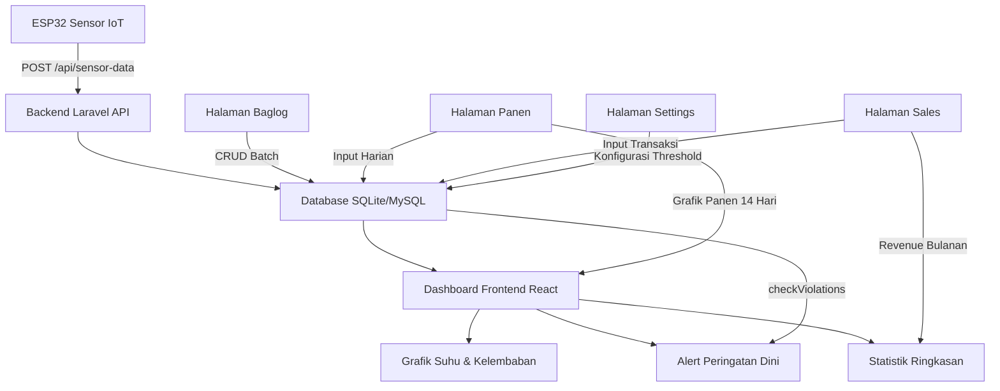

# Dokumentasi Sistem: Smart Shroom Supply Chain Management (SCM)

## Daftar Isi
1. [Pendahuluan](#1-pendahuluan)
2. [Arsitektur Sistem](#2-arsitektur-sistem)
3. [Metodologi Pengembangan (SDLC)](#3-metodologi-pengembangan-sdlc)
4. [Halaman Login & Otorisasi](#4-halaman-login--otorisasi)
5. [Halaman Dashboard (Beranda)](#5-halaman-dashboard-beranda)
6. [Halaman Baglog Management](#6-halaman-baglog-management)
7. [Halaman Harvests (Rekap Panen)](#7-halaman-harvests-rekap-panen)
8. [Halaman Sales (Penjualan)](#8-halaman-sales-penjualan)
9. [Halaman Settings (Pengaturan Threshold)](#9-halaman-settings-pengaturan-threshold)
10. [Sidebar & Navigasi](#10-sidebar--navigasi)
11. [Hubungan Antar Modul & Relevansi TA](#11-hubungan-antar-modul--relevansi-ta)
12. [Ringkasan Fitur & Kebutuhan Fungsional (FR)](#12-ringkasan-fitur--kebutuhan-fungsional-fr)

---

## 1. Pendahuluan

### 1.1 Nama Sistem
**Smart Shroom SCM** — Sistem Manajemen Rantai Pasok Jamur Kuping Berbasis IoT

### 1.2 Tujuan Sistem
Sistem ini dibangun sebagai produk utama **Tugas Akhir (TA)** bidang Sistem Informasi, dengan tujuan:
1. **Memantau iklim mikro kumbung** (suhu, kelembapan, CO2, cahaya) secara *real-time* menggunakan sensor IoT (ESP32).
2. **Mengelola siklus hidup baglog** — dari pencatatan batch masuk, pemantauan umur, hingga deteksi kontaminasi.
3. **Mencatat dan menganalisis data panen harian** — termasuk tren produksi 2 minggu terakhir.
4. **Mengelola transaksi penjualan** — pencatatan pembeli, harga, kuantitas, dan perhitungan *revenue* otomatis.
5. **Memberikan peringatan dini (early warning)** — jika parameter iklim keluar dari ambang batas optimal yang sudah dikonfigurasi.

### 1.3 Konteks TA
Sistem ini menjawab rumusan masalah utama dalam TA, yaitu:
> *"Bagaimana merancang dan mengimplementasikan sistem informasi berbasis web dan IoT untuk mendigitalisasi proses monitoring dan manajemen rantai pasok budidaya jamur kuping?"*

---

## 2. Arsitektur Sistem

### 2.1 Tech Stack

| Layer | Teknologi | Alasan Pemilihan |
|---|---|---|
| **Frontend** | React 18 + TypeScript + Vite | SPA cepat, type-safe, hot-reload untuk pengembangan |
| **UI Framework** | TailwindCSS (Harmonious Modern Sage Green & Dark Mode) | Desain modern ergonomis, palet hijau sage `#244b37`, border halus `#d6e9df`, support Dark Mode lengkap |
| **Micro-Animations** | RAF & GPU-Accelerated CSS Transitions | Count-up 60 FPS (`AnimatedNumber`), jarum rotasi gauge GPU (`SemiCircleGauge`), progress bar dinamis (`AnimatedProgressBar`) |
| **State Management** | Zustand (Auth & Toast) + TanStack Query (Server State) | Lightweight, performa tinggi, tidak perlu Redux |
| **Backend** | Laravel 12 (PHP) | Framework MVC terlengkap, Eloquent ORM, Sanctum Auth |
| **Database** | SQLite (Dev) → PostgreSQL / Supabase (Production) | Ringan saat development, scalable & reliable saat deploy |
| **IoT Hardware** | ESP32 DevKit V1 + 3x DHT22 + BH1750 + MQ-135 | Formasi Segitiga Diagonal, Weighted Sensor Fusion, Wi-Fi built-in |
| **Komunikasi IoT** | HTTP REST API (Stateless) | Efisien, mudah didebug, tidak butuh message broker tambahan |

### 2.2 Pola Arsitektur Backend

```
Controller → Service → Repository → Model (Eloquent)
```

*   **Controller**: Menerima HTTP request, memanggil Service, mengembalikan JSON response.
*   **Service**: Berisi business logic (perhitungan, validasi lanjutan, agregasi data).
*   **Repository**: Abstraksi akses database (query builder, Eloquent).
*   **Model**: Representasi tabel database, definisi relasi, dan helper methods.

### 2.3 Diagram Alur Data

```
ESP32 (Sensor) ──HTTP POST──→ Laravel API ──Validasi──→ Database (SQLite/MySQL)
                                    ↓
                              React Frontend ←──HTTP GET──→ REST API Endpoints
                                    ↓
                              Dashboard (Grafik, Tabel, Notifikasi)
```

---

## 3. Metodologi Pengembangan (SDLC)

Sistem ini dikembangkan menggunakan metodologi **Agile Software Development** (khususnya pendekatan *Iterative & Incremental*). Pemilihan metode Agile didasarkan pada kebutuhan pengembangan yang adaptif dan berfokus pada kualitas kode (*Clean Code*). 

Karakteristik SDLC Agile yang diterapkan pada project TA ini:
1. **Iterative Development:** Fitur dikembangkan secara bertahap (sprint/iterasi). Misalnya: Modul IoT diselesaikan terlebih dahulu, kemudian modul Baglog, dilanjutkan dengan visualisasi Chart di Dashboard.
2. **Test-Driven / Automated Testing:** Mengadopsi prinsip *Extreme Programming (XP)* di mana setiap logika bisnis (seperti pengecekan threshold atau kalkulasi revenue) divalidasi menggunakan *Automated Testing* (terdapat 115 skenario *PHPUnit test* dengan 299 assertions yang 100% *pass*).
3. **Adaptive to Change:** Saat ada perubahan *requirement* (contoh: transisi visual ke Harmonious Sage Green, adaptasi downsampling 6 jam per 5 menit, penambahan paginasi per 10 baris), perubahan dapat langsung diimplementasikan tanpa merusak modul lain berkat arsitektur yang *decoupled* (terpisah).

---

## 4. Halaman Login & Otorisasi

### 4.1 Tujuan
Mengamankan akses ke sistem agar hanya pengguna terotorisasi yang bisa mengelola data budidaya.

### 4.2 Mekanisme
*   Menggunakan **Laravel Sanctum** (Token-based SPA Authentication).
*   Setelah login berhasil, token disimpan di `localStorage` melalui Zustand store.
*   Setiap request API dilampiri header `Authorization: Bearer <token>`.

### 4.3 Peran (Role)

| Role | Hak Akses |
|---|---|
| **Admin** | Akses penuh: Dashboard, Baglog, Panen, Penjualan, Settings (Threshold) |
| **Worker** | Akses terbatas: Dashboard, Baglog (view only), Panen (input & view) |

### 4.4 Hubungan dengan TA
Membuktikan implementasi **keamanan sistem informasi** melalui autentikasi dan otorisasi berbasis role. Ini menjawab kebutuhan non-fungsional: *"Sistem harus membatasi akses berdasarkan peran pengguna."*

---

## 5. Halaman Dashboard (Beranda)

Halaman utama sistem yang merangkum seluruh kondisi kumbung dan performa bisnis dalam satu tampilan.

### 5.1 Komponen: Indikator Real-time (4 Card KPI dengan Micro-Animations)

| Card | Indikator Visual | Sumber Data | Interval Refresh | Deskripsi |
|---|---|---|---|---|
| 🌡️ **Suhu Saat Ini** | `SemiCircleGauge` (Needle Sweep) + `AnimatedNumber` | `GET /api/sensor-data/latest` | 30 detik | Suhu rata-rata tertimbang (3x DHT22) dalam °C, min 15 max 35 dengan jarum rotasi GPU |
| 💧 **Kelembapan** | `SemiCircleGauge` (Needle Sweep) + `AnimatedNumber` | `GET /api/sensor-data/latest` | 30 detik | Kelembapan relatif rata-rata (%), min 40 max 100 dengan indikator zona optimal |
| 📦 **Baglog Aktif** | `AnimatedProgressBar` + `AnimatedNumber` | `GET /api/dashboard/stats` | 1 menit | Total unit baglog produktif berstatus "active" terhadap kapasitas kumbung (3.000 unit) |
| 🍄 **Panen Hari Ini** | `AnimatedProgressBar` + `AnimatedNumber` | `GET /api/dashboard/stats` | 1 menit | Realisasi panen hari ini (KG) terhadap target harian operasional 15 KG |

**Hubungan dengan TA:** Ke-4 card ini memenuhi **FR-1.1** (Real-time Climate Cards) dan **FR-1.3** (Quick Stats). Dilengkapi animasi count-up 60 FPS menggunakan `requestAnimationFrame` dan `easeOutCubic`, serta rotasi jarum gauge CSS hardware-accelerated yang halus tanpa lag.

### 5.2 Komponen: Banner Peringatan (Alert System)

*   **Tujuan:** Jika suhu/kelembapan melampaui batas threshold, banner peringatan muncul secara otomatis di atas Dashboard.
*   **Logika:** Backend mengevaluasi `ThresholdSetting::checkViolations()` yang membandingkan data sensor terbaru dengan parameter aktif yang dikonfigurasi Admin.
*   **Skenario:**
    *   Suhu > `temp_max` → `Suhu Kritis! XX°C melebihi batas YY°C`
    *   Kelembapan < `humidity_min` → `Kelembaban Rendah! XX% di bawah batas YY%`
*   **Endpoint:** Data alert disisipkan dalam response `GET /api/dashboard/stats` dan `POST /api/sensor-data`.

**Hubungan dengan TA:** Implementasi **Early Warning System (EWS)** — menjawab: *"Sistem dapat memberikan notifikasi dini saat parameter lingkungan menyimpang dari standar budidaya."*

### 5.3 Komponen: Grafik Riwayat Mikroklimat (Recharts Area Chart dengan Adaptive Downsampling)

*   **Tipe:** Area Chart dengan kurva halus `monotone`, gradient warna hijau tua `#244b37` dan aksen status iklim.
*   **Selector Rentang Waktu:** 
    *   **6 Jam:** Agregasi per 5 menit (~72 data point) — resolusi tinggi untuk memantau siklus misting & fan terbaru.
    *   **12 Jam:** Agregasi per 10 menit (~72 data point).
    *   **24 Jam:** Agregasi per 15 menit (~96 data point) — tren diurnal siang/malam.
    *   **7 Hari:** Agregasi per 60 menit (~168 data point) — analisis tren mingguan makro.
*   **Sumber Data:** `GET /api/sensor-data/chart?hours=6|12|24|168`.
*   **Optimasi Backend (SQL Downsampling):** Menggunakan agregasi bucket waktu SQL pada `SensorDataRepository.php` sehingga payload berkurang >95% dan latensi query terpangkas dari ~400ms menjadi ~14ms.
*   **Batas Optimal:** Reference band horizontal hijau muda pada rentang ideal jamur kuping (24°C–32°C dan 80%–95%).

**Hubungan dengan TA:** Memenuhi **FR-1.2** (Adaptive Climate History Analytics). Petani dapat menganalisis respons mikroklimat terhadap cuaca luar dan jadwal penyiraman tanpa membebani browser atau server.

### 5.5 Komponen: Panen Hari Ini (Big Number Card)

*   **Tipe:** Card angka besar (5xl font).
*   **Sumber:** Agregasi `SUM(weight_kg)` dari tabel `harvests` dimana `harvest_date = today`.
*   **Keterangan Bawah:** Timestamp terakhir update.

**Hubungan dengan TA:** Menampilkan KPI utama harian petani — *"Berapa total berat panen hari ini?"*

### 5.6 Komponen: Grafik Panen Harian (14 Hari Terakhir)

*   **Tipe:** Bar Chart (warna hijau).
*   **Sumber:** `GET /harvests/chart?days=14` — agregasi `GROUP BY harvest_date, SUM(weight_kg)`.
*   **Logika:** Hari tanpa panen tetap ditampilkan dengan nilai 0 agar konteks waktu tidak hilang.
*   **Keterangan Bawah:** *"Data diambil dari modul Harvest (FR-3.1)"*

**Hubungan dengan TA:** Memenuhi **FR-3.1** (Harvest Analytics). Memberikan *insight* tren produktivitas mingguan — apakah panen cenderung naik, turun, atau stabil.

### 5.7 Komponen: Tabel Batch Penanaman Aktif

*   **Kolom:** Kode Batch, Tanggal Tanam, Umur (Hari), Jumlah Baglog, Supplier.
*   **Sumber:** `BaglogBatch::where('status', 'active')` (3 batch terakhir).
*   **Indikator Umur:** Hijau jika < 30 hari, Kuning jika ≥ 30 hari (mendekati masa panen).

**Hubungan dengan TA:** Memenuhi **FR-2.1** (Baglog Lifecycle). Membantu petani memantau umur baglog tanpa harus buka halaman terpisah.

### 5.8 Komponen: Log Aktivitas Kontrol Otomatis (Aktuator)

*   **Kolom:** Waktu Kejadian, Aktuator (Misting/Fan), Pemicu Nyala (Trigger ON), Durasi Nyala (detik), Kondisi Akhir (Status / Stop Reason).
*   **Sumber:** Tabel `sprinkler_logs` (10 log terakhir).
*   **Pemicu Nyala:** Menjelaskan secara spesifik alasan aktuator aktif (misal: `Kelembaban Rendah (76.8% < 80%)` atau `Suhu Kritis (33.2°C > 32°C)`).
*   **Kondisi Akhir:** Menjelaskan alasan aktuator berhenti (misal: `Target tercapai` atau `Safety timeout`).

**Hubungan dengan TA:** Memenuhi **FR-4.2** (Actuator Logging & Audit Trail). Mencatat jejak aktivitas seluruh aktuator kumbung secara transparan dan akuntabel.

---

## 6. Halaman Baglog Management

### 6.1 Tujuan
Mengelola siklus hidup baglog (media tanam) mulai dari kedatangan hingga pembuangan.

### 6.2 Fitur

| Fitur | Deskripsi | Role |
|---|---|---|
| **Tabel Batch & Paginasi** | Menampilkan seluruh data batch baglog dengan **Paginasi 10 baris per halaman**, tab filter status (Semua, Aktif, Kontaminasi, Dibuang), dan search bar real-time | Admin, Worker |
| **Kartu Ringkasan Siklus** | 4 card metrik: Total Batch Terdaftar, Baglog Aktif, Afkir & Kontaminasi, Rata-rata Umur Baglog (dengan `AnimatedNumber`) | Admin, Worker |
| **Indikator Visual Umur** | Progress bar umur miselium (Hijau: muda <30 hari, Kuning: produktif 30–90 hari, Merah: afkir >90 hari) | Admin, Worker |
| **Tambah Batch Baru** | Modal input: tanggal masuk, jumlah baglog, supplier bibit, lokasi rak, catatan fisik | Admin only |
| **Ubah Status Siklus** | Tombol aksi cepat: "Tandai Kontaminasi" atau "Tandai Dibuang / Afkir" | Admin only |
| **Kode Batch Otomatis** | Format: `BL-YYYYMMDD-XXX` (auto-generated di backend) | System |

### 6.3 Lifecycle Status

```
Active → Contaminated → Disposed
  ↓
 (Panen berhasil)
  ↓
Disposed
```

### 6.4 Hubungan dengan TA
Memenuhi **FR-2.x** (Baglog Lifecycle Management). Menjawab: *"Bagaimana mendigitalisasi pencatatan dan pelacakan status media tanam jamur?"*

---

## 7. Halaman Harvests (Rekap Panen)

### 7.1 Tujuan
Mencatat hasil panen harian dari setiap batch baglog yang aktif dan menganalisis produktivitas petik.

### 7.2 Fitur

| Fitur | Deskripsi | Role |
|---|---|---|
| **Tabel Riwayat & Paginasi** | Tabel riwayat panen dengan **Paginasi 10 baris per halaman**, filter rentang waktu (Hari Ini, Minggu Ini, Bulan Ini, Semua), dan pencarian kode batch | Admin, Worker |
| **4 Kartu Metrik Panen** | Panen Hari Ini (terhadap target 15 KG), Total Panen Bulan Ini, Estimasi Nilai Panen (Rp 25.000/KG), Rata-rata per Sesi Petik (dengan `AnimatedNumber` & `AnimatedProgressBar`) | Admin, Worker |
| **Grafik Tren Panen 14 Hari** | Recharts Area Chart interaktif menampilkan akumulasi bobot panen harian selama 2 minggu terakhir | Admin, Worker |
| **Input Panen Harian** | Modal formulir: tanggal panen, pilih batch baglog aktif (dropdown), berat bersih (KG), dan catatan grade | Admin, Worker |
| **Auto-Invalidate** | Setelah input panen berhasil, query cache TanStack Query otomatis merefresh data Dashboard dan grafik panen | System |

### 7.3 Hubungan dengan TA
Memenuhi **FR-3.x** (Harvest Data Collection & Analytics). Menjawab: *"Bagaimana mencatat data panen secara akurat dan mengintegrasikannya dengan modul lain?"*

---

## 8. Halaman Sales (Penjualan)

### 8.1 Tujuan
Mencatat transaksi penjualan jamur kuping ke berbagai mitra pembeli, termasuk rekapitulasi keuangan dan volume terserap pasar.

### 8.2 Fitur

| Fitur | Deskripsi | Role |
|---|---|---|
| **Tabel Penjualan & Paginasi** | Tabel riwayat penjualan dengan **Paginasi 10 baris per halaman**, status lunas, dan sorting tanggal | Admin |
| **4 Kartu Metrik Keuangan** | Omzet Bulan Ini (Rp IDR), Volume Terjual (KG), Jumlah Transaksi, Rata-rata Harga/KG (dengan `AnimatedNumber`) | Admin |
| **Chip Rekomendasi Cepat** | Rekomendasi mitra pembeli rutin 1-klik (Pak Joko - Pasar Induk, Ibu Dewi - Toko Sayur, Bu Sari - Resto) | Admin |
| **Grafik Dual-Axis Penjualan** | Recharts Area/Bar Chart menampilkan korelasi volume penjualan (KG) terhadap total pendapatan (Rp) harian | Admin |
| **Input Transaksi Penjualan** | Modal input: tanggal transaksi, nama mitra pembeli, kuantitas (KG), harga per KG, kalkulasi total otomatis | Admin only |

### 8.3 Perhitungan Revenue
```
total_revenue = quantity_kg × price_per_kg
```
*   Menggunakan fungsi `bcmul()` (arbitrary-precision arithmetic) di backend agar tidak ada *floating-point error*.
*   Tipe data di database: `DECIMAL(12,2)`.

### 8.4 Hubungan dengan TA
Memenuhi **FR-3.x** (Sales & Revenue SCM). Menjawab: *"Bagaimana sistem menyediakan informasi keuangan (revenue) secara akurat untuk pengambilan keputusan bisnis?"*

---

## 9. Halaman Settings (Pengaturan Threshold)

### 9.1 Tujuan
Mengonfigurasi batas ambang (threshold) parameter iklim yang menjadi dasar sistem peringatan dini (EWS).

### 9.2 Parameter yang Dikonfigurasi

| Parameter | Default | Satuan | Penjelasan |
|---|---|---|---|
| `temp_min` | 24.00 | °C | Suhu minimum untuk jamur kuping |
| `temp_max` | 32.00 | °C | Suhu maksimum |
| `humidity_min` | 80.00 | % | Kelembapan minimum |
| `humidity_max` | 95.00 | % | Kelembapan maksimum |

### 9.3 Mekanisme
1. Admin mengubah nilai threshold melalui form di halaman Settings.
2. Backend menyimpan ke tabel `threshold_settings`.
3. Setiap kali Dashboard di-refresh, `DashboardService` memanggil `checkViolations()` yang membandingkan data sensor terbaru dengan threshold aktif.
4. Jika ada pelanggaran, alert ditampilkan di Dashboard.

### 9.4 Hubungan dengan TA
Memenuhi **FR-1.4** (Configurable Threshold). Menjawab: *"Bagaimana Admin dapat mengatur parameter optimal iklim tanpa harus mengubah kode program?"*

---

## 10. Sidebar & Navigasi

### 10.1 Fitur Sidebar
*   **Collapsible:** Sidebar bisa di-*collapse* (icon-only mode) untuk memperluas area konten. State disimpan di `localStorage`.
*   **Responsive:** Di mobile, sidebar berubah menjadi overlay yang diakses melalui tombol hamburger (☰).
*   **Role-aware:** Menu "Sales" dan "Settings" hanya muncul untuk role Admin.

### 10.2 Komponen Header
*   **Jam Real-time:** Menampilkan waktu WIB terkini (update per detik) dengan format: `HH:MM:SS - Hari, DD Bln YYYY`.

---

## 11. Hubungan Antar Modul & Relevansi TA

### 11.1 Diagram Keterhubungan



### 11.2 Alur Bisnis End-to-End

1. **Input Awal:** Admin mendaftarkan batch baglog baru (Halaman Baglog).
2. **Monitoring:** Sensor IoT mengirim data iklim setiap 5 menit → Dashboard menampilkan grafik + alert.
3. **Panen:** Worker mencatat hasil panen harian (Halaman Panen) → data mengalir ke Dashboard (card + chart).
4. **Penjualan:** Admin mencatat transaksi jual (Halaman Sales) → revenue terakumulasi di Dashboard.
5. **Evaluasi:** Admin membandingkan tren panen (bar chart 14 hari) dengan kondisi iklim (line chart suhu/kelembaban) untuk mengevaluasi korelasi iklim terhadap produktivitas.

### 11.3 Kontribusi Ilmiah untuk TA
Sistem ini membuktikan bahwa integrasi **IoT + Sistem Informasi + Manajemen Rantai Pasok** dapat:
*   **Meningkatkan efisiensi** → data tercatat otomatis, bukan manual di buku.
*   **Mengurangi risiko kerugian** → peringatan dini mencegah kerusakan jamur akibat iklim ekstrem.
*   **Mendukung pengambilan keputusan** → dashboard visual membantu petani memahami pola tanpa harus menganalisis angka mentah.

---

## 12. Ringkasan Fitur & Kebutuhan Fungsional (FR)

| Kode FR | Kebutuhan Fungsional | Modul/Halaman | Status |
|---|---|---|---|
| FR-1.1 | Menampilkan data iklim terbaru dengan `SemiCircleGauge` & count-up | Dashboard — 4 Card KPI | ✅ Selesai |
| FR-1.2 | Riwayat iklim multirentang (6h/12h/24h/7d) dengan SQL downsampling | Dashboard — Recharts Area Chart | ✅ Selesai |
| FR-1.3 | Ringkasan produktivitas harian (Baglog Aktif & Panen Hari Ini) | Dashboard — Metrik & Progress | ✅ Selesai |
| FR-1.4 | Konfigurasi ambang batas iklim & preset fase pertumbuhan | Settings — Threshold Configuration | ✅ Selesai |
| FR-2.1 | CRUD data batch baglog (Kode unik auto-generated) | Baglog Management | ✅ Selesai |
| FR-2.2 | Pelacakan status lifecycle baglog & indikator visual umur | Baglog Management | ✅ Selesai |
| FR-2.3 | Manajemen tabel baglog dengan paginasi per 10 baris | Baglog Management — Table & Filters | ✅ Selesai |
| FR-3.1 | Pencatatan hasil panen & visualisasi grafik tren 14 hari | Harvests + Dashboard | ✅ Selesai |
| FR-3.2 | Tabel panen dengan paginasi per 10 baris & kartu ringkasan | Harvests — Table & Metrics | ✅ Selesai |
| FR-3.3 | Pencatatan transaksi penjualan & chip mitra rekomendasi | Sales Management | ✅ Selesai |
| FR-3.4 | Tabel penjualan dengan paginasi per 10 & grafik dual-axis | Sales Management — Table & Chart | ✅ Selesai |
| FR-4.1 | Endpoint penerimaan data IoT (Rate limit 20 req/menit) | API `POST /api/sensor-data` | ✅ Selesai |
| FR-4.2 | Logging aktivitas aktuator misting dan fan | API `POST /api/sprinkler-logs` + Dashboard | ✅ Selesai |
| FR-4.3 | Otomasi kendali cerdas Firmware v3.5 (Sensor Fusion & Histeresis) | ESP32 Firmware + Simulator | ✅ Selesai |
| NFR-1 | Autentikasi & otorisasi berbasis role (Admin vs Worker) | Login + Sanctum Token | ✅ Selesai |
| NFR-2 | Rate limiting endpoint publik (Anti-DDoS) | Throttle Middleware | ✅ Selesai |
| NFR-3 | Validasi ketat terhadap input data (Anti-Injeksi) | FormRequest Classes | ✅ Selesai |
| NFR-4 | Presisi data keuangan & pengukuran (`DECIMAL`) | Model + Database Migration | ✅ Selesai |
| NFR-5 | Automated Testing (115 test cases, 299 assertions) | PHPUnit (Feature + Unit 100% Pass) | ✅ Selesai |

---

> **Catatan:** Dokumen ini dapat digunakan sebagai referensi untuk menyusun **Bab 3 (Perancangan Sistem)** dan **Bab 4 (Implementasi & Pengujian)** pada laporan Tugas Akhir.
