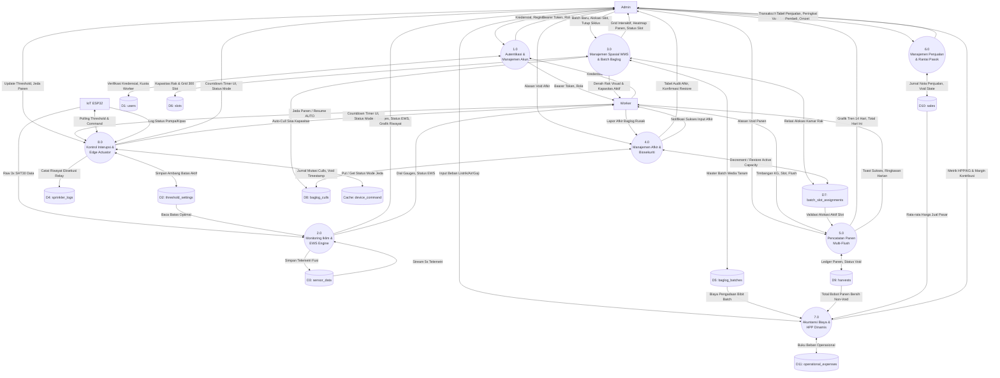
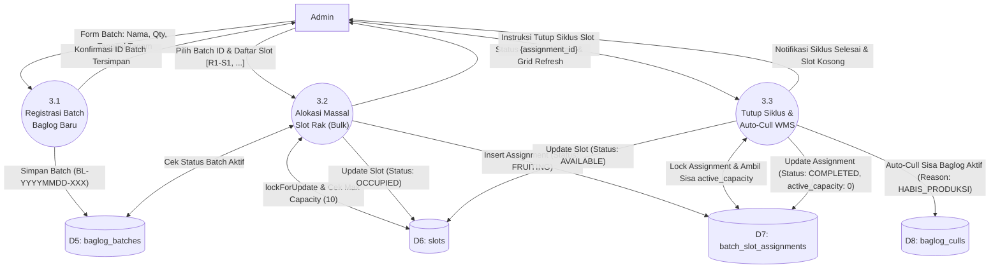
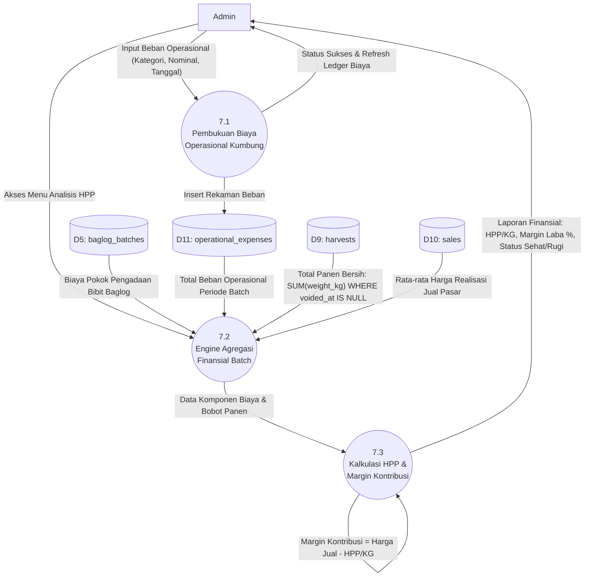

# Spesifikasi Data Flow Diagram (DFD) — Smart Shroom SCM 🍄

**Judul Tugas Akhir:** *Sistem Informasi Supply Chain Management dan Spasial WMS pada Kumbung Jamur Terintegrasi dengan Otomasi dan Monitoring Mikroklimat IoT*  
**Dokumen:** Analisis Aliran Data Sistem (Data Flow Diagram / DFD Level 0, Level 1, Level 2 & Data Dictionary)  
**Referensi Terkait:** [docs/use_case.md](file:///d:/DevTools/Antigravity/Projects/TA_vio/docs/use_case.md) | [docs/sequence_diagram.md](file:///d:/DevTools/Antigravity/Projects/TA_vio/docs/sequence_diagram.md) | [docs/erd.md](file:///d:/DevTools/Antigravity/Projects/TA_vio/docs/erd.md)  
**Penyusun:** Benedictus Vio  
**Standar Rekayasa:** Ponytail Lean Spec (Zero-Bloat, Anti-Bab 1-5 Skripsi, 100% Pure Information Flow & Data Stores)

---

## 1. Notasi & Entitas Sistem

Diagram Aliran Data (DFD) ini menggunakan notasi hibrida terstandarisasi (Gane-Sarson & Yourdon-DeMarco) yang merefleksikan arsitektur riil aplikasi:

| Komponen DFD | Simbol / Notasi | Keterangan & Representasi Sistem |
|---|---|---|
| **External Entity** (Terminator) | Kotak Persegi `[ ... ]` | Sumber data (*source*) atau tujuan akhir informasi (*sink*): Admin, Worker, IoT ESP32, Pembeli. |
| **Process** (Proses Transformasi) | Lingkaran / Rounded Box `(( ... ))` | Logika pengolahan data pada backend Laravel & frontend controller. |
| **Data Store** (Penyimpanan Data) | Silinder / Open Box `[( ... )]` | Tabel database MySQL/SQLite atau memori cache aktif. |
| **Data Flow** (Aliran Data) | Garis Panah Berarah `-->|...|` | Paket data, formulir HTTP payload, respons JSON, atau telemetri sensor. |

### Identifikasi Entitas Luar (External Entities)
1. **Admin (Pemilik Kumbung)**: Pengelola utama hak akses penuh (pengadaan batch, alokasi spasial, tutup siklus, void audit trail, threshold, HPP, registrasi).
2. **Worker (Pekerja Kumbung)**: Pelaksana harian operasional (input panen, input afkir culls, jeda panen, monitoring iklim).
3. **Perangkat IoT (ESP32)**: Aktor edge otomatis non-manusia (pengirim fusi 3x sensor SHT30 vertikal, poller threshold & command jeda, pengirim log aktuator).
4. **Pembeli / Mitra Pasar (Entitas Logistik)**: Pihak eksternal penerima pasokan jamur kuping (pedagang pasar, toko sayur, resto).

---

## 2. DFD Level 0: Diagram Konteks (Context Diagram)

Diagram konteks mendefinisikan batasan sistem (*system boundary*) secara holistik, memetakan seluruh aliran data masuk dan keluar antara entitas luar dan sistem pusat **0.0 Smart Shroom SCM**.

```mermaid
flowchart TD
    %% External Entities
    Admin["fa:fa-user-tie Admin (Pemilik Kumbung)"]
    Worker["fa:fa-user-gear Worker (Pekerja Lapangan)"]
    ESP32["fa:fa-microchip Perangkat IoT ESP32 (Edge)"]
    Buyer["fa:fa-store Pembeli / Mitra Pasar"]

    %% Core System Process
    System(("0.0<br/><b>Sistem Informasi<br/>Smart Shroom SCM</b>"))

    %% Admin Inflows
    Admin -->|"Kredensial Login, Data Akun Pekerja"| System
    Admin -->|"Konfigurasi Ambang Batas Iklim & Preset"| System
    Admin -->|"Data Pengadaan Batch Baglog Baru"| System
    Admin -->|"Perintah Alokasi Spasial Slot Rak 3D (WMS)"| System
    Admin -->|"Instruksi Tutup Siklus Rak & Auto-Cull"| System
    Admin -->|"Instruksi Voiding Transaksi (Harvest/Sale/Cull)"| System
    Admin -->|"Data Beban Operasional Kumbung (Listrik/Air/TK)"| System
    Admin -->|"Pencatatan Nota Penjualan Jamur"| System

    %% Admin Outflows
    System -->|"Token Sesi Sanctum, Status Autentikasi"| Admin
    System -->|"Dashboard Ringkasan 4 Kartu KPI & EWS Alert"| Admin
    System -->|"Visualisasi Denah Spasial 300 Slot & Heatmap"| Admin
    System -->|"Laporan Finansial: HPP Dinamis & Margin Laba"| Admin
    System -->|"Tabel Riwayat Ledger Audit Trail (Soft Voided)"| Admin

    %% Worker Inflows
    Worker -->|"Kredensial Login"| System
    Worker -->|"Data Timbangan Panen Harian (Slot & Flush)"| System
    Worker -->|"Data Mutasi Afkir Baglog (Penyebab Rusak)"| System
    Worker -->|"Perintah Interupsi Jeda Panen (2h/4h/6h/8h)"| System
    Worker -->|"Perintah Resume ke Mode AUTO"| System

    %% Worker Outflows
    System -->|"Token Sesi, Hak Akses Operasional"| Worker
    System -->|"Status Mikroklimat Real-Time & Peringatan EWS"| Worker
    System -->|"Denah Rak Visual & Status Kapasitas Aktif"| Worker
    System -->|"Status Countdown Timer Failsafe Jeda Panen"| Worker

    %% ESP32 Inflows
    ESP32 -->|"Data Fusi Sensor Vertikal (3x SHT30 IP68)"| System
    ESP32 -->|"Log Aktivitas Aktuator (Relay Misting & Fan)"| System

    %% ESP32 Outflows
    System -->|"Konfigurasi Threshold Aktif (Temp/Humidity)"| ESP32
    System -->|"Perintah Status Mode Perangkat (PAUSE/AUTO)"| ESP32

    %% Buyer Interaction
    System -->|"Nota & Rincian Faktur Penjualan Jamur"| Buyer
    Buyer -->|"Pembayaran & Konfirmasi Pesanan"| Admin
```

---

## 3. DFD Level 1: Dekomposisi Proses Utama

DFD Level 1 memecah sistem pusat menjadi 8 subsistem fungsional terisolasi yang berinteraksi langsung dengan 11 Data Store database:

---

## 4. DFD Level 2: Dekomposisi Proses Kritis

### 4.1 DFD Level 2 — Proses 3.0: Manajemen Spasial WMS & Siklus Rak (UC-08, UC-19, UC-29)
Membedah interaksi kompleks alokasi kamar rak 3D, kunci atomik kapasitas, dan penutupan siklus panen.

---

### 4.2 DFD Level 2 — Proses 7.0: Akuntansi Biaya Manajerial & HPP Dinamis (UC-22, UC-23)
Membedah kalkulasi Harga Pokok Produksi dinamis yang mengisolasi data transaksi ter-void.

---

## 5. Kamus Data Aliran Informasi (Data Dictionary)

Spesifikasi struktur data pada arus informasi utama sistem:

| Arus Data | Sumber & Tujuan | Format & Struktur Atribut |
|---|---|---|
| `TelemetriSensor` | ESP32 $\rightarrow$ P2.0 $\rightarrow$ `sensor_data` | `{temp_top: Float, temp_mid: Float, temp_bottom: Float, humidity_avg: Float, heat_index: Float, created_at: Timestamp}` |
| `BatasThreshold` | Admin $\rightarrow$ P8.0 $\rightarrow$ `threshold_settings` | `{temp_min: Float, temp_max: Float, humidity_min: Float, humidity_max: Float, phase_preset: String}` *(Syarat: `humidity_max - humidity_min >= 4`)* |
| `CommandJeda` | User $\rightarrow$ P8.0 $\rightarrow$ `Cache` $\rightarrow$ ESP32 | `{command: Enum('AUTO','PAUSE'), duration_seconds: Int, expires_at: Timestamp}` |
| `AlokasiSlot` | Admin $\rightarrow$ P3.2 $\rightarrow$ `batch_slot_assignments` | `{baglog_batch_id: Int, assigned_at: Date, slots: Array<{slot_code: String, initial_quantity: Int, initial_mycelium_stage: Enum}>}` |
| `JurnalAfkir` | User $\rightarrow$ P4.0 $\rightarrow$ `baglog_culls` | `{slot_code: String, quantity: Int, reason: Enum('TRICHODERMA','CONTAMINATED','DRIED','HABIS_PRODUKSI'), notes: String}` |
| `VoidRequest` | Admin $\rightarrow$ P4.0 / P5.0 / P6.0 | `{id: Int, void_reason: String(min: 3), void_by: Int, voided_at: Timestamp}` |
| `DataPanen` | Worker $\rightarrow$ P5.0 $\rightarrow$ `harvests` | `{slot_code: String, flush_number: Int(1-7), weight_kg: Decimal(8,2), quality_grade: Enum('SUPER','GRADE_A','AFKIR')}` |
| `NotaPenjualan` | Admin $\rightarrow$ P6.0 $\rightarrow$ `sales` | `{buyer_name: String, quantity_kg: Decimal(8,2), price_per_kg: Decimal(12,2), payment_method: String, total_amount: Decimal}` |
| `RingkasanHPP` | P7.3 $\rightarrow$ Admin UI | `{batch_id: Int, total_procurement_cost: Decimal, total_opex: Decimal, net_harvest_kg: Decimal, cogs_per_kg: Decimal, margin_profit_pct: Float}` |

---

## 6. Matriks Relasi DFD vs Use Case vs Data Store

Traceability menyeluruh untuk menjamin validitas rekayasa perangkat lunak tanpa inkonsistensi:

| ID DFD | Nama Proses DFD | Kode Use Case Terkait | Data Store yang Terlibat |
|---|---|---|---|
| **1.0** | Autentikasi & Akun | UC-01, UC-02, UC-03 | `D1: users` |
| **2.0** | Monitoring Iklim & EWS | UC-04, UC-05, UC-06 | `D2: threshold_settings`, `D3: sensor_data` |
| **3.0** | Spasial WMS 3D & Siklus | UC-08, UC-09, UC-10, UC-19, UC-20, UC-29 | `D5: baglog_batches`, `D6: slots`, `D7: batch_slot_assignments`, `D8: baglog_culls` |
| **4.0** | Mutasi Afkir & Biosekuriti | UC-21, UC-28 | `D7: batch_slot_assignments`, `D8: baglog_culls` |
| **5.0** | Pencatatan Panen Multi-Flush | UC-11, UC-12, UC-14, UC-26 | `D7: batch_slot_assignments`, `D9: harvests` |
| **6.0** | Manajemen Penjualan | UC-13, UC-27 | `D10: sales` |
| **7.0** | Akuntansi HPP Dinamis | UC-22, UC-23 | `D5: baglog_batches`, `D9: harvests`, `D10: sales`, `D11: operational_expenses` |
| **8.0** | Kontrol Failsafe & Aktuator | UC-15, UC-16, UC-17, UC-18, UC-24, UC-25 | `D2: threshold_settings`, `D4: sprinkler_logs`, `Cache: device_command` |
