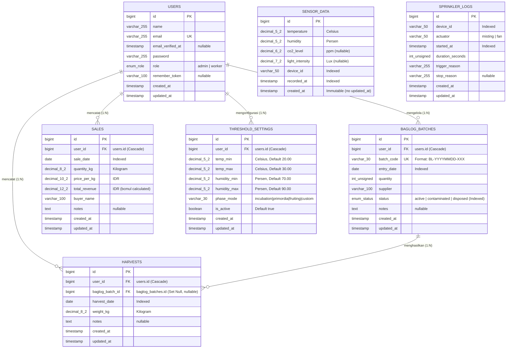

# Entity Relationship Diagram (ERD) — Smart Shroom SCM 🍄

**Dokumen:** Desain Basis Data & Kamus Data (*Database Design & Data Dictionary*)  
**Proyek:** Smart Shroom Supply Chain Management (SCM) Berbasis IoT  
**Konteks:** Tugas Akhir Program Studi Sistem Informasi  
**Penyusun:** Benedictus Vio  
**Database Engine:** SQLite (Development / Testing) & PostgreSQL / Supabase (Production)  
**Terakhir Diperbarui:** September 2026  

---

## 1. Pendahuluan & Prinsip Desain Database

Perancangan basis data **Smart Shroom SCM** menerapkan prinsip **Database First** dan **Zero Spaghetti Architecture** untuk menjamin integritas data, konsistensi kalkulasi finansial, serta keandalan penyimpanan deret waktu (*time-series*) dari perangkat IoT.

### Prinsip Utama yang Diterapkan:
1. **Presisi Finansial & Pengukuran (No Floating-Point Error):**
   - Seluruh kolom moneter (`price_per_kg`, `total_revenue`) dan metrik lingkungan (`temperature`, `humidity`, `weight_kg`) menggunakan tipe data `DECIMAL`, **bukan `FLOAT` atau `DOUBLE`**, guna mencegah *rounding error* pada saat agregasi pendapatan dan analisis mikroklimat.
2. **Immutabilitas Data Sensor (Audit-Proof Time Series):**
   - Tabel `sensor_data` bersifat *append-only* (tidak memiliki kolom `updated_at`). Sekali data telemetri tercatat dari ESP32, data tersebut menjadi rekaman historis permanen yang tidak dapat dimanipulasi.
3. **Strategi Pengindeksan (Query Optimization):**
   - Menerapkan *Single-Column Index* dan *Composite Index* pada foreign key (`user_id`), kolom penanggalan (`entry_date`, `harvest_date`, `sale_date`), serta timestamp sensor (`recorded_at`, `[device_id, recorded_at]`) untuk menjamin latensi query dashboard tetap di bawah 100ms.
4. **Normalisasi Penuh (3NF):**
   - Struktur database telah memenuhi kaidah Bentuk Normal Ketiga (3NF) guna mengeliminasi anomali penyisipan (*insertion*), pembaruan (*update*), dan penghapusan (*deletion*).

---

## 2. Diagram ERD Konseptual & Fisikal (Mermaid)

---

## 3. Kamus Data Rinci (Data Dictionary)

Berikut rincian spesifikasi struktur tabel, tipe data, *constraints*, dan indeks:

### 3.1 Tabel `users`
Menyimpan identitas dan hak akses akun pengelola kumbung (Admin) dan buruh tani (Worker).

| Nama Kolom | Tipe Data | Nullable | Default | Constraints / Index | Keterangan |
|---|---|:---:|:---:|:---:|---|
| `id` | `BIGINT UNSIGNED` | ❌ | Auto Increment | **Primary Key** | Identifier unik pengguna. |
| `name` | `VARCHAR(255)` | ❌ | — | — | Nama lengkap pengguna. |
| `email` | `VARCHAR(255)` | ❌ | — | **Unique** | Alamat surel untuk otentikasi. |
| `email_verified_at` | `TIMESTAMP` | ✅ | `NULL` | — | Waktu verifikasi email. |
| `password` | `VARCHAR(255)` | ❌ | — | — | Hash kata sandi (`bcrypt`). |
| `role` | `ENUM('admin','worker')`| ❌ | `'worker'` | — | Peran pengguna (RBAC). Kuota: 1 Admin, 5 Worker. |
| `remember_token` | `VARCHAR(100)` | ✅ | `NULL` | — | Token persistensi sesi. |
| `created_at` | `TIMESTAMP` | ✅ | `NULL` | — | Waktu akun dibuat. |
| `updated_at` | `TIMESTAMP` | ✅ | `NULL` | — | Waktu akun terakhir diperbarui. |

---

### 3.2 Tabel `baglog_batches`
Mencatat kelompok media tanam (*baglog*) jamur kuping yang didatangkan dari supplier beserta siklus hidupnya.

| Nama Kolom | Tipe Data | Nullable | Default | Constraints / Index | Keterangan |
|---|---|:---:|:---:|:---:|---|
| `id` | `BIGINT UNSIGNED` | ❌ | Auto Increment | **Primary Key** | Identifier unik batch baglog. |
| `user_id` | `BIGINT UNSIGNED` | ❌ | — | **Foreign Key** → `users(id)` (Cascade), **Index** | Admin yang mencatat batch. |
| `batch_code` | `VARCHAR(30)` | ❌ | — | **Unique** | Kode batch auto-generated (`BL-YYYYMMDD-XXX`). |
| `entry_date` | `DATE` | ❌ | — | **Index** | Tanggal baglog masuk kumbung (basis hitung umur). |
| `quantity` | `INT UNSIGNED` | ❌ | — | — | Jumlah kantong baglog dalam batch. |
| `supplier` | `VARCHAR(100)` | ❌ | — | — | Nama pemasok media tanam. |
| `status` | `ENUM('active','contaminated','disposed')` | ❌ | `'active'` | **Index** | Status siklus hidup media tanam. |
| `notes` | `TEXT` | ✅ | `NULL` | — | Catatan kondisi fisik media tanam. |
| `created_at` | `TIMESTAMP` | ✅ | `NULL` | — | Waktu pencatatan batch. |
| `updated_at` | `TIMESTAMP` | ✅ | `NULL` | — | Waktu status batch terakhir diubah. |

* **Composite Index:** `[user_id, status]` untuk query cepat filter batch aktif milik admin tertentu.
* *Catatan:* Umur baglog (`age_days`) dihitung secara dinamis melalui Eloquent Model Accessor `diffInDays(now())` dari `entry_date`, bukan kolom tersimpan (mencegah *stale data*).

---

### 3.3 Tabel `harvests`
Mencatat hasil panen harian komoditas jamur kuping basah.

| Nama Kolom | Tipe Data | Nullable | Default | Constraints / Index | Keterangan |
|---|---|:---:|:---:|:---:|---|
| `id` | `BIGINT UNSIGNED` | ❌ | Auto Increment | **Primary Key** | Identifier unik pencatatan panen. |
| `user_id` | `BIGINT UNSIGNED` | ❌ | — | **Foreign Key** → `users(id)` (Cascade), **Index** | Pekerja/Admin yang menginput data. |
| `baglog_batch_id` | `BIGINT UNSIGNED` | ✅ | `NULL` | **Foreign Key** → `baglog_batches(id)` (Set Null) | Batch baglog sumber panen (opsional). |
| `harvest_date` | `DATE` | ❌ | — | **Index** | Tanggal pemetikan panen dilakukan. |
| `weight_kg` | `DECIMAL(8,2)` | ❌ | — | — | Berat hasil panen dalam Kilogram (Presisi 2 desimal). |
| `notes` | `TEXT` | ✅ | `NULL` | — | Catatan kualitas panen / cuaca. |
| `created_at` | `TIMESTAMP` | ✅ | `NULL` | — | Waktu rekaman panen disimpan. |
| `updated_at` | `TIMESTAMP` | ✅ | `NULL` | — | Waktu modifikasi rekaman panen. |

* **Composite Indexes:**
  - `[user_id, harvest_date]`: Query agregasi total panen harian per pengguna.
  - `[baglog_batch_id, harvest_date]`: Evaluasi tren produktivitas panen per batch baglog.

---

### 3.4 Tabel `sales`
Mencatat data transaksi penjualan jamur kuping kepada tengkulak atau pembeli pasar.

| Nama Kolom | Tipe Data | Nullable | Default | Constraints / Index | Keterangan |
|---|---|:---:|:---:|:---:|---|
| `id` | `BIGINT UNSIGNED` | ❌ | Auto Increment | **Primary Key** | Identifier unik transaksi penjualan. |
| `user_id` | `BIGINT UNSIGNED` | ❌ | — | **Foreign Key** → `users(id)` (Cascade), **Index** | Admin yang mencatat transaksi. |
| `sale_date` | `DATE` | ❌ | — | **Index** | Tanggal transaksi penjualan. |
| `quantity_kg` | `DECIMAL(8,2)` | ❌ | — | — | Kuantitas jamur terjual dalam Kilogram. |
| `price_per_kg` | `DECIMAL(10,2)`| ❌ | — | — | Harga satuan per Kilogram dalam Rupiah (IDR). |
| `total_revenue` | `DECIMAL(12,2)`| ❌ | — | — | Total pendapatan kotor (IDR), dihitung di backend. |
| `buyer_name` | `VARCHAR(100)` | ❌ | — | — | Nama tengkulak atau pihak pembeli. |
| `notes` | `TEXT` | ✅ | `NULL` | — | Catatan tambahan transaksi. |
| `created_at` | `TIMESTAMP` | ✅ | `NULL` | — | Waktu transaksi dibuat. |
| `updated_at` | `TIMESTAMP` | ✅ | `NULL` | — | Waktu transaksi diubah. |

* **Composite Index:** `[user_id, sale_date]` untuk filtrasi performa omset bulanan/mingguan.
* **Kaidah Bisnis Backend:** `total_revenue` dihitung wajib melalui `bcmul($quantity_kg, $price_per_kg, 2)` di Service Layer untuk menghindari floating arithmetic inaccuracy.

---

### 3.5 Tabel `threshold_settings`
Menyimpan konfigurasi batas ambang keamanan iklim mikro kumbung jamur kuping.

| Nama Kolom | Tipe Data | Nullable | Default | Constraints / Index | Keterangan |
|---|---|:---:|:---:|:---:|---|
| `id` | `BIGINT UNSIGNED` | ❌ | Auto Increment | **Primary Key** | Identifier unik konfigurasi threshold. |
| `user_id` | `BIGINT UNSIGNED` | ❌ | — | **Foreign Key** → `users(id)` (Cascade), **Index** | Admin pemilik konfigurasi. |
| `temp_min` | `DECIMAL(5,2)` | ❌ | `20.00` | — | Batas bawah suhu aman (°C). |
| `temp_max` | `DECIMAL(5,2)` | ❌ | `30.00` | — | Batas atas suhu aman (°C). |
| `humidity_min`| `DECIMAL(5,2)` | ❌ | `70.00` | — | Batas bawah kelembapan aman (%). |
| `humidity_max`| `DECIMAL(5,2)` | ❌ | `90.00` | — | Batas atas kelembapan aman (%). |
| `phase_mode` | `VARCHAR(30)` | ❌ | `'fruiting'` | — | Fase pertumbuhan: `incubation`, `primordia`, `fruiting`, `custom`. |
| `is_active` | `BOOLEAN` | ❌ | `true` | — | Penanda threshold aktif (hanya 1 aktif). |
| `created_at` | `TIMESTAMP` | ✅ | `NULL` | — | Waktu pembuatan pengaturan. |
| `updated_at` | `TIMESTAMP` | ✅ | `NULL` | — | Waktu pembaruan pengaturan. |

---

### 3.6 Tabel `sensor_data`
Menyimpan payload data telemetri iklim mikro deret waktu (*time-series*) yang dikirimkan oleh ESP32.

| Nama Kolom | Tipe Data | Nullable | Default | Constraints / Index | Keterangan |
|---|---|:---:|:---:|:---:|---|
| `id` | `BIGINT UNSIGNED` | ❌ | Auto Increment | **Primary Key** | Identifier unik log sensor. |
| `temperature` | `DECIMAL(5,2)` | ❌ | — | — | Pembacaan suhu aktual (°C) dari DHT22. |
| `humidity` | `DECIMAL(5,2)` | ❌ | — | — | Pembacaan kelembapan aktual (%) dari DHT22. |
| `co2_level` | `DECIMAL(6,2)` | ✅ | `NULL` | — | Konsentrasi CO2 aktual (ppm) jika terpasang. |
| `light_intensity`|`DECIMAL(7,2)`| ✅ | `NULL` | — | Intensitas cahaya aktual (Lux) dari BH1750. |
| `device_id` | `VARCHAR(50)` | ❌ | — | **Index** | Identifier mikrokontroler (misal: `ESP32-KUMBUNG-01`). |
| `recorded_at` | `TIMESTAMP` | ❌ | — | **Index** | Cap waktu pembacaan fisik sensor dari RTC DS3231. |
| `created_at` | `TIMESTAMP` | ❌ | `CURRENT_TIMESTAMP` | — | Waktu paket data diterima server. |

* **Composite Index:** `[device_id, recorded_at]` untuk query rentang grafik 24 jam terakhir.
* **Immutabilitas Data:** Tabel ini **tidak memiliki `updated_at`**. Setiap record baru bersifat *read-only* setelah disimpan.

---

### 3.7 Tabel `sprinkler_logs`
Mencatat histori durasi dan alasan pemicuan aktuator penyiraman kabut (*misting pump*) atau kipas (*fan*) oleh ESP32.

| Nama Kolom | Tipe Data | Nullable | Default | Constraints / Index | Keterangan |
|---|---|:---:|:---:|:---:|---|
| `id` | `BIGINT UNSIGNED` | ❌ | Auto Increment | **Primary Key** | Identifier unik log aktuator. |
| `device_id` | `VARCHAR(50)` | ❌ | — | **Index** | ID mikrokontroler pengirim log. |
| `actuator` | `VARCHAR(50)` | ❌ | `'misting'` | — | Jenis aktuator: `misting`, `fan`. |
| `started_at` | `TIMESTAMP` | ❌ | — | **Index** | Waktu aktuator mulai diaktifkan. |
| `duration_seconds`|`INT UNSIGNED`| ❌ | — | — | Lama aktuator bekerja (dalam detik). |
| `trigger_reason`| `VARCHAR(255)` | ❌ | — | — | Alasan pemicuan (misal: *"Kelembapan 62% < Min 70%"*). |
| `stop_reason` | `VARCHAR(255)` | ✅ | `NULL` | — | Kondisi pematian (misal: *"Target tercapai"*, *"Safety timeout"*). |
| `created_at` | `TIMESTAMP` | ✅ | `NULL` | — | Waktu log tersimpan di server. |
| `updated_at` | `TIMESTAMP` | ✅ | `NULL` | — | Waktu modifikasi status log. |

---

## 4. Bukti Normalisasi Database (1NF s/d 3NF)

Sistem basis data ini dirancang mengikuti tahapan normalisasi relational formal:

### 1. Bentuk Normal Pertama (1NF)
- Seluruh tabel tidak memiliki atribut bernilai ganda (*repeating groups* / *multivalued attributes*).
- Setiap atribut menyimpan nilai yang bersifat atomik (contoh: berat panen, suhu, kuantitas baglog tersimpan secara mandiri).
- Setiap tabel telah memiliki Primary Key unik (`id`).

### 2. Bentuk Normal Kedua (2NF)
- Telah memenuhi kriteria 1NF.
- Seluruh Primary Key berstatus kunci tunggal (`id`), sehingga tidak ada ketergantungan parsial (*partial functional dependency*). Semua atribut non-kunci bergantung penuh pada Primary Key masing-masing.

### 3. Bentuk Normal Ketiga (3NF)
- Telah memenuhi kriteria 2NF.
- Tidak terdapat ketergantungan transitif (*transitive functional dependency*).
  - Umur baglog (`age_days`) **tidak dibuatkan kolom fisik** di database melainkan dikomputasi saat runtime melalui `entry_date` ke tanggal saat ini.
  - Sisa stok jamur mingguan **tidak disimpan statis**, melainkan diagregasikan secara dinamis dari `SUM(harvests.weight_kg) - SUM(sales.quantity_kg)`.
  - Data batch baglog tidak mencatat data profil admin secara redundan, melainkan merujuk ke foreign key `user_id`.

---

## 5. Pertahanan Sidang & Karakteristik Arsitektur (FAQ Dosen)

| Pertanyaan Dosen Penguji | Argumen Teknis & Jawaban Akademis |
|---|---|
| *"Kenapa tabel `sensor_data` dan `sprinkler_logs` tidak punya Foreign Key ke tabel `users`?"* | Perangkat IoT ESP32 adalah *Edge Device* otonom tanpa identitas user sesi web. Mengaitkan data sensor langsung ke `users` melanggar prinsip *Decoupling Architecture*. Data sensor diidentifikasi oleh `device_id` yang merepresentasikan fisik kumbung, bukan akun personal. |
| *"Kenapa tidak menggunakan tipe data FLOAT untuk menghemat kapasitas storage?"* | Standar IEEE 754 pada tipe `FLOAT` menghasilkan *binary representation error* (contoh: `0.1 + 0.2 = 0.30000000000000004`). Dalam sistem akuntansi rantai pasok dan kontrol mikroklimat jamur kuping, ketidakakuratan ini dapat merusak rekonsiliasi kas dan pemicuan aktuator. Tipe `DECIMAL` memberikan kepastian *fixed-point precision*. |
| *"Mengapa `baglog_batch_id` di tabel `harvests` dibuat Nullable?"* | Untuk mengakomodasi skenario operasional lapangan (*edge cases*): buruh tani yang memanen kadang mencampur hasil panen dari beberapa rak kumbung tanpa mencatat nomor batch asal. Sistem tetap harus mampu membukukan total berat panen tanpa membatalkan transaksi. |
| *"Kenapa tabel `sensor_data` tidak memiliki kolom `updated_at`?"* | Data pembacaan fisik lingkungan bersifat *Immutable Event Stream*. Membuka peluang modifikasi terhadap raw sensor data membuka celah manipulasi data audit iklim kumbung. |
