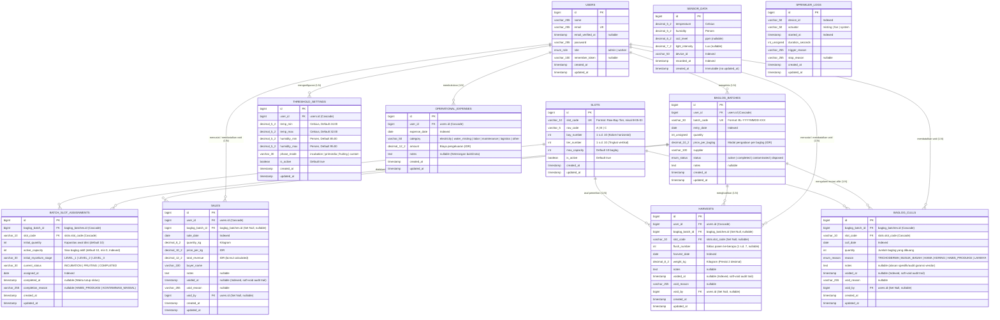

# Entity Relationship Diagram (ERD) — Smart Shroom SCM 🍄

**Judul Tugas Akhir:** *Sistem Informasi Supply Chain Management dan Spasial WMS pada Kumbung Jamur Terintegrasi dengan Otomasi dan Monitoring Mikroklimat IoT*  
**Dokumen:** Desain Basis Data & Kamus Data (*Database Design & Data Dictionary*)  
**Konteks:** Tugas Akhir Program Studi Sistem Informasi  
**Penyusun:** Benedictus Vio  
**Database Engine:** SQLite (Development / Testing) & PostgreSQL / Supabase (Production)  
**Terakhir Diperbarui:** Oktober 2026 (Sinkronisasi WMS Fase A–D, Voiding Ledger Audit Trail, HPP Dinamis, & IoT Rule Engine)  

---

## 1. Pendahuluan & Prinsip Desain Database

Perancangan basis data **Smart Shroom SCM** menerapkan prinsip **Database First** dan **Zero Spaghetti Architecture** untuk menjamin integritas data, konsistensi kalkulasi finansial, serta keandalan penyimpanan deret waktu (*time-series*) dari perangkat IoT.

### Prinsip Utama yang Diterapkan:
1. **Presisi Finansial & Pengukuran (No Floating-Point Error):**
   - Seluruh kolom moneter (`price_per_kg`, `price_per_baglog`, `total_revenue`, `amount`) dan metrik lingkungan (`temperature`, `humidity`, `weight_kg`) menggunakan tipe data `DECIMAL`, **bukan `FLOAT` atau `DOUBLE`**, guna mencegah *rounding error* pada saat agregasi pendapatan, perhitungan HPP, dan analisis mikroklimat.
2. **Pemisahan Entitas Fisik vs Dinamis (Warehouse Management System):**
   - **Slot / Rak** adalah entitas statis permanen (`slots`), sedangkan **Batch Baglog** adalah entitas dinamis yang menempati slot melalui tabel pivot alokasi (`batch_slot_assignments`). Mutasi antar rak dilarang demi ketertelusuran biosekuriti.
3. **Pencatatan Berbasis Ledger Imutabel & Soft-Void Audit Trail:**
   - Pengurangan populasi jamur tidak dilakukan dengan mengedit angka total secara manual, melainkan dicatat melalui jurnal mutasi afkir (`baglog_culls`).
   - Pembatalan transaksi (*human error*) pada panen, penjualan, dan afkir dilarang menggunakan hard-delete (`DELETE FROM`), melainkan menerapkan **Voiding Ledger Pattern** (`voided_at`, `void_reason`, `void_by`) demi menjaga kepatuhan audit biosekuriti dan rekonsiliasi akuntansi.
   - Data sensor telemetri (`sensor_data`) bersifat *append-only* tanpa kolom `updated_at`.
4. **Strategi Pengindeksan (Query Optimization):**
   - Menerapkan *Single-Column Index* dan *Composite Index* pada foreign key (`user_id`, `baglog_batch_id`), kolom penanggalan (`entry_date`, `harvest_date`, `sale_date`, `cull_date`, `expense_date`), koordinat slot (`slot_code`), status pembatalan (`voided_at`), serta timestamp sensor (`recorded_at`, `[device_id, recorded_at]`) untuk menjamin latensi query dashboard tetap sub-100ms.
5. **Normalisasi Penuh (3NF) & High-Performance Spatial Read:**
   - Struktur database telah memenuhi kaidah Bentuk Normal Ketiga (3NF). Kolom `active_capacity` pada `batch_slot_assignments` disinkronkan secara atomik berbasis database transaction (`DB::transaction`) dengan `lockForUpdate()` saat mutasi afkir/penyelesaian siklus guna mempercepat rendering denah spasial 300 slot secara instan.

---

## 2. Diagram ERD Konseptual & Fisikal (Mermaid)

```mermaid
erDiagram
    USERS ||--o{ BAGLOG_BATCHES : "mengelola (1:N)"
    USERS ||--o{ HARVESTS : "mencatat / membatalkan void (1:N)"
    USERS ||--o{ SALES : "mencatat / membatalkan void (1:N)"
    USERS ||--o{ BAGLOG_CULLS : "membatalkan void (1:N)"
    USERS ||--o{ THRESHOLD_SETTINGS : "mengonfigurasi (1:N)"
    USERS ||--o{ OPERATIONAL_EXPENSES : "membukukan (1:N)"

    BAGLOG_BATCHES ||--o{ BATCH_SLOT_ASSIGNMENTS : "dialokasikan ke (1:N)"
    SLOTS ||--o{ BATCH_SLOT_ASSIGNMENTS : "ditempati oleh (1:N)"

    BAGLOG_BATCHES ||--o{ BAGLOG_CULLS : "mengalami mutasi afkir (1:N)"
    SLOTS ||--o{ BAGLOG_CULLS : "lokasi afkir (1:N)"

    BAGLOG_BATCHES ||--o{ HARVESTS : "menghasilkan (1:N)"
    SLOTS ||--o{ HARVESTS : "asal pemetikan (1:N)"

    BAGLOG_BATCHES ||--o{ SALES : "sumber stok penjualan (1:N)"

    USERS {
        bigint id PK
        varchar_255 name
        varchar_255 email UK
        timestamp email_verified_at "nullable"
        varchar_255 password
        enum_role role "admin | worker"
        varchar_100 remember_token "nullable"
        timestamp created_at
        timestamp updated_at
    }

    SLOTS {
        bigint id PK
        varchar_10 slot_code UK "Format: Row-Bay-Tier, misal B-05-03"
        varchar_5 row_code "A | B | C"
        int bay_number "1 s.d. 10 (Kolom horizontal)"
        int tier_number "1 s.d. 10 (Tingkat vertikal)"
        int max_capacity "Default 10 baglog"
        boolean is_active "Default true"
        timestamp created_at
        timestamp updated_at
    }

    BAGLOG_BATCHES {
        bigint id PK
        bigint user_id FK "users.id (Cascade)"
        varchar_30 batch_code UK "Format: BL-YYYYMMDD-XXX"
        date entry_date "Indexed"
        int_unsigned quantity
        decimal_10_2 price_per_baglog "Modal pengadaan per baglog (IDR)"
        varchar_100 supplier
        enum_status status "active | completed | contaminated | disposed"
        text notes "nullable"
        timestamp created_at
        timestamp updated_at
    }

    BATCH_SLOT_ASSIGNMENTS {
        bigint id PK
        bigint baglog_batch_id FK "baglog_batches.id (Cascade)"
        varchar_10 slot_code FK "slots.slot_code (Cascade)"
        int initial_quantity "Kapasitas awal diisi (default 10)"
        int active_capacity "Sisa baglog aktif (default 10, min 0, Indexed)"
        varchar_30 initial_mycelium_stage "LEVEL_1 | LEVEL_2 | LEVEL_3"
        varchar_30 current_status "INCUBATION | FRUITING | COMPLETED"
        date assigned_at "Indexed"
        timestamp completed_at "nullable (Waktu tutup siklus)"
        varchar_255 completion_reason "nullable (HABIS_PRODUKSI | KONTAMINASI_MASSAL)"
        timestamp created_at
        timestamp updated_at
    }

    BAGLOG_CULLS {
        bigint id PK
        bigint baglog_batch_id FK "baglog_batches.id (Cascade)"
        varchar_10 slot_code FK "slots.slot_code (Cascade)"
        date cull_date "Indexed"
        int quantity "Jumlah baglog yang dibuang"
        enum_reason reason "TRICHODERMA | BUSUK_BASAH | HAMA | KERING | HABIS_PRODUKSI | LAINNYA"
        text notes "nullable (alasan spesifik/audit garansi vendor)"
        timestamp voided_at "nullable (Indexed, soft-void audit trail)"
        varchar_255 void_reason "nullable"
        bigint void_by FK "users.id (Set Null, nullable)"
        timestamp created_at
        timestamp updated_at
    }

    HARVESTS {
        bigint id PK
        bigint user_id FK "users.id (Cascade)"
        bigint baglog_batch_id FK "baglog_batches.id (Set Null, nullable)"
        varchar_10 slot_code FK "slots.slot_code (Set Null, nullable)"
        int flush_number "Siklus panen ke-berapa (1 s.d. 7, nullable)"
        date harvest_date "Indexed"
        decimal_8_2 weight_kg "Kilogram (Presisi 2 desimal)"
        text notes "nullable"
        timestamp voided_at "nullable (Indexed, soft-void audit trail)"
        varchar_255 void_reason "nullable"
        bigint void_by FK "users.id (Set Null, nullable)"
        timestamp created_at
        timestamp updated_at
    }

    SALES {
        bigint id PK
        bigint user_id FK "users.id (Cascade)"
        bigint baglog_batch_id FK "baglog_batches.id (Set Null, nullable)"
        date sale_date "Indexed"
        decimal_8_2 quantity_kg "Kilogram"
        decimal_10_2 price_per_kg "IDR"
        decimal_12_2 total_revenue "IDR (bcmul calculated)"
        varchar_100 buyer_name
        text notes "nullable"
        timestamp voided_at "nullable (Indexed, soft-void audit trail)"
        varchar_255 void_reason "nullable"
        bigint void_by FK "users.id (Set Null, nullable)"
        timestamp created_at
        timestamp updated_at
    }

    OPERATIONAL_EXPENSES {
        bigint id PK
        bigint user_id FK "users.id (Cascade)"
        date expense_date "Indexed"
        varchar_50 category "electricity | water_misting | labor | maintenance | logistics | other"
        decimal_12_2 amount "Biaya pengeluaran (IDR)"
        text notes "nullable (Keterangan bukti/nota)"
        timestamp created_at
        timestamp updated_at
    }

    THRESHOLD_SETTINGS {
        bigint id PK
        bigint user_id FK "users.id (Cascade)"
        decimal_5_2 temp_min "Celsius, Default 24.00"
        decimal_5_2 temp_max "Celsius, Default 32.00"
        decimal_5_2 humidity_min "Persen, Default 85.00"
        decimal_5_2 humidity_max "Persen, Default 95.00"
        varchar_30 phase_mode "incubation | primordia | fruiting | custom"
        boolean is_active "Default true"
        timestamp created_at
        timestamp updated_at
    }

    SENSOR_DATA {
        bigint id PK
        decimal_5_2 temperature "Celsius"
        decimal_5_2 humidity "Persen"
        decimal_6_2 co2_level "ppm (nullable)"
        decimal_7_2 light_intensity "Lux (nullable)"
        varchar_50 device_id "Indexed"
        timestamp recorded_at "Indexed"
        timestamp created_at "Immutable (no updated_at)"
    }

    SPRINKLER_LOGS {
        bigint id PK
        varchar_50 device_id "Indexed"
        varchar_50 actuator "misting | fan | system"
        timestamp started_at "Indexed"
        int_unsigned duration_seconds
        varchar_255 trigger_reason
        varchar_255 stop_reason "nullable"
        timestamp created_at
        timestamp updated_at
    }
```

---

## 3. Kamus Data Rinci (Data Dictionary)

### 3.1 Tabel `users`
Menyimpan identitas dan hak akses akun pengelola kumbung (Admin) dan buruh tani (Worker).

| Nama Kolom | Tipe Data | Nullable | Default | Constraints / Index | Keterangan |
|---|---|:---:|:---:|:---:|---|
| `id` | `BIGINT UNSIGNED` | ❌ | Auto Increment | **Primary Key** | Identifier unik pengguna. |
| `name` | `VARCHAR(255)` | ❌ | — | — | Nama lengkap pengguna. |
| `email` | `VARCHAR(255)` | ❌ | — | **Unique** | Alamat surel untuk otentikasi. |
| `email_verified_at` | `TIMESTAMP` | ✅ | `NULL` | — | Waktu verifikasi email. |
| `password` | `VARCHAR(255)` | ❌ | — | — | Hash kata sandi (`bcrypt`). |
| `role` | `ENUM('admin','worker')`| ❌ | `'worker'` | — | Peran pengguna (RBAC). Kuota: 1 Admin, 5 Worker. |
| `remember_token` | `VARCHAR(100)` | ✅ | `NULL` | — | Token persistensi sesi. |
| `created_at` | `TIMESTAMP` | ✅ | `NULL` | — | Waktu akun dibuat. |
| `updated_at` | `TIMESTAMP` | ✅ | `NULL` | — | Waktu akun terakhir diperbarui. |

---

### 3.2 Tabel `slots` (Master Koordinat Spasial WMS)
Menyimpan denah ruang fisik kumbung 3D berbasis koordinat Kartesius: **Row-Bay-Tier**.

| Nama Kolom | Tipe Data | Nullable | Default | Constraints / Index | Keterangan |
|---|---|:---:|:---:|:---:|---|
| `id` | `BIGINT UNSIGNED` | ❌ | Auto Increment | **Primary Key** | Identifier unik slot fisik. |
| `slot_code` | `VARCHAR(10)` | ❌ | — | **Unique**, **Index** | Kode koordinat baku (misal: `B-05-03`). |
| `row_code` | `VARCHAR(5)` | ❌ | — | **Index** | Lorong/Rak: `A`, `B`, atau `C`. |
| `bay_number` | `INT` | ❌ | — | — | Kolom horizontal seksi rak (1 s.d. 10). |
| `tier_number` | `INT` | ❌ | — | — | Tingkat rak vertikal (1 di dasar s.d. 10 di atap). |
| `max_capacity` | `INT` | ❌ | `10` | — | Kapasitas fisik slot (standar 10 baglog). |
| `is_active` | `BOOLEAN` | ❌ | `true` | — | Status rak layak pakai/rusak. |
| `created_at` | `TIMESTAMP` | ✅ | `NULL` | — | Waktu slot didaftarkan. |
| `updated_at` | `TIMESTAMP` | ✅ | `NULL` | — | Waktu pembaruan data slot. |

* **Total Kapasitas Fisik Kumbung:** 3 Baris × 10 Kolom × 10 Tingkat = **300 Slot** = **3.000 Baglog**.

---

### 3.3 Tabel `baglog_batches`
Mencatat kelompok pengadaan media tanam (*baglog*) beserta modal awal per biji dan siklus hidupnya.

| Nama Kolom | Tipe Data | Nullable | Default | Constraints / Index | Keterangan |
|---|---|:---:|:---:|:---:|---|
| `id` | `BIGINT UNSIGNED` | ❌ | Auto Increment | **Primary Key** | Identifier unik batch baglog. |
| `user_id` | `BIGINT UNSIGNED` | ❌ | — | **Foreign Key** → `users(id)` (Cascade), **Index** | Admin yang mencatat batch. |
| `batch_code` | `VARCHAR(30)` | ❌ | — | **Unique** | Kode batch unik (`BL-YYYYMMDD-XXX`). |
| `entry_date` | `DATE` | ❌ | — | **Index** | Tanggal baglog masuk kumbung (basis hitung umur). |
| `quantity` | `INT UNSIGNED` | ❌ | — | — | Jumlah kantong baglog dalam batch. |
| `price_per_baglog` | `DECIMAL(10,2)` | ❌ | `0.00` | — | Modal awal per biji baglog (basis kalkulasi HPP). |
| `supplier` | `VARCHAR(100)` | ❌ | — | — | Nama pemasok media tanam. |
| `status` | `ENUM(...)` | ❌ | `'active'` | **Index** | Status: `active`, `completed`, `contaminated`, `disposed`. |
| `notes` | `TEXT` | ✅ | `NULL` | — | Catatan kondisi fisik media tanam. |
| `created_at` | `TIMESTAMP` | ✅ | `NULL` | — | Waktu pencatatan batch. |
| `updated_at` | `TIMESTAMP` | ✅ | `NULL` | — | Waktu modifikasi batch. |

---

### 3.4 Tabel `batch_slot_assignments` (Pivot Alokasi WMS)
Menghubungkan batch baglog ke koordinat slot kamar fisik kumbung.

| Nama Kolom | Tipe Data | Nullable | Default | Constraints / Index | Keterangan |
|---|---|:---:|:---:|:---:|---|
| `id` | `BIGINT UNSIGNED` | ❌ | Auto Increment | **Primary Key** | Identifier unik alokasi slot. |
| `baglog_batch_id` | `BIGINT UNSIGNED` | ❌ | — | **Foreign Key** → `baglog_batches(id)` (Cascade) | Batch yang menempati slot. |
| `slot_code` | `VARCHAR(10)` | ❌ | — | **Foreign Key** → `slots(slot_code)` (Cascade) | Koordinat rak yang ditempati. |
| `initial_quantity` | `INT` | ❌ | `10` | — | Jumlah baglog yang diletakkan saat awal alokasi. |
| `active_capacity` | `INT` | ❌ | `10` | **Index** | Sisa baglog aktif di slot (min 0). Disinkronkan atomik saat afkir/tutup siklus. |
| `initial_mycelium_stage`| `VARCHAR(30)` | ❌ | `'LEVEL_2'` | — | Tahap miselium awal (`LEVEL_1`, `LEVEL_2`, `LEVEL_3`). |
| `current_status` | `VARCHAR(30)` | ❌ | `'INCUBATION'`| — | Status kamar: `INCUBATION`, `FRUITING`, `COMPLETED`. |
| `assigned_at` | `DATE` | ❌ | — | **Index** | Tanggal baglog dimasukkan ke rak. |
| `completed_at` | `TIMESTAMP` | ✅ | `NULL` | — | Waktu siklus rak dinyatakan selesai/tutup siklus. |
| `completion_reason`| `VARCHAR(255)` | ✅ | `NULL` | — | Alasan tutup siklus (`HABIS_PRODUKSI`, `KONTAMINASI_MASSAL`, `AFKIR_TOTAL`, `MANUAL`). |
| `created_at` | `TIMESTAMP` | ✅ | `NULL` | — | Waktu rekaman alokasi dibuat. |
| `updated_at` | `TIMESTAMP` | ✅ | `NULL` | — | Waktu status alokasi diperbarui. |

* **Sinkronisasi Kapasitas Aktif Slot (Atomic Persistence & Accessor):**
  - Kolom fisik `active_capacity` disimpan terindeks di database guna memastikan rendering visualisasi 300 slot sub-50ms tanpa N+1 query.
  - Saat tutup siklus (`POST /api/batch-slot-assignments/{id}/complete`), jika masih ada sisa `active_capacity > 0`, sistem otomatis menerbitkan record `baglog_culls` bertipe `HABIS_PRODUKSI` dan mereset `active_capacity = 0`.

---

### 3.5 Tabel `baglog_culls` (Ledger Pengurangan / Kematian Baglog)
Jurnal audit pengurangan kapasitas baglog akibat kontaminasi atau kematian fisik media tanam.

| Nama Kolom | Tipe Data | Nullable | Default | Constraints / Index | Keterangan |
|---|---|:---:|:---:|:---:|---|
| `id` | `BIGINT UNSIGNED` | ❌ | Auto Increment | **Primary Key** | Identifier unik rekaman afkir. |
| `baglog_batch_id` | `BIGINT UNSIGNED` | ❌ | — | **Foreign Key** → `baglog_batches(id)` (Cascade) | Batch baglog asal. |
| `slot_code` | `VARCHAR(10)` | ❌ | — | **Foreign Key** → `slots(slot_code)` (Cascade) | Koordinat rak asal baglog busuk. |
| `cull_date` | `DATE` | ❌ | — | **Index** | Tanggal penemuan & pembuangan afkir. |
| `quantity` | `INT` | ❌ | — | — | Jumlah baglog afkir yang dibuang. |
| `reason` | `ENUM(...)` | ❌ | — | — | Alasan: `TRICHODERMA`, `BUSUK_BASAH`, `HAMA`, `KERING`, `HABIS_PRODUKSI`, `LAINNYA`. |
| `notes` | `TEXT` | ✅ | `NULL` | — | Keterangan tambahan untuk klaim garansi vendor. |
| `voided_at` | `TIMESTAMP` | ✅ | `NULL` | **Index** | Waktu pembatalan afkir (*Soft-void audit trail*). |
| `void_reason` | `VARCHAR(255)` | ✅ | `NULL` | — | Alasan pembatalan catatan afkir. |
| `void_by` | `BIGINT UNSIGNED` | ✅ | `NULL` | **Foreign Key** → `users(id)` (Set Null) | Admin/User yang membatalkan catatan afkir. |
| `created_at` | `TIMESTAMP` | ✅ | `NULL` | — | Waktu entri dicatat. |
| `updated_at` | `TIMESTAMP` | ✅ | `NULL` | — | Waktu pembaruan entri. |

---

### 3.6 Tabel `harvests`
Mencatat hasil panen harian, dilengkapi nomor flush siklus panen dan koordinat slot asal pemetikan (Heatmap Produktivitas).

| Nama Kolom | Tipe Data | Nullable | Default | Constraints / Index | Keterangan |
|---|---|:---:|:---:|:---:|---|
| `id` | `BIGINT UNSIGNED` | ❌ | Auto Increment | **Primary Key** | Identifier unik panen. |
| `user_id` | `BIGINT UNSIGNED` | ❌ | — | **Foreign Key** → `users(id)` (Cascade), **Index** | Pekerja/Admin pencatat panen. |
| `baglog_batch_id` | `BIGINT UNSIGNED` | ✅ | `NULL` | **Foreign Key** → `baglog_batches(id)` (Set Null) | Batch baglog sumber panen. |
| `slot_code` | `VARCHAR(10)` | ✅ | `NULL` | **Foreign Key** → `slots(slot_code)` (Set Null) | Koordinat slot asal pemetikan. |
| `flush_number` | `INT` | ✅ | `1` | — | Siklus petik ke-berapa (1 s.d. 7). |
| `harvest_date` | `DATE` | ❌ | — | **Index** | Tanggal pemetikan panen dilakukan. |
| `weight_kg` | `DECIMAL(8,2)` | ❌ | — | — | Berat hasil panen dalam Kilogram (Presisi 2 desimal). |
| `notes` | `TEXT` | ✅ | `NULL` | — | Catatan kualitas panen / cuaca. |
| `voided_at` | `TIMESTAMP` | ✅ | `NULL` | **Index** | Waktu pembatalan panen (*Soft-void audit trail*). |
| `void_reason` | `VARCHAR(255)` | ✅ | `NULL` | — | Alasan pembatalan data panen. |
| `void_by` | `BIGINT UNSIGNED` | ✅ | `NULL` | **Foreign Key** → `users(id)` (Set Null) | Admin yang membatalkan data panen. |
| `created_at` | `TIMESTAMP` | ✅ | `NULL` | — | Waktu pencatatan disimpan. |
| `updated_at` | `TIMESTAMP` | ✅ | `NULL` | — | Waktu modifikasi panen. |

---

### 3.7 Tabel `sales`
Mencatat data transaksi penjualan jamur kuping basah kepada pembeli pasar/tengkulak, terhubung ke batch asal untuk pelacakan omzet per batch.

| Nama Kolom | Tipe Data | Nullable | Default | Constraints / Index | Keterangan |
|---|---|:---:|:---:|:---:|---|
| `id` | `BIGINT UNSIGNED` | ❌ | Auto Increment | **Primary Key** | Identifier unik transaksi. |
| `user_id` | `BIGINT UNSIGNED` | ❌ | — | **Foreign Key** → `users(id)` (Cascade), **Index** | Admin pencatat transaksi. |
| `baglog_batch_id` | `BIGINT UNSIGNED` | ✅ | `NULL` | **Foreign Key** → `baglog_batches(id)` (Set Null) | Batch sumber panen yang dijual (opsional). |
| `sale_date` | `DATE` | ❌ | — | **Index** | Tanggal transaksi penjualan. |
| `quantity_kg` | `DECIMAL(8,2)` | ❌ | — | — | Kuantitas jamur terjual dalam Kilogram. |
| `price_per_kg` | `DECIMAL(10,2)`| ❌ | — | — | Harga satuan per Kilogram (IDR). |
| `total_revenue` | `DECIMAL(12,2)`| ❌ | — | — | Total pendapatan kotor (IDR), dihitung via `bcmul()`. |
| `buyer_name` | `VARCHAR(100)` | ❌ | — | — | Nama mitra pembeli. |
| `notes` | `TEXT` | ✅ | `NULL` | — | Catatan tambahan transaksi. |
| `voided_at` | `TIMESTAMP` | ✅ | `NULL` | **Index** | Waktu pembatalan transaksi (*Soft-void audit trail*). |
| `void_reason` | `VARCHAR(255)` | ✅ | `NULL` | — | Alasan pembatalan transaksi penjualan. |
| `void_by` | `BIGINT UNSIGNED` | ✅ | `NULL` | **Foreign Key** → `users(id)` (Set Null) | Admin yang membatalkan transaksi penjualan. |
| `created_at` | `TIMESTAMP` | ✅ | `NULL` | — | Waktu transaksi dibuat. |
| `updated_at` | `TIMESTAMP` | ✅ | `NULL` | — | Waktu transaksi diubah. |

---

### 3.8 Tabel `operational_expenses` (Biaya Operasional Kumbung)
Mencatat beban operasional harian/bulanan kumbung guna komputasi Harga Pokok Produksi (HPP) dan Margin Kontribusi.

| Nama Kolom | Tipe Data | Nullable | Default | Constraints / Index | Keterangan |
|---|---|:---:|:---:|:---:|---|
| `id` | `BIGINT UNSIGNED` | ❌ | Auto Increment | **Primary Key** | Identifier unik pengeluaran. |
| `user_id` | `BIGINT UNSIGNED` | ❌ | — | **Foreign Key** → `users(id)` (Cascade), **Index** | Admin pembukuan biaya. |
| `expense_date` | `DATE` | ❌ | — | **Index** | Tanggal transaksi pengeluaran. |
| `category` | `VARCHAR(50)` | ❌ | — | **Index** | Kategori: `electricity`, `water_misting`, `labor`, `maintenance`, `logistics`, `other`. |
| `amount` | `DECIMAL(12,2)`| ❌ | — | — | Nominal pengeluaran dalam Rupiah (IDR). |
| `notes` | `TEXT` | ✅ | `NULL` | — | Deskripsi rincian biaya / nomor nota. |
| `created_at` | `TIMESTAMP` | ✅ | `NULL` | — | Waktu pencatatan pengeluaran. |
| `updated_at` | `TIMESTAMP` | ✅ | `NULL` | — | Waktu pembaruan rekaman. |

* **Formula Margin Kontribusi (HPP Dinamis):**
  $$\text{Margin Kontribusi} = \text{Total Omzet} - (\text{Modal Pengadaan Baglog} + \text{Total Biaya Operasional Variabel})$$

---

### 3.9 Tabel `threshold_settings`
Menyimpan konfigurasi batas ambang keamanan iklim mikro kumbung jamur kuping.

| Nama Kolom | Tipe Data | Nullable | Default | Constraints / Index | Keterangan |
|---|---|:---:|:---:|:---:|---|
| `id` | `BIGINT UNSIGNED` | ❌ | Auto Increment | **Primary Key** | Identifier unik konfigurasi threshold. |
| `user_id` | `BIGINT UNSIGNED` | ❌ | — | **Foreign Key** → `users(id)` (Cascade), **Index** | Admin pemilik konfigurasi. |
| `temp_min` | `DECIMAL(5,2)` | ❌ | `24.00` | — | Batas bawah suhu aman (°C). |
| `temp_max` | `DECIMAL(5,2)` | ❌ | `32.00` | — | Batas atas suhu aman (°C). |
| `humidity_min`| `DECIMAL(5,2)` | ❌ | `85.00` | — | Batas bawah kelembapan aman (%). |
| `humidity_max`| `DECIMAL(5,2)` | ❌ | `95.00` | — | Batas atas kelembapan aman (%). |
| `phase_mode` | `VARCHAR(30)` | ❌ | `'fruiting'` | — | Fase pertumbuhan: `incubation`, `primordia`, `fruiting`, `custom`. |
| `is_active` | `BOOLEAN` | ❌ | `true` | — | Penanda threshold aktif (hanya 1 aktif). |
| `created_at` | `TIMESTAMP` | ✅ | `NULL` | — | Waktu pembuatan pengaturan. |
| `updated_at` | `TIMESTAMP` | ✅ | `NULL` | — | Waktu pembaruan pengaturan. |

---

### 3.10 Tabel `sensor_data`
Menyimpan payload data telemetri iklim mikro deret waktu (*time-series*) yang dikirimkan oleh ESP32.

| Nama Kolom | Tipe Data | Nullable | Default | Constraints / Index | Keterangan |
|---|---|:---:|:---:|:---:|---|
| `id` | `BIGINT UNSIGNED` | ❌ | Auto Increment | **Primary Key** | Identifier unik log sensor. |
| `temperature` | `DECIMAL(5,2)` | ❌ | — | — | Pembacaan suhu aktual rata-rata tertimbang (°C). |
| `humidity` | `DECIMAL(5,2)` | ❌ | — | — | Pembacaan kelembapan aktual rata-rata tertimbang (%). |
| `co2_level` | `DECIMAL(6,2)` | ✅ | `NULL` | — | Konsentrasi CO2 aktual (ppm) jika terpasang. |
| `light_intensity`|`DECIMAL(7,2)`| ✅ | `NULL` | — | Intensitas cahaya aktual (Lux). |
| `device_id` | `VARCHAR(50)` | ❌ | — | **Index** | Identifier mikrokontroler (`ESP32-KUMBUNG-01`). |
| `recorded_at` | `TIMESTAMP` | ❌ | — | **Index** | Cap waktu pembacaan fisik sensor. |
| `created_at` | `TIMESTAMP` | ❌ | `CURRENT_TIMESTAMP` | — | Waktu paket data diterima server. |

* **Composite Index:** `[device_id, recorded_at]` untuk query grafik downsampled adaptif (5m, 10m, 15m, 60m).
* **Immutabilitas Data:** Tabel ini **tidak memiliki `updated_at`**. Setiap record baru bersifat *read-only*.

---

### 3.11 Tabel `sprinkler_logs`
Mencatat histori durasi dan pemicu aktivasi aktuator (Pompa Misting, Exhaust Fan, atau Event Sistem Jeda Panen).

| Nama Kolom | Tipe Data | Nullable | Default | Constraints / Index | Keterangan |
|---|---|:---:|:---:|:---:|---|
| `id` | `BIGINT UNSIGNED` | ❌ | Auto Increment | **Primary Key** | Identifier unik log aktuator. |
| `device_id` | `VARCHAR(50)` | ❌ | — | **Index** | ID mikrokontroler pengirim log. |
| `actuator` | `VARCHAR(50)` | ❌ | `'misting'` | — | Jenis aktuator: `misting`, `fan`, `system`. |
| `started_at` | `TIMESTAMP` | ❌ | — | **Index** | Waktu aktuator mulai bekerja. |
| `duration_seconds`|`INT UNSIGNED`| ❌ | — | — | Lama aktuator bekerja (detik). |
| `trigger_reason`| `VARCHAR(255)` | ❌ | — | — | Alasan pemicuan (misal: *"RH Rendah (82.1% < 85.0%)"*). |
| `stop_reason` | `VARCHAR(255)` | ✅ | `NULL` | — | Kondisi pematian (misal: *"Target tercapai"*, *"Mode Panen"*). |
| `created_at` | `TIMESTAMP` | ✅ | `NULL` | — | Waktu log tersimpan di server. |
| `updated_at` | `TIMESTAMP` | ✅ | `NULL` | — | Waktu modifikasi status log. |

---

## 4. Bukti Normalisasi Database (1NF s/d 3NF)

1. **Bentuk Normal Pertama (1NF):** Seluruh atribut menyimpan nilai skalar atomik. Koordinat rak dipecah menjadi komponen eksplisit (`row_code`, `bay_number`, `tier_number`) dengan format kode terstandarisasi `Row-Bay-Tier`.
2. **Bentuk Normal Kedua (2NF):** Seluruh Primary Key berstatus kunci tunggal (`id`), sehingga tidak ada ketergantungan parsial (*partial functional dependency*). Seluruh atribut non-kunci bergantung penuh pada Primary Key tabel masing-masing.
3. **Bentuk Normal Ketiga (3NF):** Tidak ada atribut turunan yang disimpan statis yang menimbulkan *transitive dependency*:
   - Umur baglog (`age_days`) dihitung on-the-fly melalui Accessor `diffInDays(now())` dari `entry_date`.
   - Kapasitas aktif slot dihitung dinamis dari `initial_quantity - SUM(culls)`.
   - Margin kontribusi dihitung dari agregasi `total_revenue - (modal_baglog + operasional)`.

---

## 5. Pertahanan Sidang & Karakteristik Arsitektur (FAQ Dosen)

| Pertanyaan Dosen Penguji | Argumen Teknis & Jawaban Akademis |
|---|---|
| *"Kenapa tabel `slots` dan `batch_slot_assignments` dipisah, tidak langsung simpan koordinat di tabel `baglog_batches`?"* | Memisahkan entitas fisik (kamar rak statis) dengan entitas dinamis (batch baglog) mengadopsi standar **Warehouse Management System (WMS)**. Satu batch pengadaan (1.500 baglog) menempati 150 slot berbeda di kumbung. Menyimpan koordinat di tabel batch melanggar 1NF (*repeating groups*) dan membuat pelacakan denah 3D menjadi tidak mungkin. |
| *"Kenapa pengurangan baglog rusak/mati dibuat tabel terpisah `baglog_culls`, bukan langsung kurangi field `quantity` di tabel batch?"* | Prinsip **Accounting Ledger & Biosecurity Audit Trail**. Dalam budidaya jamur, kematian akibat *Trichoderma* (jamur hijau) harus dapat dilacak kapan dan di koordinat mana titik mulanya terjadi. Selain itu, catatan ini menjadi bukti audit klaim garansi retur ke vendor bibit. |
| *"Kenapa `laba_bersih_real` dianalisis sebagai Margin Kontribusi pada modul HPP?"* | Secara teori akuntansi biaya manajerial, pengeluaran operasional yang dimasukkan adalah biaya variabel (listrik, misting, tenaga kerja harian). Karena belum mencakup depresiasi aset tetap (struktur bangunan kumbung & hardware mikrokontroler), penyebutan **Margin Kontribusi** jauh lebih jujur dan akurat secara ilmiah dibandingkan laba bersih absolut. |
| *"Kenapa koreksi salah catat panen/penjualan/afkir menggunakan kolom void (`voided_at`, `void_reason`, `void_by`) dan bukan `DELETE` biasa?"* | Mengadopsi prinsip **Voiding Ledger Pattern & Non-Destructive Accounting**. Menghapus baris transaksi (`DELETE`) menghilangkan jejak audit (*audit trail break*), mengaburkan investigasi selisih kas/stok, dan melanggar standar akuntansi. Melalui soft-void, riwayat kesalahan manusia tetap terekam bersama penanggung jawab dan alasannya, sedangkan agregasi metrik otomatis mengecualikan record void melalui scope `whereNull('voided_at')`. |
| *"Bagaimana sistem mengosongkan rak saat siklus kamar selesai jika masih ada sisa baglog tua?"* | Melalui mekanisme **WMS Cycle Completion with Auto-Culls (`HABIS_PRODUKSI`)**. Dalam transaksi atomik ber-lock (`DB::transaction`), sistem menandai alokasi slot sebagai `COMPLETED`, mencatat `completed_at`, dan secara otomatis mencatatkan sisa `active_capacity` ke jurnal `baglog_culls` dengan alasan `HABIS_PRODUKSI`. Langkah ini menjamin kapasitas rak kembali 0 dan total baglog kumbung tetap presisi tanpa ada baglog gaib. |
| *"Bagaimana data sensor tetap akurat jika salah satu sensor SHT30/DHT22 rusak?"* | Firmware v3.6 dan API menerapkan **Weighted Sensor Fusion dengan Dynamic Normalization**. Bobot standar 35% Atas, 40% Tengah, 25% Bawah otomatis dinormalisasi ulang hanya pada sensor yang mengembalikan nilai valid (`!isnan`), sehingga sistem tidak freeze (*fail-soft*). |
