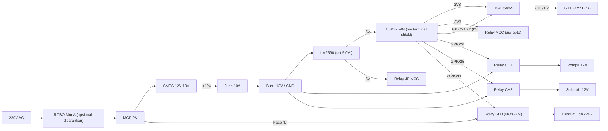

# Rancangan Hardware Kumbung — ESP32 → Misting & Exhaust Fan
**Smart Shroom SCM — Tugas Akhir**

Dokumen ini adalah **rancangan fisik (as-built plan)** untuk kumbung **5 m × 7 m × 3,5 m (122,5 m³)**
dengan BoM terbaru (3× SHT30 I2C + TCA9548A). Daftar belanja ada di `docs/hardware-shopping-list.md`.
Logika kendali tetap mengacu `docs/logika_aktuator.md` (firmware v3.5).

> **Status asumsi.** Semua koordinat di bawah adalah **asumsi desain** (posisi pintu, box, fan, tandon).
> Kalau kondisi lapangan beda, hitung ulang tabel di bagian 3 & 4 dengan rumus yang sama.
> Harga & angka debit adalah **perkiraan**; verifikasi di lapangan (lihat bagian 8).

---

## 1. Asumsi Geometri

Sistem koordinat: **x** = lebar (0–5 m), **y** = panjang dari pintu (0–7 m), **z** = tinggi (0–3,5 m).

| Elemen | Posisi (asumsi) | Alasan |
|:---|:---|:---|
| Pintu | Dinding depan (y = 0) | Sesuai `penempatan_sensor.md` |
| Exhaust fan | Dinding belakang (y = 7), x = 2,5, z ≈ 2,8 | Udara panas naik; tarik udara menyapu seluruh lorong |
| Lubang udara masuk (intake) + kasa | Dinding depan, rendah (z ≈ 0,4) | Aliran silang depan→belakang; kasa anti-serangga |
| Box panel IP65 | **Luar** dinding belakang, x ≈ 0,8, z ≈ 1,5 | Jarak kabel sensor terpendek & kabel fan pendek |
| Pompa + solenoid + filter | Luar dinding belakang, di samping box | Selang tekanan tinggi & kabel 12V pendek |
| Tandon air | Luar, di sisi pompa, lebih tinggi/sejajar pompa | Suction pompa maks ±1–2 m |
| Jalur misting | 2 baris di z ≈ 3,0 m, x = 1,25 dan x = 3,75 | Membagi lebar 5 m menjadi 2 × 2,5 m |

### Denah (tampak atas, skala kasar)

```
 LUAR  [Tandon]─[Filter]─[Pompa]─[Solenoid]   [BOX PANEL]
 ═════╪═══════════════════════════╪═══════════════[ FAN z=2.8 ]══  ← dinding belakang y=7
      │ trunk PU masuk dinding    │                  ▲ buang udara
      │      ┌────────────┬───────┘                  │
      │      │ Tee 6mm    │                          │
      │   x=1.25       x=3.75     (jalur misting z=3.0, 7 nozzle/baris)
      │      ●  y=6.2     ●                    [C] 4.5,6.5,z0.5
      │      ●  y=5.3     ●
      │      ●  y=4.4     ●
      │      ●  y=3.5     ●      [B] 2.5,3.5,z1.5
      │      ●  y=2.6     ●
      │      ●  y=1.7     ●      [A] 2.5,1.5,z2.5
      │      ●  y=0.8     ●
 ═════╧════[ INTAKE rendah + kasa ]═══[ PINTU ]═══════════════  ← dinding depan y=0
```
`●` = nozzle (Tee slip-lock). 2 baris × 7 = **14 nozzle** (jarak 0,9 m, mulai y = 0,8 m).
Cakupan ≈ 0,9 m × 2,5 m ≈ 2,25 m² per nozzle → 14 × 2,25 ≈ **31,5 m²** dari lantai 35 m².

---

## 2. Penempatan Sensor (SHT30 I2C ×3)

| ID | Posisi (x, y, z) | Catatan pasang |
|:---|:---|:---|
| A (Atas) | 2,5 · 1,5 · 2,5 m | Tengah lorong, ≥ 1,2 m dari baris nozzle; beri pelindung percikan |
| B (Tengah) | 2,5 · 3,5 · 1,5 m | Tengah lorong |
| C (Bawah) | 4,4 · 6,5 · 0,5 m | Pojok belakang, ≥ 0,7 m dari baris nozzle |

Aturan pasang (berlaku semua): **moncong menghadap bawah**, jauhkan dari semburan langsung nozzle,
beri label A/B/C pada kabel, sambungan kabel disolder + selongsong bakar **berlem (dual-wall)**.

---

## 3. Panjang Kabel & Selang (Dihitung, Bukan Ditebak)

> **Koreksi penting.** `penempatan_sensor.md` memakai jarak diagonal garis lurus (9,3 m). Kabel nyata
> mengikuti dinding/langit-langit (jarak Manhattan), jadi **lebih panjang dari diagonal**.

### 3.1 Kabel sensor (per kanal TCA9548A)
Titik masuk kabel: dinding belakang (0,8 · 7 · 2,4). Rumus: `|Δx| + |Δy| + |Δz| + slack 1 m`
(slack = drip-loop & ujung).

| Sensor | Δx | Δy | Δz | + slack | Total | Kabel ekstensi (−0,5 m kabel probe) |
|:---|---:|---:|---:|---:|---:|---:|
| A | 1,7 | 5,5 | 0,1 | 1,0 | **8,3 m** | 7,8 m |
| B | 1,7 | 3,5 | 0,9 | 1,0 | **7,1 m** | 6,6 m |
| C | 3,6 | 0,5 | 1,9 | 1,0 | **7,0 m** | 6,5 m |
| **Jumlah** | | | | | | **20,9 m → beli 25 m** |

Kabel jenis **Cat5e FTP/UTP (twisted pair)**, bukan kabel 4-core lurus (lihat 5.3).

### 3.2 Kabel daya
| Jalur | Panjang | Spesifikasi |
|:---|---:|:---|
| Box → pompa + solenoid (12 V) | ±3 m | 2 × 1,5 mm² serabut (pompa ±5–6 A) |
| Box → fan (220 V AC) | ±5 m | 3 × 1,0–1,5 mm² (fase, netral, **PE**) |

Kabel 220 V dan kabel sensor **wajib beda konduit** (gangguan & keselamatan).

### 3.3 Selang PU 6 mm
| Segmen | Panjang |
|:---|---:|
| Pompa → solenoid → tembus dinding → naik ke z = 3,0 | ±4,0 m |
| Trunk melintang ke Tee splitter | ±1,5 m |
| 2 lengan ke x = 1,25 & x = 3,75 | 2 × 1,25 = 2,5 m |
| 2 baris sepanjang y (0,3 + 6,2) | 2 × 6,5 = 13,0 m |
| **Subtotal** | **±21 m** |
| Cadangan 20 % (salah potong, pemasangan) | +4 m |
| **Beli** | **25 m** ✅ (cukup, tanpa sisa banyak) |

Pasang klip selang tiap ±0,6 m → **±40 klip** (selang PU melendut kalau tidak dijepit).

### 3.4 Konsumsi air (perkiraan)
Nozzle 0,3 mm @ 5–7 bar ≈ 0,07–0,10 L/menit → 14 nozzle ≈ **1,0–1,4 L/menit**.
Satu siklus maks 90 s ≈ 1,5–2,1 L. Pemakaian realistis 50–100 L/hari; skenario terburuk
(siklus 90 s + cooldown 150 s sepanjang 11 jam siang) ≈ 330 L/hari. **Tandon ≥ 200 L** (idealnya 500 L) + pelampung.

---

## 4. Anggaran Daya

Beban DC (SMPS 12 V 10 A = 120 W):

| Beban | Arus (12 V) | Catatan |
|:---|---:|:---|
| Pompa diafragma | 4–6 A (start ±7 A) | Dominan |
| Solenoid | ±0,4 A | |
| LM2596 → ESP32 + TCA + SHT ×3 | ±0,15 A | ESP32 puncak WiFi ±0,5 A @5 V |
| Koil relay (3 aktif × ±70 mA @5 V) | ±0,1 A | |
| **Total puncak** | **±6,7 A (80 W)** | **67 % kapasitas → aman** |

Sisi AC: SMPS saat pompa jalan ≈ 80 W/0,85 ≈ 0,45 A. Fan 10" ≈ 80–120 W ≈ 0,5 A.
Karena firmware **melarang misting saat fan ON** (interlock), puncak AC realistis ≈ **0,6 A** → MCB 2 A cukup.
Kalau sering *trip* saat fan start (inrush), naikkan ke 4 A.

---

## 5. Skema Rangkaian

### 5.1 Diagram blok



### 5.2 Tabel pinout & sambungan

**ESP32 (30-pin) ↔ modul**

| Dari | Ke | Fungsi |
|:---|:---|:---|
| GPIO21 (SDA) | TCA9548A SDA | Bus I2C utama |
| GPIO22 (SCL) | TCA9548A SCL | Bus I2C utama |
| 3V3 | TCA9548A VIN | Daya TCA (3,3 V) |
| 3V3 | Relay **VCC** | Sisi optocoupler (logika 3,3 V) |
| GPIO26 | Relay IN1 | Pompa |
| GPIO25 | Relay IN2 | Solenoid |
| GPIO33 | Relay IN3 | Exhaust fan |
| (cadangan) | Relay IN4 | Kosong / ekspansi |
| VIN (5 V) | LM2596 OUT+ | Daya ESP32 |
| GND | GND bersama | 12 V, 5 V, 3,3 V satu massa |

**TCA9548A ↔ SHT30** (daya sensor 3,3 V; rentang sensor 2,15–5,5 V)

| Kanal TCA | Sensor | Kabel |
|:---|:---|:---|
| SD0/SC0 | A (Atas) | Cat5e ±7,8 m |
| SD1/SC1 | B (Tengah) | Cat5e ±6,6 m |
| SD2/SC2 | C (Bawah) | Cat5e ±6,5 m |
| Pull-up | **2,2 kΩ** SDA→3V3 dan SCL→3V3 **per kanal**, dipasang di sisi TCA | Modul TCA biasanya tanpa pull-up di sisi kanal |

Alamat I2C: TCA = `0x70`, SHT30 = `0x44` (aman karena terpisah kanal), LCD (opsional) = `0x27` di bus utama.

### 5.3 Pemetaan kabel Cat5e (twisted pair)
| Pair | Kawat | Fungsi |
|:---|:---|:---|
| Oranye | oranye + oranye/putih | **SDA + GND** |
| Hijau | hijau + hijau/putih | **SCL + GND** |
| Biru | biru + biru/putih | **3V3 + GND** (dua kawat paralel, hambatan lebih kecil) |
| Shield | drain | GND, **disambung di sisi box saja** |

Memasangkan SDA dan SCL masing-masing dengan GND menekan *crosstalk* — alasan utama memilih twisted-pair
dibanding kabel 4-core lurus.

### 5.4 Sisi beban (relay)

Modul relay **5 V, 4 kanal, optocoupler, low-level trigger** (cocok dengan `RELAY_ON = LOW`).

**Wajib: lepas jumper JD-VCC–VCC.**
- `VCC` ← 3V3 ESP32 (sisi LED optocoupler).
- `JD-VCC` ← 5 V dari LM2596 (koil relay).
- `GND` ← massa bersama.

Alasan: kalau VCC = 5 V tapi GPIO hanya 3,3 V, tegangan LED opto tetap ±1,7 V saat GPIO "HIGH" →
relay bisa setengah-nyala/bergetar. Dengan VCC = 3,3 V, GPIO HIGH benar-benar mematikan LED.
Uji dengan multimeter (bagian 7, langkah 3).

| Beban | Rangkaian | Proteksi |
|:---|:---|:---|
| **Pompa 12 V** | +12 V(setelah fuse) → COM1; NO1 → pompa(+); pompa(−) → GND | Dioda **1N5408** melintang motor (katoda ke +), kapasitor 100 nF keramik di terminal motor |
| **Solenoid 12 V** | +12 V → COM2; NO2 → solenoid(+); solenoid(−) → GND | Dioda **1N4007** melintang koil (katoda ke +) |
| **Fan 220 V** | Fase (setelah MCB) → COM3; NO3 → fan L; Netral langsung ke fan N; **PE ke bodi fan** | **RC snubber** (0,1 µF X2 + 100 Ω 2 W) melintang COM3–NO3 |

Aturan umum: hanya **fase** yang disaklar; netral & PE tidak lewat relay. Bodi SMPS metal & bodi fan wajib terhubung **PE**.

### 5.5 Daya ESP32
LM2596 **disetel 5,0 V dengan multimeter SEBELUM disambung ke ESP32** (modul baru sering keluar 8–12 V dan membunuh ESP32).
Pasang kapasitor **470–1000 µF/16–25 V** di output LM2596 (lonjakan arus WiFi).
Letakkan ESP32 dengan antena menjauh dari bodi metal SMPS.

### 5.6 Hidrolik

```
Tandon ─ selang 1/2" ─ [Filter sedimen 1µm] ─ selang 1/2" ─ [POMPA] ─ PU6 ─ [SOLENOID NC] ─ tembus dinding ─ trunk ─ Tee ─ 2 baris nozzle
                        (sisi isap, bukan sisi tekan)          │
                                                        (opsional) manometer 0–200 PSI
```
- **Filter di sisi isap** (housing plastik tidak tahan 130 PSI). Wajib kedap udara (seal tape), ganti cartridge tiap 1–2 bulan — cartridge buntu = pompa kavitasi.
- Selang isap memakai **selang 1/2" berkawat/anyaman**, bukan PU 6 mm.
- Urutan firmware sudah benar: **solenoid buka → 200 ms → pompa ON**; stop: **pompa OFF → 200 ms → solenoid tutup**.
- Solenoid berada di sisi tekan → **rating tekanan harus ≥ tekanan cut-off pompa** (lihat daftar belanja).
- Target tekanan kerja nozzle **5–7 bar (70–100 PSI)**. Cek rating selang/fitting; bila cut-off pompa > rating, turunkan setelan pressure switch.
- Setelah solenoid menutup, sisa tekanan di jalur membuat nozzle menetes beberapa detik. Kalau mengganggu, ganti nozzle dengan tipe **anti-tetes** (ada check valve).

---

## 6. Implementasi Firmware Dual-Mode (v3.6 As-Built)

Firmware v3.6 kini telah mengadopsi arsitektur **Dual-Mode** via flag `#define USE_SHT30 1` (Hardware As-Built 3x SHT30 IP68 via TCA9548A) dan `#define USE_SHT30 0` (Fallback Simulasi Wokwi 3x DHT22):

| Item | Implementasi As-Built (SHT30) | Fallback Wokwi (DHT22) |
|:---|:---|:---|
| **Library** | `Adafruit_SHT31.h` (support SHT30 & SHT31) | `DHT.h` |
| **Wiring Sensor** | I2C SDA (GPIO 21) & SCL (GPIO 22) via TCA9548A | GPIO 4, 15, 2 (Direct 1-Wire) |
| **I2C Clock** | `Wire.setClock(50000);` (50 kHz untuk kabel Cat5e >7m) | N/A |
| **Kanal TCA** | CH0 (Atas 2.5m), CH1 (Tengah 1.5m), CH2 (Bawah 0.5m) | N/A |
| **Relay Aktuator** | GPIO 26 (Pompa), GPIO 25 (Valve), GPIO 33 (Fan) | Tetap sama |

```cpp
// Pilih kanal TCA9548A (0-7). Hanya satu kanal aktif pada satu waktu.
void tcaSelect(uint8_t ch) {
  Wire.beginTransmission(0x70);
  Wire.write(1 << ch);
  Wire.endTransmission();
}
// Contoh: tcaSelect(0); sht.begin(0x44); float t = sht.readTemperature();
```
Bobot fusion (35/40/25), deteksi NaN, dan interlock **tidak berubah**.

---

## 7. Checklist Commissioning (urut, jangan loncat)

1. **Sebelum dirakit:** setel LM2596 ke 5,0 V (multimeter). Cek polaritas SMPS 12 V.
2. **Bench I2C:** rakit ESP32 + TCA + 3 sensor dengan **kabel panjang final** (±8 m) di meja. Tes `Wire.setClock(50000)`. Kalau sering NaN → turunkan ke 10 kHz atau lihat bagian 9.
3. **Relay tanpa beban:** jumper JD-VCC sudah dilepas. Set GPIO HIGH → LED relay **harus mati**; LOW → nyala. Ulangi 20× (cek tidak bergetar).
4. **Beban 220 V uji:** pakai lampu pijar/bohlam di CH3 dulu, **bukan** langsung fan. Pasang snubber.
5. **12 V:** sambung solenoid, lalu pompa. Pastikan dioda terpasang searah. Fuse 10 A terpasang.
6. **Hidrolik:** isi tandon, buang udara (pompa jalan dengan solenoid terbuka, nozzle belum dipasang). Pasang nozzle, cek kebocoran fitting pada tekanan kerja.
7. **Ukur debit nyata:** tampung semburan 60 s dengan gelas ukur → koreksi bagian 3.4 untuk Bab 4 TA.
8. **Uji interlock:** paksa RH rendah → misting jalan; paksa suhu tinggi → fan jalan & misting terpotong.
9. **Uji 24 jam** sebelum dianggap selesai; cek log di dashboard.

---

## 8. Risiko & Mitigasi

| Risiko | Dampak | Mitigasi |
|:---|:---|:---|
| Kabel I2C 7–8 m tidak stabil | Sensor NaN / hang | Per-kanal TCA (segmen terpisah), 50 kHz, pull-up 2,2 kΩ, twisted-pair, bench test |
| Rating solenoid < tekanan pompa | Bocor/pecah | Solenoid kuningan ≥ 10 bar, atau turunkan cut-off |
| Cartridge filter buntu | Pompa kavitasi, debit turun | Jadwal ganti, cartridge cadangan, manometer |
| Percikan nozzle ke sensor A | Sensor basah | Moncong ke bawah, jarak ≥ 1,2 m, pelindung |
| Relay bergetar (3,3 V vs 5 V) | Pompa/fan nyala-mati liar | Jumper JD-VCC dilepas (5.4) |
| Percikan relay AC mereset ESP32 | Reboot acak | RC snubber, kabel 220 V terpisah |
| Kejut listrik di lingkungan RH 90 % | Keselamatan | PE terpasang, RCBO 30 mA |
| Box panas (SMPS) di luar ruangan | Umur komponen turun | Box di tempat teduh, beban SMPS ≤ 70 % |
| Fan terlalu kecil untuk 122,5 m³ | Flush CO₂ kurang | 10" ≈ 500–800 m³/jam (4–6 ACH). Pastikan ada intake; naikkan ke 12" bila perlu |

## 9. Rencana Cadangan (bila bench test I2C gagal)
1. **Probe SHT RS485/Modbus** ×3 (≈ Rp 130–180 rb/unit) + 1 modul MAX485 + dongle USB-RS485 untuk set ID. Kabel cukup **satu jalur 2-kawat** (daisy-chain), firmware ganti ke Modbus.
2. **Extender I2C diferensial** (pasangan PCA9615) per kanal.
3. Pindahkan sensor terjauh lebih dekat ke box (efek ke penelitian kecil: yang dibuktikan adalah stratifikasi vertikal).
