# Spesifikasi Sequence Diagram — Smart Shroom SCM 🍄

**Judul Tugas Akhir:** *Sistem Informasi Supply Chain Management dan Spasial WMS pada Kumbung Jamur Terintegrasi dengan Otomasi dan Monitoring Mikroklimat IoT*  
**Dokumen:** Spesifikasi Interaksi Sekuensial Sistem (UML Sequence Diagrams)  
**Referensi Terkait:** [docs/use_case.md](file:///d:/DevTools/Antigravity/Projects/TA_vio/docs/use_case.md) | [docs/dfd.md](file:///d:/DevTools/Antigravity/Projects/TA_vio/docs/dfd.md) | [docs/PRD.md](file:///d:/DevTools/Antigravity/Projects/TA_vio/docs/PRD.md) | [docs/erd.md](file:///d:/DevTools/Antigravity/Projects/TA_vio/docs/erd.md)  
**Penyusun:** Benedictus Vio  
**Standar Rekayasa:** Ponytail Lean Spec (Zero-Bloat, Anti-Bab 1-5 Skripsi, 100% Pure Architecture & Code Lifelines)

---

## 1. Arsitektur Komponen & Lifeline UML

Seluruh sequence diagram dalam dokumen ini menggunakan interaksi antar-lifeline berikut:

| Komponen Lifeline | Entitas Nyata dalam Kode | Peran & Tanggung Jawab |
|---|---|---|
| `Actor` | Admin / Worker / ESP32 | Pengguna fisik atau mikrokontroler di kumbung. |
| `FE` (Frontend UI) | React 18, Vite, Tailwind, Zustand, TanStack Query | Antarmuka pengguna, form validation, optimistic state, modal dialog. |
| `API` (Laravel Router) | `routes/api.php`, Sanctum Middleware, RateLimiter | Endpoint router, token authentication, RBAC guard (`role:admin`). |
| `Controller` | `App\Http\Controllers\Api\*` | Validasi payload request (`Validator`), orkestrasi business logic. |
| `DB` (Database Server) | MySQL / SQLite, Eloquent ORM | Transaksi data atomik (`DB::transaction`), isolasi state, foreign key integrity. |
| `Cache` | Cache Memory / Redis / File | Penyimpanan state volatil cepat (status `command` jeda panen, temporary config). |
| `IoT` (Firmware ESP32) | ESP32 C++ Firmware, SHT30 I2C, Relay Modul | Edge computing, closed-loop actuator control, failsafe hardware. |

---

## 2. Modul A: Autentikasi & Otorisasi Pengguna

### SD-01: Alur Autentikasi Login (UC-01)
Interaksi autentikasi kredensial pengguna, penerbitan token Bearer Sanctum, dan persistensi state pada Zustand store.

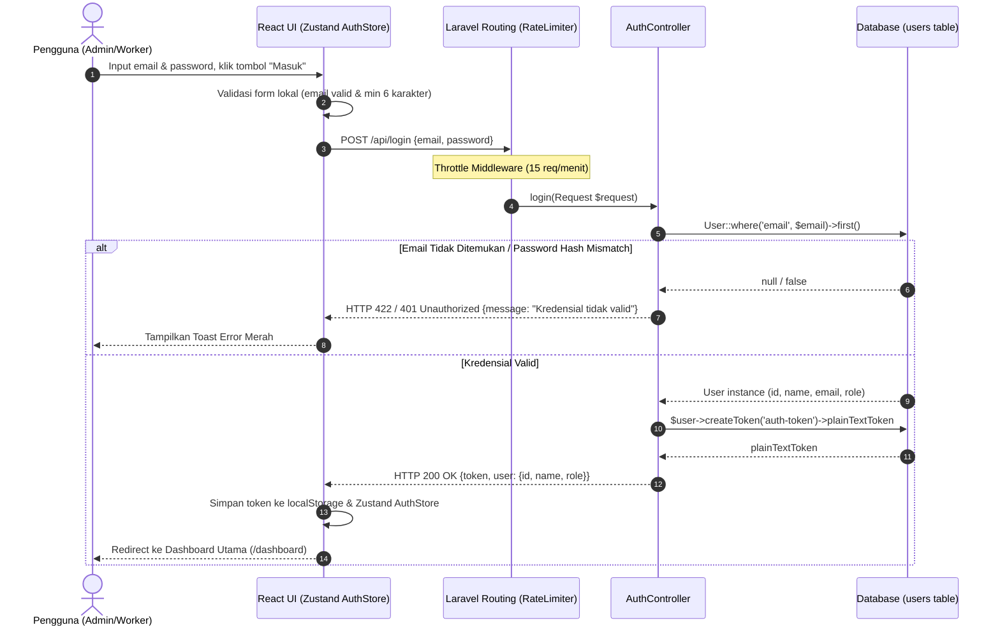

---

### SD-02: Registrasi Akun Pekerja Baru dengan Kuota RBAC (UC-02)
Pendaftaran akun baru oleh Admin dengan validasi kuota worker dan otorisasi Sanctum `role:admin`.

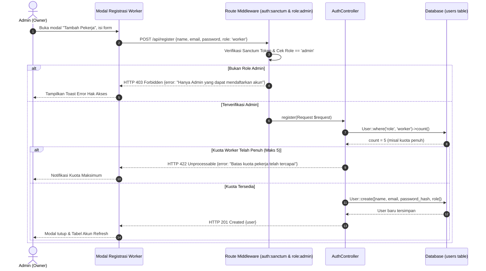

---

## 3. Modul B: Pemantauan Iklim Mikro & Early Warning System (EWS)

### SD-03: Alur Polling Telemetri & Evaluasi EWS Real-Time (UC-04, UC-06)
Frontend secara berkala mengambil data fusi sensor vertikal terbaru dan mendeteksi kondisi anomali iklim mikro.

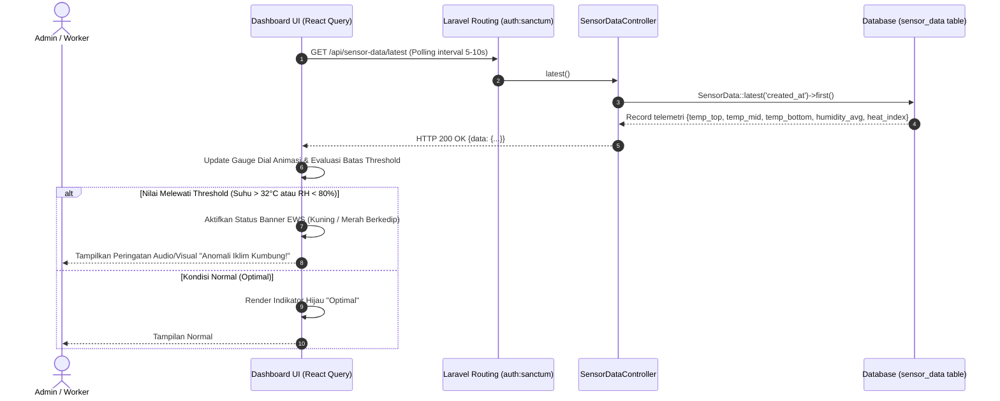

---

## 4. Modul C: Spasial WMS 3D & Manajemen Siklus Rak

### SD-04: Alur Alokasi Batch Baglog ke Koordinat Slot Rak Spasial (UC-19)
Admin memetakan bibit jamur dari batch logistik ke slot denah rak fisik (3D Grid) secara massal (*bulk allocation*).

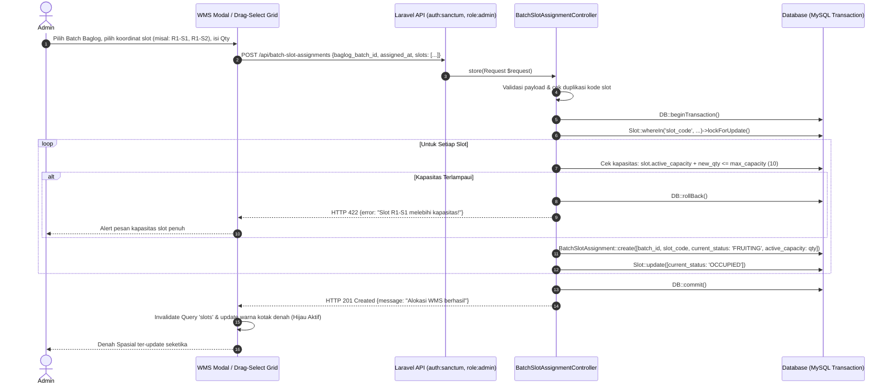

---

### SD-05: Alur Tutup Siklus Kamar Rak & Auto-Cull WMS (UC-29)
Penyelesaian masa tanam pada rak yang telah melewati batas panen produktif, memutasikan sisa baglog menjadi afkir secara atomik.

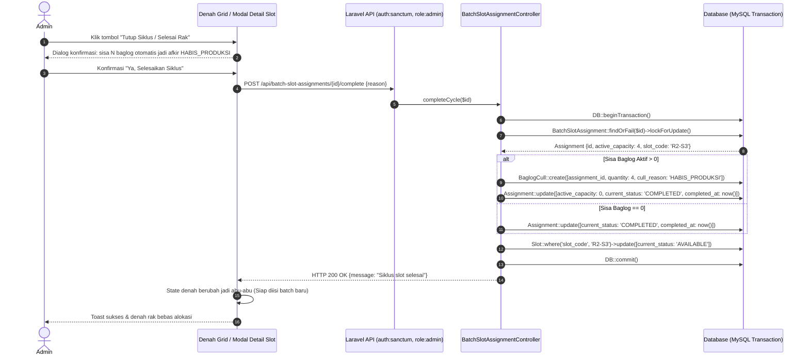

---

## 5. Modul D: Manajemen Mutasi Afkir & Biosekuriti

### SD-06: Pencatatan Afkir Baglog (UC-21) & Pembatalan Void Afkir (UC-28)
Worker/Admin mencatat jamur rusak/terkontaminasi (mengurangi kapasitas aktif slot), dan Admin membatalkan entri (*void*) dengan pengembalian kapasitas rak otomatis.

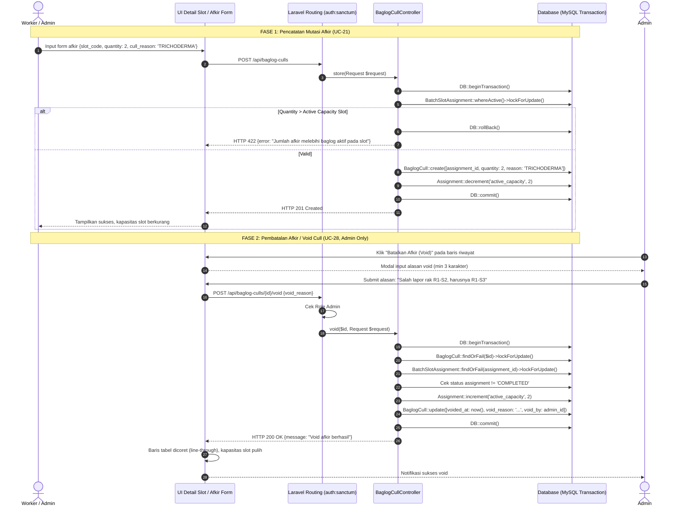

---

## 6. Modul E: Rantai Pasok Panen & Penjualan

### SD-07: Pencatatan Panen Multi-Flush (UC-11) & Void Panen (UC-26)
Pencatatan hasil timbangan harian per slot rak dan pembatalan (*void audit trail*) tanpa penghapusan data fisik.

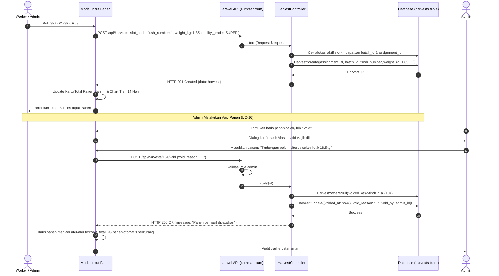

---

### SD-08: Transaksi Penjualan & Void Sales (UC-13, UC-27)
Pencatatan penjualan ke pasar/tengkulak serta pembatalan transaksi dengan re-kalkulasi instan pada omzet dan HPP.

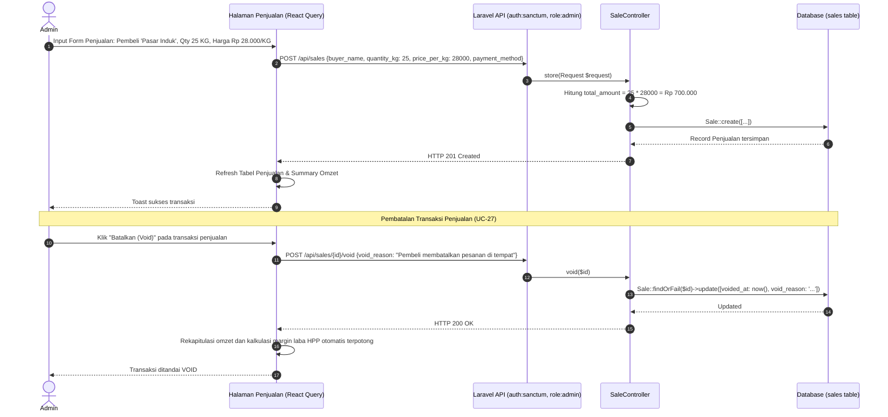

---

## 7. Modul F: Akuntansi Biaya Manajerial & HPP Dinamis

### SD-09: Kalkulasi HPP Dinamis & Margin Kontribusi (UC-22, UC-23)
Sistem mengagregasikan biaya bibit baglog, proporsi beban operasional kumbung (listrik, air, tenaga kerja), dan total bobot panen bersih (*net harvest excluding voids*).

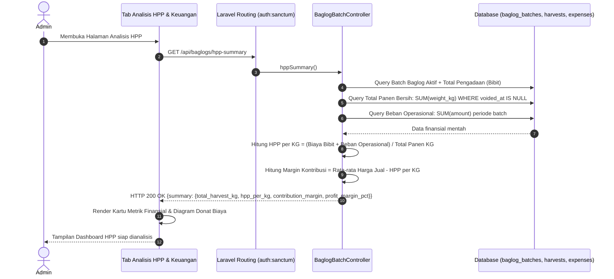

---

## 8. Modul G: Kontrol Interupsi & Mode Panen (Failsafe)

### SD-10: Alur Mode Jeda Panen & Resume AUTO (UC-24, UC-25)
Interupsi manual saat pekerja masuk ke kumbung untuk mencegah sprayer menyemprot air ke tubuh pekerja dan jamur siap petik.

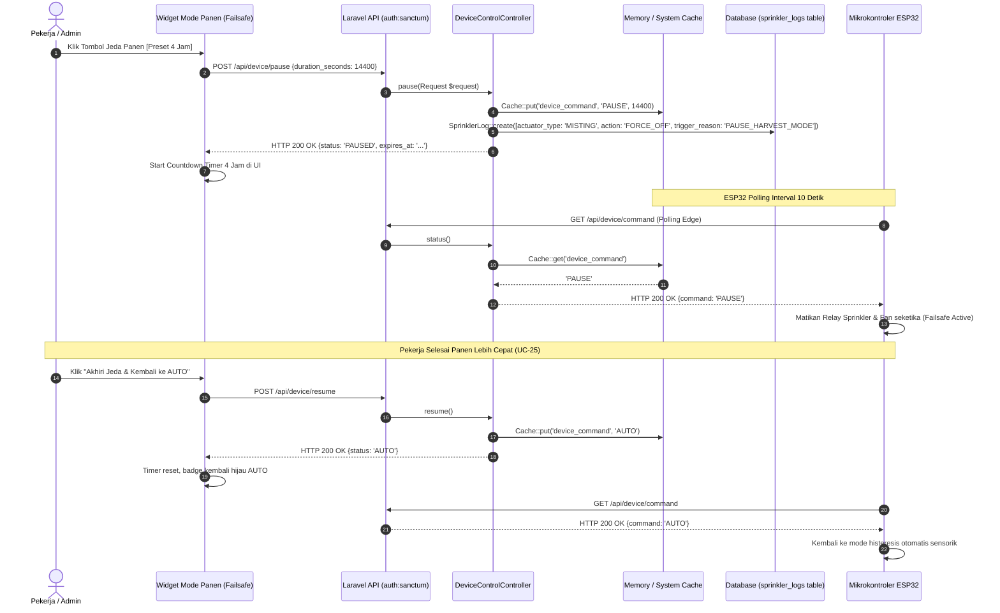

---

## 9. Modul H: Edge Computing & Closed Loop IoT Engine

### SD-11: Alur Pengiriman Telemetri & Polling Edge ESP32 (UC-16, UC-17, UC-18)
Siklus telemetri berkala (fusi 3 sensor SHT30 vertikal), eksekusi histeresis lokal pada firmware ESP32, dan pelaporan log aktuator ke cloud.

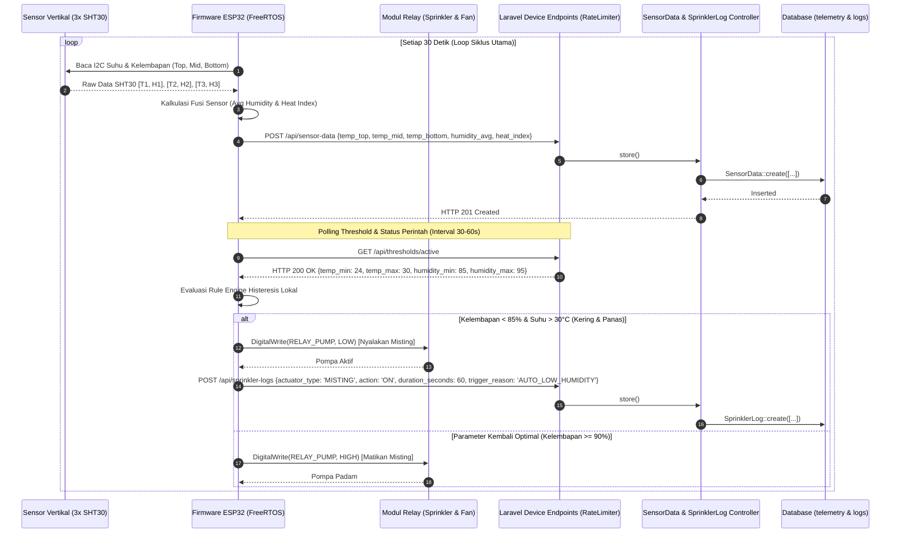

---

## 10. Matriks Relasi Use Case vs Sequence Diagram

Untuk memastikan integritas analisis perangkat lunak tanpa celah fungsional (*zero orphaned use case*), berikut matriks keterlacakan (*traceability matrix*):

| Modul | Kode Use Case | Nama Use Case | Nomor Sequence Diagram | Sifat Transaksi / Operasi |
|---|---|---|---|---|
| **Modul A** | UC-01 | Melakukan Login | **SD-01** | Sanctum Token Issuance |
| | UC-02 | Registrasi Akun Baru | **SD-02** | RBAC Guard & Quota Validation |
| | UC-03 | Melakukan Logout | **SD-01** (Variant) | Token Revocation (`currentAccessToken()->delete()`) |
| **Modul B** | UC-04 | Memantau Iklim Real-Time | **SD-03** | Polling Interval React Query |
| | UC-05 | Analisis Grafik Multirentang | **SD-03** (Variant) | Aggregation Query Range |
| | UC-06 | Peringatan Dini EWS | **SD-03** | Edge & Frontend Evaluation |
| | UC-07 | Memantau Log Aktuator | **SD-11** | Historical Actuator Audit |
| **Modul C** | UC-08 | Tambah Batch Baglog | **SD-04** (Precondition)| Master Data Procurement |
| | UC-19 | Alokasi Batch ke Slot WMS 3D | **SD-04** | Atomic DB Lock & Bulk Insert |
| | UC-20 | Memantau Heatmap Grid | **SD-04** | Spasial Coordinates Query |
| | UC-29 | Tutup Siklus & Auto-Cull | **SD-05** | Atomic DB Transaction & Cull Generation |
| **Modul D** | UC-21 | Mencatat Jurnal Mutasi Afkir | **SD-06** (Fase 1) | Decrement `active_capacity` Slot |
| | UC-28 | Membatalkan Catatan Afkir | **SD-06** (Fase 2) | Atomic Void Rollback Capacity |
| **Modul E** | UC-11 | Mencatat Panen Harian | **SD-07** (Fase 1) | Multi-Flush Slot Attribution |
| | UC-26 | Membatalkan Catatan Panen | **SD-07** (Fase 2) | Void Audit Trail Ledger |
| | UC-13 | Mencatat Transaksi Penjualan | **SD-08** (Fase 1) | Sales Order Processing |
| | UC-27 | Membatalkan Penjualan | **SD-08** (Fase 2) | Void Audit Trail & Omzet Reversal |
| | UC-14 | Rekap Mingguan & Stok | **SD-08** | Stock Accumulation |
| **Modul F** | UC-22 | Beban Biaya Operasional | **SD-09** | Ledger Expense Accounting |
| | UC-23 | Analisis HPP Dinamis | **SD-09** | Dynamic Batch Costing Formula |
| **Modul G** | UC-24 | Aktifkan Mode Jeda Panen | **SD-10** | Failsafe Cache Command Override |
| | UC-25 | Akhiri Mode Jeda Panen | **SD-10** | Immediate Resume to AUTO |
| **Modul H** | UC-16 | Pengiriman Telemetri Sensor | **SD-11** | Non-Blocking IoT Push Telemetry |
| | UC-17 | Polling Threshold & Command | **SD-11** | Edge Sync Execution |
| | UC-18 | Pengiriman Log Aktuator | **SD-11** | Hardware Event Auditing |

---

## 11. Karakteristik Ketahanan Sistem (System Resilience & Edge Cases)

1. **Idempotensi & Void Safety**:  
   Seluruh operasi pembatalan (`/void`) pada Panen, Penjualan, dan Afkir tidak pernah menjalankan perintah SQL `DELETE`. Sistem menerapkan *soft immutable audit trail* dengan mengisikan `voided_at`, `void_reason`, dan `void_by` untuk menjamin tidak ada manipulasi data terselubung oleh pengguna.
2. **Atomic Capacity Recovery**:  
   Pada `SD-06` (Void Cull), pengembalian kapasitas aktif (`active_capacity`) dilindungi pengecekan status alokasi. Jika slot sudah ditutup siklusnya (`COMPLETED`), pembatalan ditolak untuk mencegah anomali *ghost capacity* pada rak kosong.
3. **Edge IoT Autonomous Failsafe**:  
   Jika koneksi internet atau server backend mati, ESP32 tetap menjalankan logika histeresis mandiri menggunakan batas threshold terakhir yang tersimpan di flash memory (NVS), memastikan kumbung jamur tidak mengalami gagal panen akibat dehidrasi.
