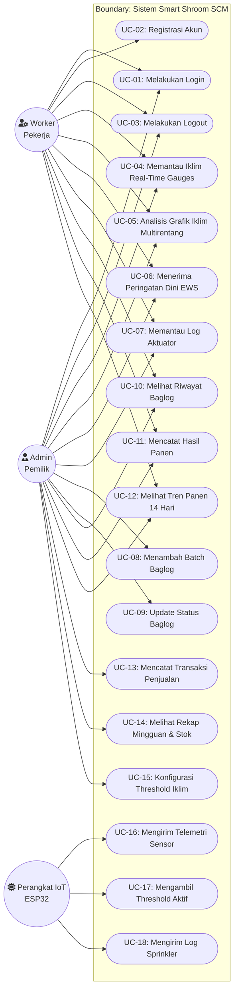

# Spesifikasi Use Case — Smart Shroom SCM 🍄

**Dokumen:** Spesifikasi Kebutuhan Perangkat Lunak (SRS) — Use Case Analysis  
**Proyek:** Sistem Informasi Manajemen Rantai Pasok Budidaya Jamur Kuping Berbasis IoT  
**Konteks:** Tugas Akhir Program Studi Sistem Informasi  
**Penyusun:** Benedictus Vio  
**Terakhir Diperbarui:** September 2026  

---

## 1. Pendahuluan

Dokumen ini mendefinisikan analisis Use Case untuk sistem **Smart Shroom SCM**, mencakup batasan sistem, identifikasi aktor, diagram Use Case UML, matriks hak akses, serta spesifikasi skenario rinci (*Use Case Specifications*). Analisis ini diselaraskan secara langsung dengan implementasi backend Laravel 12 (Sanctum Auth, RBAC), frontend React 18 (Zustand, TanStack Query), dan mikrokontroler IoT ESP32.

---

## 2. Identifikasi Aktor (Actors)

Sistem membagi pengguna dan entitas interaktif menjadi 3 aktor utama:

| Aktor | Tipe | Deskripsi Peran & Tanggung Jawab |
|---|---|---|
| **Admin** | Human (Primary) | Pemilik atau pengelola utama kumbung jamur. Memiliki akses menyeluruh (*full control*) terhadap konfigurasi threshold lingkungan, manajemen siklus media tanam (baglog), pencatatan panen, transaksi penjualan, dan rekapitulasi keuangan. |
| **Worker** | Human (Primary) | Pekerja kebun / buruh tani harian. Memiliki hak akses operasional terbatas untuk memantau kondisi iklim mikro secara real-time, memeriksa daftar baglog aktif, dan mencatat data hasil panen harian. |
| **Perangkat IoT (ESP32)** | System / Device (Secondary) | Mikrokontroler cerdas berbasis ESP32 yang terpasang di kumbung. Bertindak sebagai aktor otomatis non-manusia yang mengirimkan data telemetri sensor lingkungan, mengambil threshold aktif, dan mencatat log eksekusi aktuator (*sprinkler/misting*). |

> **Catatan Akademis:** Memasukkan *Perangkat IoT (ESP32)* sebagai System Actor sah secara metodologi UML (misalnya standar RUP / IEEE 1471), karena mikrokontroler tersebut memicu transaksi data secara otonom ke sistem tanpa perantara manusia.

---

## 3. Katalog Use Case

Use case sistem dikelompokkan ke dalam 5 modul utama:

### Modul A: Autentikasi & Otorisasi Pengguna
- **UC-01: Melakukan Login** (Admin, Worker)
- **UC-02: Melakukan Registrasi Akun Baru** (Worker / Calon Pengguna — dibatasi kuota sistem)
- **UC-03: Melakukan Logout** (Admin, Worker)

### Modul B: Pemantauan Iklim Mikro & Early Warning System (EWS)
- **UC-04: Memantau Iklim Mikro Real-Time (Dial Gauges)** (Admin, Worker)
- **UC-05: Menganalisis Grafik Riwayat Iklim Multirentang (6h/12h/24h/7d)** (Admin, Worker)
- **UC-06: Menerima Peringatan Dini (Early Warning Alert)** (Admin, Worker)
- **UC-07: Memantau Log Aktivitas Aktuator (Sprinkler & Fan)** (Admin, Worker)

### Modul C: Manajemen Media Tanam (Baglog Lifecycle)
- **UC-08: Menambahkan Batch Baglog Baru** (Admin)
- **UC-09: Memperbarui Status Siklus Baglog** (Admin)
- **UC-10: Melihat Riwayat Baglog (Tabel Paginasi per 10)** (Admin, Worker)

### Modul D: Pencatatan Panen & Rantai Pasok Penjualan
- **UC-11: Mencatat Hasil Panen Harian & Melihat Tabel (Paginasi per 10)** (Admin, Worker)
- **UC-12: Menganalisis Grafik Tren Panen 14 Hari** (Admin, Worker)
- **UC-13: Mencatat Transaksi Penjualan & Melihat Tabel (Paginasi per 10)** (Admin)
- **UC-14: Memantau Rekapitulasi Mingguan & Stok** (Admin)

### Modul E: Konfigurasi & Integrasi IoT (Edge Computing)
- **UC-15: Mengonfigurasi Ambang Batas Iklim & Preset Fase** (Admin)
- **UC-16: Mengirim Data Telemetri Sensor (Fusi 3x DHT22)** (Perangkat IoT ESP32)
- **UC-17: Mengambil Konfigurasi Threshold Aktif** (Perangkat IoT ESP32)
- **UC-18: Mengirim Log Aktivitas Aktuator (Misting & Fan)** (Perangkat IoT ESP32)

---

## 4. Use Case Diagram (UML)



---

## 5. Matriks Hak Akses & Peran (Role-Based Access Matrix)

Tabel berikut menunjukkan pemetaan hak akses otorisasi untuk setiap Use Case:

| Kode UC | Nama Use Case | Admin | Worker | Perangkat IoT (ESP32) | Catatan Keamanan / Endpoint |
|---|---|:---:|:---:|:---:|---|
| **UC-01** | Melakukan Login | ✅ | ✅ | ❌ | `POST /api/login` (Rate limited: 15 req/m) |
| **UC-02** | Registrasi Akun Baru | ❌ | ✅ | ❌ | `POST /api/register` (Kuota worker maks 5) |
| **UC-03** | Melakukan Logout | ✅ | ✅ | ❌ | `POST /api/logout` (Revoke token Sanctum) |
| **UC-04** | Memantau Iklim Mikro Real-Time | ✅ | ✅ | ❌ | `GET /api/sensor-data/latest` (SemiCircleGauge + AnimatedNumber) |
| **UC-05** | Analisis Grafik Iklim Multirentang | ✅ | ✅ | ❌ | `GET /api/sensor-data/chart?hours=6\|12\|24\|168` (SQL Downsampling) |
| **UC-06** | Menerima Peringatan Dini (EWS) | ✅ | ✅ | ❌ | `GET /api/dashboard/stats` (Threshold check) |
| **UC-07** | Memantau Log Aktuator (Misting/Fan) | ✅ | ✅ | ❌ | `GET /api/sprinkler-logs` (Audit trail aktuator) |
| **UC-08** | Menambah Batch Baglog | ✅ | ❌ | ❌ | `POST /api/baglogs` (Admin only) |
| **UC-09** | Update Status Siklus Baglog | ✅ | ❌ | ❌ | `PATCH /api/baglogs/{id}/status` |
| **UC-10** | Melihat Riwayat Baglog & Paginasi | ✅ | ✅ | ❌ | `GET /api/baglogs` (Paginasi 10 baris/halaman) |
| **UC-11** | Mencatat Panen & Paginasi Riwayat | ✅ | ✅ | ❌ | `POST & GET /api/harvests` (Paginasi 10 baris/halaman) |
| **UC-12** | Melihat Tren Panen 14 Hari | ✅ | ✅ | ❌ | `GET /harvests/chart?days=14` |
| **UC-13** | Mencatat Penjualan & Paginasi | ✅ | ❌ | ❌ | `POST & GET /api/sales` (Paginasi 10 baris/halaman, `bcmul`) |
| **UC-14** | Melihat Rekap Mingguan & Stok | ✅ | ❌ | ❌ | `GET /api/sales/weekly-report` |
| **UC-15** | Konfigurasi Threshold & Preset | ✅ | ❌ | ❌ | `PUT /api/thresholds` (Admin only) |
| **UC-16** | Mengirim Telemetri Sensor | ❌ | ❌ | ✅ | `POST /api/sensor-data` (Rate limit: 20 req/m, 3x DHT22) |
| **UC-17** | Mengambil Threshold Aktif | ❌ | ❌ | ✅ | `GET /api/thresholds/active` (No auth, read-only) |
| **UC-18** | Mengirim Log Aktuator (Misting/Fan)| ❌ | ❌ | ✅ | `POST /api/sprinkler-logs` |

---

## 6. Spesifikasi Rinci Use Case (Use Case Narrative)

Berikut adalah dokumentasi skenario detail berbasis standar penulisan IEEE / Cockburn:

### UC-01: Melakukan Login
* **Aktor:** Admin, Worker
* **Deskripsi:** Pengguna memasukkan kredensial (email dan password) untuk mendapatkan otentikasi berupa token Sanctum SPA.
* **Precondition:** Pengguna telah terdaftar di database dan aplikasi frontend berada pada route `/login`.
* **Postcondition:** Pengguna berhasil diautentikasi, token tersimpan di state manager (`authStore`), dan diarahkan ke `/` (Dashboard).
* **Alur Normal (Main Flow):**
  1. Pengguna mengakses form login.
  2. Pengguna mengisi email dan kata sandi.
  3. Pengguna menekan tombol "Login".
  4. Frontend mengirim request `POST /api/login`.
  5. Backend memvalidasi format email dan password.
  6. Backend memverifikasi hash kata sandi pengguna.
  7. Backend mengembalikan status `200 OK` beserta data profil user dan token Sanctum.
  8. Frontend menyimpan token dan mengarahkan tampilan ke dashboard utama.
* **Alur Alternatif (Alternative Flow):**
  - **5a / 6a. Kredensial tidak valid:**
    - Backend mengembalikan kode status `422 Unprocessable Entity` atau `401 Unauthorized`.
    - Frontend menampilkan toast pesan kesalahan: *"Email atau password yang Anda masukkan salah."*
  - **4a. Melebihi batas percobaan (Rate Limiting):**
    - Jika terjadi request lebih dari 15 kali dalam 1 menit, middleware mengembalikan `429 Too Many Requests`.

---

### UC-04: Memantau Iklim Mikro Real-Time
* **Aktor:** Admin, Worker
* **Deskripsi:** Pengguna memantau parameter suhu, kelembapan, CO2, dan lux saat ini yang diperbarui secara otomatis.
* **Precondition:** Pengguna telah login dan membuka halaman Dashboard (`/`).
* **Postcondition:** Tampilan dashboard menyajikan 4 kartu indikator mikroklimat terupdate.
* **Alur Normal (Main Flow):**
  1. Dashboard memanggil query `GET /api/sensor-data/latest` dan `GET /api/dashboard/stats`.
  2. Backend mengambil data pembacaan sensor terbaru dari tabel `sensor_data`.
  3. Frontend merender data suhu (°C), kelembapan relatif (%), level CO2 (ppm), dan intensitas cahaya (Lux) pada kartu Semi-Circle Gauge dan Climate Cards.
  4. TanStack Query secara berkala (*polling* interval 30 detik) melakukan *background refetch* untuk menyegarkan data tanpa memuat ulang seluruh halaman (*no full page refresh*).
* **Alur Alternatif (Alternative Flow):**
  - **2a. Belum ada data sensor dari ESP32:**
    - Sistem menampilkan nilai fallback/placeholder (`-- °C`, `-- %`) beserta indikator *"Menunggu data sensor"*.

---

### UC-06: Menerima Peringatan Dini (Early Warning System)
* **Aktor:** Admin, Worker
* **Deskripsi:** Sistem mengevaluasi data sensor terbaru terhadap ambang batas (*threshold*) aktif dan menampilkan tanda bahaya jika iklim kumbung berada di luar batas aman.
* **Precondition:** Pengguna sedang aktif membuka Dashboard.
* **Postcondition:** Muncul alert banner visual berlatar belakang merah yang mencantumkan parameter yang mengalami anomali.
* **Alur Normal (Main Flow):**
  1. Frontend menerima data sensor terbaru beserta rentang threshold optimal dari `GET /api/dashboard/stats`.
  2. Logika `checkViolations()` memeriksa apakah `temperature < temp_min`, `temperature > temp_max`, `humidity < humidity_min`, atau `humidity > humidity_max`.
  3. Jika parameter melewati batas, sistem memunculkan banner *Early Warning Alert* di posisi teratas dashboard yang merinci parameter yang melanggar dan saran penanganan.
* **Alur Alternatif:**
  - **2a. Seluruh parameter berada dalam rentang aman:**
    - Banner alert tidak ditampilkan; badge status menampilkan *"Kondisi Optimal"*.

---

### UC-08: Menambahkan Batch Baglog Baru
* **Aktor:** Admin
* **Deskripsi:** Admin mencatat kedatangan atau pembuatan media tanam (baglog) baru ke dalam kumbung.
* **Precondition:** Pengguna telah terautentikasi dengan hak akses `role:admin`.
* **Postcondition:** Record batch baru tersimpan dengan status `active` dan kode batch unik auto-generated.
* **Alur Normal (Main Flow):**
  1. Admin membuka halaman *Baglog Management* (`/baglogs`).
  2. Admin menekan tombol "Tambah Batch Baglog".
  3. Admin mengisi form: tanggal masuk (`entry_date`), jumlah unit (`quantity`), nama supplier, dan catatan.
  4. Admin menekan tombol "Simpan Batch".
  5. Frontend mengirim payload `POST /api/baglogs`.
  6. Backend memvalidasi input melalui `StoreBaglogRequest`.
  7. Backend meng-generate kode batch unik dengan format `BL-YYYYMMDD-XXX` (contoh: `BL-20260915-001`).
  8. Backend menyimpan data ke tabel `baglog_batches` dan mengembalikan respons `201 Created`.
  9. Frontend menampilkan toast sukses dan memperbarui tabel batch baglog.
* **Alur Alternatif:**
  - **6a. Validasi gagal (misal kuantitas < 1):**
    - Backend menolak request dengan status `422`. Frontend menampilkan pesan error pada input terkait.

---

### UC-09: Memperbarui Status Siklus Baglog
* **Aktor:** Admin
* **Deskripsi:** Admin mengubah status siklus hidup baglog dari aktif menjadi terkontaminasi atau dimusnahkan/diafkir.
* **Precondition:** Batch baglog sasaran terdaftar di sistem.
* **Postcondition:** Status batch berubah (`active` → `contaminated` atau `disposed`), dan ringkasan jumlah baglog aktif di dashboard terkoreksi.
* **Alur Normal (Main Flow):**
  1. Admin memilih salah satu batch pada tabel Baglog.
  2. Admin memilih opsi ubah status: `contaminated` (terkontaminasi jamur liar) atau `disposed` (dibuang/selesai siklus).
  3. Frontend mengirim request `PATCH /api/baglogs/{id}/status`.
  4. Backend memvalidasi validitas enum status.
  5. Backend memperbarui kolom status batch di database.
  6. Frontend memperbarui indikator warna status pada tabel secara real-time.

---

### UC-11: Mencatat Hasil Panen Harian
* **Aktor:** Admin, Worker
* **Deskripsi:** Aktor mencatat hasil pemetikan jamur harian, berat total timbangan (Kg), serta mengaitkannya dengan batch baglog asal.
* **Precondition:** Aktor telah login.
* **Postcondition:** Data panen tersimpan di tabel `harvests`, agregat total panen hari ini ter-update, dan visualisasi grafik 14 hari bertambah.
* **Alur Normal (Main Flow):**
  1. Aktor membuka halaman *Harvest Management* atau menekan tombol *"Quick Harvest"* di Dashboard.
  2. Sistem menampilkan modal input panen dan meload daftar batch baglog yang aktif.
  3. Aktor memilih tanggal panen, memilih batch baglog terkait, memasukkan berat timbangan dalam kilogram (Kg), dan catatan kualitas (opsional).
  4. Aktor menekan tombol "Simpan Panen".
  5. Frontend mengirim `POST /api/harvests`.
  6. Backend memvalidasi input melalui `StoreHarvestRequest`.
  7. Backend menyimpan record panen dengan relasi `user_id` aktor yang menginput.
  8. Sistem merespons sukses `201 Created`.
  9. Modal tertutup, total panen hari ini dan grafik tren panen 14 hari langsung diperbarui.
* **Alur Alternatif:**
  - **3a. Batch baglog dikosongkan:**
    - Sistem tetap mengizinkan input panen umum tanpa foreign key `baglog_batch_id` (`nullable`).
  - **6a. Nilai berat bernilai 0 atau negatif:**
    - Validasi backend menolak data (`weight_kg must be greater than 0`).

---

### UC-13: Mencatat Transaksi Penjualan Jamur
* **Aktor:** Admin
* **Deskripsi:** Admin mencatat penjualan komoditas jamur ke pembeli/tengkulak, dengan perhitungan total omset (*revenue*) yang dihitung otomatis di backend.
* **Precondition:** Admin terautentikasi (`role:admin`).
* **Postcondition:** Record transaksi tersimpan di tabel `sales`, omset bulanan bertambah, dan stok mingguan terpotong.
* **Alur Normal (Main Flow):**
  1. Admin membuka halaman *Sales Management* (`/sales`).
  2. Admin mengisi formulir transaksi: tanggal transaksi, nama pembeli, kuantitas terjual (Kg), harga satuan per Kg (Rp), dan catatan.
  3. Admin menekan tombol "Simpan Penjualan".
  4. Frontend mengirim data via `POST /api/sales`.
  5. Backend memvalidasi input melalui `StoreSaleRequest`.
  6. Backend menghitung pendapatan menggunakan fungsi aritmatika presisi tinggi:  
     `$totalRevenue = bcmul($quantityKg, $pricePerKg, 2);`
  7. Backend menyimpan data transaksi dan mengembalikan kode status `201 Created`.
  8. Frontend menampilkan data penjualan baru pada tabel riwayat transaksi dan merefresh ringkasan revenue.
* **Alur Alternatif:**
  - **4a. Request dilakukan oleh Worker:**
    - Middleware `RoleCheck` memblokir akses dan mengembalikan respons `403 Forbidden`.

---

### UC-15: Mengonfigurasi Ambang Batas Iklim (Threshold Settings)
* **Aktor:** Admin
* **Deskripsi:** Admin mengonfigurasi batas minimal dan maksimal suhu serta kelembapan yang menjadi acuan sistem EWS dan kontrol aktuator kumbung.
* **Precondition:** Pengguna telah login sebagai Admin dan membuka halaman *Settings* (`/settings`).
* **Postcondition:** Nilai threshold baru tersimpan sebagai rekor aktif (`is_active = true`), menggantikan konfigurasi lama.
* **Alur Normal (Main Flow):**
  1. Admin membuka menu *Settings*.
  2. Sistem menampilkan formulir berisi nilai threshold aktif saat ini.
  3. Admin mengubah nilai batas: Suhu Min (°C), Suhu Max (°C), Kelembapan Min (%), dan Kelembapan Max (%).
  4. Admin menekan tombol "Simpan Perubahan".
  5. Frontend mengirim request `PUT /api/thresholds`.
  6. Backend memvalidasi bahwa `temp_min < temp_max` dan `humidity_min < humidity_max`.
  7. Backend menonaktifkan konfigurasi lama dan mengaktifkan konfigurasi baru.
  8. Backend mengembalikan status sukses, dan nilai baru siap dibaca oleh ESP32 pada siklus sync berikutnya.

---

### UC-16: Mengirim Data Telemetri Sensor (IoT Edge)
* **Aktor:** Perangkat IoT (ESP32)
* **Deskripsi:** ESP32 membaca data lingkungan secara berkala dari sensor fisik dan mengirimkannya ke API backend melalui protokol HTTP POST.
* **Precondition:** ESP32 terhubung ke access point Wi-Fi dan RTC DS3231 tersinkronisasi.
* **Postcondition:** Data tersimpan secara permanen (*immutable*) di tabel `sensor_data`.
* **Alur Normal (Main Flow):**
  1. ESP32 membaca sensor suhu dan kelembapan (DHT22), serta intensitas cahaya (BH1750).
  2. ESP32 merangkai payload JSON berformat:
     ```json
     {
       "device_id": "ESP32-KUMBUNG-01",
       "temperature": 27.50,
       "humidity": 84.00,
       "co2_level": 450.00,
       "light_intensity": 125.00,
       "recorded_at": "2026-09-15T11:00:00Z"
     }
     ```
  3. ESP32 mengirim HTTP POST ke `/api/sensor-data`.
  4. Endpoint menerapkan filter rate limiting publik (`throttle:20,1`).
  5. Backend memvalidasi struktur data melalui `StoreSensorDataRequest`.
  6. Backend menyimpan record ke database tanpa memodifikasi data yang sudah ada (*append-only*).
  7. Backend mengembalikan respons `201 Created`.
* **Alur Alternatif (Fail-Safe / Blackbox Mode):**
  - **3a. Koneksi Wi-Fi putus atau backend tidak merespons:**
    - ESP32 mendeteksi kegagalan transmisi HTTP.
    - ESP32 menyimpan paket data ke dalam local storage (SPIFFS / RAM Ring Buffer) bersama cap waktu dari modul RTC lokal.
    - Ketika koneksi internet kumbung pulih, ESP32 mengirimkan antrean data yang tertunda secara beruntun (*bulk upload*).

---

### UC-18: Mengirim Log Aktivitas Sprinkler
* **Aktor:** Perangkat IoT (ESP32)
* **Deskripsi:** Mikrokontroler melaporkan eksekusi penyiraman kabut (*misting pump*) ke backend setiap kali siklus penyiraman selesai dijalankan.
* **Precondition:** Aktuator relay telah menyelesaikan tugas pengabutan.
* **Postcondition:** Riwayat durasi dan alasan aktivasi tersimpan di tabel `sprinkler_logs`.
* **Alur Normal (Main Flow):**
  1. Logika kontrol lokal ESP32 mengaktifkan relay misting karena kelembapan berada di bawah batas minimum.
  2. Setelah durasi penyiraman selesai, ESP32 menyusun payload log berisi: `device_id`, nama aktuator (`misting`), `started_at`, `duration_seconds`, dan `trigger_reason` (contoh: *"Kelembapan 62% < batas 70%"*).
  3. ESP32 mengirimkan HTTP POST ke `/api/sprinkler-logs`.
  4. Backend memvalidasi dan menyimpan log aktivitas aktuator.
  5. Log ini langsung dapat dipantau oleh Admin/Worker pada dashboard web.

---

## 7. Catatan Teknis untuk Ujian / Sidang Skripsi

1. **Prinsip Separation of Concerns:**
   - Logika bisnis (kalkulasi keuntungan penjualan via `bcmul`, penentuan status anomali sensor, dan agregasi data) diisolasi di **Backend Service Layer**, bukan di frontend browser atau firmware IoT.
2. **Integritas Data Sensor (Immutability):**
   - Tabel `sensor_data` sengaja dibuat tanpa `updated_at` (*immutable append-only*). Hal ini menjamin keaslian data audit lingkungan kumbung dari manipulasi manual.
3. **Kepatuhan RBAC:**
   - Worker dibatasi secara tegas agar tidak dapat mengakses data finansial (penjualan/revenue) maupun mengubah ambang batas keamanan lingkungan kumbung.
