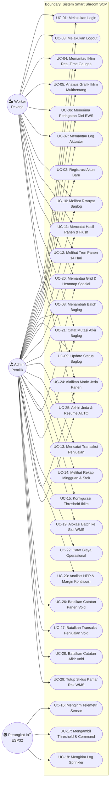

# Spesifikasi Use Case — Smart Shroom SCM 🍄

**Judul Tugas Akhir:** *Sistem Informasi Supply Chain Management dan Spasial WMS pada Kumbung Jamur Terintegrasi dengan Otomasi dan Monitoring Mikroklimat IoT*  
**Dokumen:** Spesifikasi Kebutuhan Perangkat Lunak (SRS) — Use Case Analysis  
**Konteks:** Tugas Akhir Program Studi Sistem Informasi  
**Penyusun:** Benedictus Vio  
**Terakhir Diperbarui:** Oktober 2026 (Sinkronisasi WMS Fase A–D, Voiding Ledger Audit Trail, HPP Dinamis, & IoT Rule Engine)  
**Dokumen Terkait:** [docs/sequence_diagram.md](file:///d:/DevTools/Antigravity/Projects/TA_vio/docs/sequence_diagram.md) (Sequence Diagram UML) \| [docs/dfd.md](file:///d:/DevTools/Antigravity/Projects/TA_vio/docs/dfd.md) (Data Flow Diagram)  

---

## 1. Pendahuluan

Dokumen ini mendefinisikan analisis Use Case untuk sistem **Smart Shroom SCM**, mencakup batasan sistem, identifikasi aktor, diagram Use Case UML, matriks hak akses, serta spesifikasi skenario rinci (*Use Case Specifications*). Analisis ini diselaraskan secara langsung dengan implementasi backend Laravel 12 (Sanctum Auth, RBAC), frontend React 18 (Zustand, TanStack Query), dan mikrokontroler IoT ESP32.

---

## 2. Identifikasi Aktor (Actors)

Sistem membagi pengguna dan entitas interaktif menjadi 3 aktor utama:

| Aktor | Tipe | Deskripsi Peran & Tanggung Jawab |
|---|---|---|
| **Admin** | Human (Primary) | Pemilik atau pengelola utama kumbung jamur. Memiliki akses menyeluruh (*full control*) terhadap konfigurasi threshold lingkungan, manajemen alokasi spasial rak (WMS), tutup siklus rak, voiding pembatalan transaksi (*harvest/sales/culls*), registrasi akun baru, pengadaan batch baglog, transaksi penjualan, pembukuan biaya operasional, analisis HPP, dan kontrol mode panen. |
| **Worker** | Human (Primary) | Pekerja kebun / buruh tani harian. Memiliki hak akses operasional untuk memantau iklim mikro secara real-time, memeriksa denah grid fisik, mencatat data hasil panen harian, mencatat mutasi afkir baglog (*culls*), dan mengaktifkan jeda panen saat pintu kumbung dibuka. Dilarang membatalkan transaksi keuangan (*void*) dan dilarang mengubah threshold. |
| **Perangkat IoT (ESP32)** | System / Device (Secondary) | Mikrokontroler cerdas berbasis ESP32 yang terpasang di kumbung. Bertindak sebagai aktor otomatis non-manusia yang mengirimkan data telemetri fusi sensor vertikal, mengambil threshold aktif & perintah jeda, dan mencatat log eksekusi aktuator (*sprinkler/misting/fan*). |

---

## 3. Katalog Use Case

Use case sistem dikelompokkan ke dalam 8 modul utama (total 29 Use Cases):

### Modul A: Autentikasi & Otorisasi Pengguna
- **UC-01: Melakukan Login** (Admin, Worker)
- **UC-02: Melakukan Registrasi Akun Baru** (Admin — dilindungi `auth:sanctum` + `role:admin`, kuota maks 5 worker)
- **UC-03: Melakukan Logout** (Admin, Worker)

### Modul B: Pemantauan Iklim Mikro & Early Warning System (EWS)
- **UC-04: Memantau Iklim Mikro Real-Time (Dial Gauges)** (Admin, Worker)
- **UC-05: Menganalisis Grafik Riwayat Iklim Multirentang (6h/12h/24h/7d)** (Admin, Worker)
- **UC-06: Menerima Peringatan Dini (Early Warning Alert)** (Admin, Worker)
- **UC-07: Memantau Log Aktivitas Aktuator (Sprinkler & Fan)** (Admin, Worker)

### Modul C: Manajemen Media Tanam & Alokasi Spasial (WMS 3D)
- **UC-08: Menambahkan Batch Baglog Baru** (Admin)
- **UC-09: Memperbarui Status Siklus Baglog** (Admin)
- **UC-10: Melihat Riwayat Baglog (Tabel Paginasi per 10)** (Admin, Worker)
- **UC-19: Mengalokasikan Batch Baglog ke Slot Spasial Rak 3D (WMS)** (Admin)
- **UC-20: Memantau Grid Spasial & Heatmap Produktivitas Panen per Slot** (Admin, Worker)
- **UC-29: Menyelesaikan Siklus Kamar Rak & Auto-Cull (Complete Cycle WMS)** (Admin)

### Modul D: Manajemen Mutasi Afkir & Biosekuriti
- **UC-21: Mencatat Jurnal Mutasi Afkir Baglog (Ledger Culls)** (Admin, Worker)
- **UC-28: Membatalkan Catatan Afkir Baglog (Void Cull Audit Trail)** (Admin)

### Modul E: Pencatatan Panen & Rantai Pasok Penjualan
- **UC-11: Mencatat Hasil Panen Harian per Slot & Nomor Flush (Paginasi per 10)** (Admin, Worker)
- **UC-26: Membatalkan Catatan Panen (Void Harvest Audit Trail)** (Admin)
- **UC-12: Menganalisis Grafik Tren Panen 14 Hari** (Admin, Worker)
- **UC-13: Mencatat Transaksi Penjualan & Melihat Tabel (Paginasi per 10)** (Admin)
- **UC-27: Membatalkan Transaksi Penjualan (Void Sale Audit Trail)** (Admin)
- **UC-14: Memantau Rekapitulasi Mingguan & Stok Panen** (Admin)

### Modul F: Akuntansi Biaya Manajerial & HPP Dinamis
- **UC-22: Mencatat Beban Biaya Operasional Kumbung** (Admin)
- **UC-23: Memantau Analisis HPP Dinamis & Margin Kontribusi** (Admin)

### Modul G: Kontrol Interupsi & Mode Panen (Failsafe)
- **UC-24: Mengaktifkan Mode Jeda Panen (Failsafe Timer Interupsi IoT)** (Admin, Worker)
- **UC-25: Mengakhiri Mode Jeda Panen & Resume ke Mode AUTO** (Admin, Worker)

### Modul H: Konfigurasi & Integrasi IoT (Edge Computing)
- **UC-15: Mengonfigurasi Ambang Batas Iklim & Preset Fase** (Admin)
- **UC-16: Mengirim Data Telemetri Sensor (Fusi 3x SHT30 IP68)** (Perangkat IoT ESP32)
- **UC-17: Mengambil Konfigurasi Threshold Aktif & Command Device** (Perangkat IoT ESP32)
- **UC-18: Mengirim Log Aktivitas Aktuator (Misting & Fan)** (Perangkat IoT ESP32)

---

## 4. Use Case Diagram (UML)

```mermaid
flowchart LR
    %% Actors
    Admin((fa:fa-user-tie Admin\nPemilik))
    Worker((fa:fa-user-gear Worker\nPekerja))
    IoTDevice((fa:fa-microchip Perangkat IoT\nESP32))

    %% System Boundary
    subgraph System["Boundary: Sistem Smart Shroom SCM"]
        %% Modul A
        UC01([UC-01: Melakukan Login])
        UC02([UC-02: Registrasi Akun Baru])
        UC03([UC-03: Melakukan Logout])

        %% Modul B
        UC04([UC-04: Memantau Iklim Real-Time Gauges])
        UC05([UC-05: Analisis Grafik Iklim Multirentang])
        UC06([UC-06: Menerima Peringatan Dini EWS])
        UC07([UC-07: Memantau Log Aktuator])

        %% Modul C
        UC08([UC-08: Menambah Batch Baglog])
        UC09([UC-09: Update Status Baglog])
        UC10([UC-10: Melihat Riwayat Baglog])
        UC19([UC-19: Alokasi Batch ke Slot WMS])
        UC20([UC-20: Memantau Grid & Heatmap Spasial])
        UC29([UC-29: Tutup Siklus Kamar Rak WMS])

        %% Modul D
        UC21([UC-21: Catat Mutasi Afkir Baglog])
        UC28([UC-28: Batalkan Catatan Afkir Void])

        %% Modul E
        UC11([UC-11: Mencatat Hasil Panen & Flush])
        UC26([UC-26: Batalkan Catatan Panen Void])
        UC12([UC-12: Melihat Tren Panen 14 Hari])
        UC13([UC-13: Mencatat Transaksi Penjualan])
        UC27([UC-27: Batalkan Transaksi Penjualan Void])
        UC14([UC-14: Melihat Rekap Mingguan & Stok])

        %% Modul F
        UC22([UC-22: Catat Biaya Operasional])
        UC23([UC-23: Analisis HPP & Margin Kontribusi])

        %% Modul G
        UC24([UC-24: Aktifkan Mode Jeda Panen])
        UC25([UC-25: Akhiri Jeda & Resume AUTO])

        %% Modul H
        UC15([UC-15: Konfigurasi Threshold Iklim])
        UC16([UC-16: Mengirim Telemetri Sensor])
        UC17([UC-17: Mengambil Threshold & Command])
        UC18([UC-18: Mengirim Log Sprinkler])
    end

    %% Relasi Admin
    Admin --> UC01
    Admin --> UC02
    Admin --> UC03
    Admin --> UC04
    Admin --> UC05
    Admin --> UC06
    Admin --> UC07
    Admin --> UC08
    Admin --> UC09
    Admin --> UC10
    Admin --> UC11
    Admin --> UC12
    Admin --> UC13
    Admin --> UC14
    Admin --> UC15
    Admin --> UC19
    Admin --> UC20
    Admin --> UC21
    Admin --> UC22
    Admin --> UC23
    Admin --> UC24
    Admin --> UC25
    Admin --> UC26
    Admin --> UC27
    Admin --> UC28
    Admin --> UC29

    %% Relasi Worker
    Worker --> UC01
    Worker --> UC03
    Worker --> UC04
    Worker --> UC05
    Worker --> UC06
    Worker --> UC07
    Worker --> UC10
    Worker --> UC11
    Worker --> UC12
    Worker --> UC20
    Worker --> UC21
    Worker --> UC24
    Worker --> UC25

    %% Relasi Perangkat IoT
    IoTDevice --> UC16
    IoTDevice --> UC17
    IoTDevice --> UC18
```

---

## 5. Matriks Hak Akses & Peran (Role-Based Access Matrix)

| Kode UC | Nama Use Case | Admin | Worker | Perangkat IoT (ESP32) | Catatan Keamanan / Endpoint |
|---|---|:---:|:---:|:---:|---|
| **UC-01** | Melakukan Login | ✅ | ✅ | ❌ | `POST /api/login` (Throttle: 15 req/m) |
| **UC-02** | Registrasi Akun Baru | ✅ | ❌ | ❌ | `POST /api/register` (Terkunci Role Admin F-02, Kuota Worker: 5) |
| **UC-03** | Melakukan Logout | ✅ | ✅ | ❌ | `POST /api/logout` (Revoke token Sanctum) |
| **UC-04** | Memantau Iklim Mikro Real-Time | ✅ | ✅ | ❌ | `GET /api/sensor-data/latest` |
| **UC-05** | Analisis Grafik Iklim Multirentang | ✅ | ✅ | ❌ | `GET /api/sensor-data/chart` (SQL Downsampling) |
| **UC-06** | Menerima Peringatan Dini (EWS) | ✅ | ✅ | ❌ | `GET /api/dashboard/stats` (Threshold check) |
| **UC-07** | Memantau Log Aktuator (Misting/Fan) | ✅ | ✅ | ❌ | `GET /api/sprinkler-logs` |
| **UC-08** | Menambah Batch Baglog | ✅ | ❌ | ❌ | `POST /api/baglogs` (Admin only, BL-YYYYMMDD-XXX) |
| **UC-09** | Update Status Siklus Baglog | ✅ | ❌ | ❌ | `PATCH /api/baglogs/{id}/status` |
| **UC-10** | Melihat Riwayat Baglog & Paginasi | ✅ | ✅ | ❌ | `GET /api/baglogs` (Paginasi 10 baris) |
| **UC-11** | Mencatat Panen & Paginasi Riwayat | ✅ | ✅ | ❌ | `POST & GET /api/harvests` (Paginasi 10 baris) |
| **UC-12** | Melihat Tren Panen 14 Hari | ✅ | ✅ | ❌ | `GET /api/harvests/chart?days=14` |
| **UC-13** | Mencatat Penjualan & Paginasi | ✅ | ❌ | ❌ | `POST & GET /api/sales` (Admin only, `bcmul`) |
| **UC-14** | Melihat Rekap Mingguan & Stok | ✅ | ❌ | ❌ | `GET /api/sales/weekly-report` |
| **UC-15** | Konfigurasi Threshold & Preset | ✅ | ❌ | ❌ | `PUT /api/thresholds` (Admin only, RH spread >= 4%) |
| **UC-16** | Mengirim Telemetri Sensor | ❌ | ❌ | ✅ | `POST /api/sensor-data` (Throttle: 20 req/m) |
| **UC-17** | Mengambil Threshold & Command | ❌ | ❌ | ✅ | `GET /api/thresholds/active` (Read-only) |
| **UC-18** | Mengirim Log Aktuator (Misting/Fan)| ❌ | ❌ | ✅ | `POST /api/sprinkler-logs` (Duration max 86400s) |
| **UC-19** | Alokasi Batch ke Slot WMS | ✅ | ❌ | ❌ | `POST /api/batch-slot-assignments` (Admin only) |
| **UC-20** | Memantau Grid & Heatmap Spasial | ✅ | ✅ | ❌ | `GET /api/slots`, `/api/slots/heatmap` |
| **UC-21** | Mencatat Mutasi Afkir Baglog | ✅ | ✅ | ❌ | `POST & GET /api/baglog-culls` |
| **UC-22** | Mencatat Biaya Operasional | ✅ | ❌ | ❌ | `POST & GET /api/operational-expenses` (Admin only) |
| **UC-23** | Analisis HPP & Margin Kontribusi | ✅ | ❌ | ❌ | `GET /api/baglogs/hpp-summary` (Admin only) |
| **UC-24** | Aktifkan Mode Jeda Panen | ✅ | ✅ | ❌ | `POST /api/device/pause` (Presets 2h s.d. 8h max) |
| **UC-25** | Akhiri Jeda & Resume ke AUTO | ✅ | ✅ | ❌ | `POST /api/device/resume` (Instant-read trigger) |
| **UC-26** | Membatalkan Catatan Panen (Void) | ✅ | ❌ | ❌ | `POST /api/harvests/{id}/void` (Admin only, Audit trail) |
| **UC-27** | Membatalkan Transaksi Penjualan (Void)| ✅ | ❌ | ❌ | `POST /api/sales/{id}/void` (Admin only, Audit trail) |
| **UC-28** | Membatalkan Catatan Afkir (Void) | ✅ | ❌ | ❌ | `POST /api/baglog-culls/{id}/void` (Admin only, Restore capacity) |
| **UC-29** | Menyelesaikan Siklus Kamar Rak WMS | ✅ | ❌ | ❌ | `POST /api/batch-slot-assignments/{id}/complete` (Admin only, Auto-culls) |

---

## 6. Spesifikasi Rinci Use Case Tambahan (Fase 2 s/d 5)

### UC-19: Mengalokasikan Batch Baglog ke Slot Spasial Rak 3D (WMS)
* **Aktor:** Admin
* **Deskripsi:** Admin menempatkan sejumlah baglog dari batch aktif ke dalam koordinat kamar fisik kumbung (`Row-Bay-Tier`, misal: `B-05-03`).
* **Precondition:** Batch baglog aktif tersedia dan slot tujuan dalam keadaan kosong (`is_active = true`).
* **Postcondition:** Record alokasi baru dibuat di tabel `batch_slot_assignments`, slot terisi dengan kapasitas awal 10 baglog.
* **Alur Normal:**
  1. Admin membuka halaman *Kumbung Grid* (`/kumbung-grid`).
  2. Admin memilih baris rak (A, B, atau C) dan menekan tombol "+ Alokasikan Baglog".
  3. Sistem memunculkan modal alokasi berisi pilihan batch aktif, slot kosong, dan tingkat pertumbuhan miselium.
  4. Admin memilih data dan menekan tombol "Simpan Alokasi".
  5. Frontend mengirim `POST /api/batch-slot-assignments`.
  6. Backend memvalidasi bahwa slot belum ditempati oleh batch aktif lain (mencegah tumpang tindih alokasi).
  7. Backend menyimpan alokasi dan mengembalikan status `201 Created`.

---

### UC-20: Memantau Grid Spasial & Heatmap Produktivitas Panen
* **Aktor:** Admin, Worker
* **Deskripsi:** Pengguna memantau status fisik 300 slot rak kumbung atau beralih ke mode Heatmap untuk melihat kamar rak paling produktif.
* **Precondition:** Pengguna telah login dan membuka menu *Kumbung Grid*.
* **Alur Normal:**
  1. Pengguna membuka halaman *Kumbung Grid*.
  2. Sistem memuat master slot beserta status alokasi terkini.
  3. Header menampilkan pemilih rak A/B/C dan tombol beralih mode ("Grid Fisik" vs "Peta Panen").
  4. Jika memilih "Peta Panen", warna kotak slot berubah gradasi hijau sesuai total akumulasi berat panen (KG) yang pernah dipetik dari slot tersebut.
  5. Pengguna dapat mengklik kotak slot manapun untuk membuka *Modal Detail Slot* (melihat riwayat batch, sisa kapasitas aktif, dan log panen).

---

### UC-21: Mencatat Jurnal Mutasi Afkir Baglog (Ledger Culls)
* **Aktor:** Admin, Worker
* **Deskripsi:** Pengguna mencatat pembuangan baglog yang rusak, busuk, atau diserang jamur parasit demi biosekuriti kumbung.
* **Precondition:** Terdapat baglog rusak pada slot kamar tertentu di kumbung.
* **Postcondition:** Record tersimpan di `baglog_culls`, kapasitas aktif slot otomatis berkurang.
* **Alur Normal:**
  1. Pengguna menekan tombol "Catat Afkir" di halaman Baglog Management atau Detail Slot.
  2. Pengguna mengisi: kode batch, koordinat slot (`slot_code`), tanggal afkir, kuantitas yang dibuang, dan alasan (`TRICHODERMA`, `BUSUK_BASAH`, `HAMA`, `KERING`, `LAINNYA`).
  3. Pengguna menekan "Simpan Data Afkir".
  4. Backend memvalidasi bahwa jumlah afkir tidak melebihi kapasitas aktif slot saat ini.
  5. Backend menyimpan mutasi dan mengembalikan status `201 Created`.

---

### UC-22: Mencatat Beban Biaya Operasional Kumbung
* **Aktor:** Admin
* **Deskripsi:** Admin menginput bukti pembayaran pengeluaran operasional (token listrik PLN, air pompa misting, upah harian pekerja, pembelian plastik/alkohol sanitasi).
* **Precondition:** Admin membuka tab Keuangan / HPP pada halaman *Sales Management*.
* **Postcondition:** Beban tersimpan di tabel `operational_expenses` dan langsung menambah variabel modal pada kalkulasi HPP.
* **Alur Normal:**
  1. Admin menekan tombol "+ Tambah Biaya Operasional".
  2. Admin memilih tanggal pengeluaran, kategori pengeluaran, nominal biaya (IDR), dan nomor nota/keterangan.
  3. Backend memvalidasi data dan menyimpannya secara presisi via tipe `DECIMAL(12,2)`.

---

### UC-23: Memantau Analisis HPP Dinamis & Margin Kontribusi
* **Aktor:** Admin
* **Deskripsi:** Admin meninjau neraca biaya manajerial yang menghitung keuntungan kotor sebenarnya setelah dikurangi modal bibit baglog dan beban operasional riil.
* **Precondition:** Transaksi penjualan dan beban operasional telah tercatat di sistem.
* **Alur Normal:**
  1. Admin membuka menu *Sales Management*.
  2. Kartu *HPP Analysis* menampilkan 4 metrik finansial:
     - **Modal Awal Pengadaan:** Total belanja bibit baglog (`quantity * price_per_baglog`).
     - **Beban Operasional Kumbung:** Akumulasi biaya listrik, misting, dan tenaga kerja.
     - **Total Omzet Penjualan:** Akumulasi pendapatan kotor dari penjualan jamur basah.
     - **Margin Kontribusi (Laba Operasional):** `Omzet - (Modal Baglog + Operasional)`.
  3. Sistem menampilkan HPP ekuivalen per Kg jamur yang berhasil diproduksi.

---

### UC-24: Mengaktifkan Mode Jeda Panen (Failsafe Timer)
* **Aktor:** Admin, Worker
* **Deskripsi:** Pengguna menyalakan jeda otomatis sebelum masuk ke dalam kumbung untuk memanen jamur, sehingga pompa misting dan exhaust fan mati sementara.
* **Alur Normal:**
  1. Pengguna membuka Dashboard dan melihat widget *Mode Panen (Failsafe)*.
  2. Pengguna memilih preset durasi jeda: `[2 Jam]`, `[4 Jam]`, `[6 Jam]`, atau `[8 Jam]`.
  3. Frontend mengirim `POST /api/device/pause` dengan `duration_seconds`.
  4. Backend mencatat command `PAUSE` ke dalam cache dan menyimpan log interupsi ke `sprinkler_logs`.
  5. ESP32 membaca status `PAUSE` via polling `GET /api/thresholds/active` dan seketika mematikan relay pompa misting dan kipas.

---

### UC-25: Mengakhiri Mode Jeda Panen & Resume ke Mode AUTO
* **Aktor:** Admin, Worker
* **Deskripsi:** Jika panen selesai lebih cepat sebelum timer habis, pengguna menekan tombol interupsi untuk segera mengembalikan kontrol iklim ke mode AUTO.
* **Alur Normal:**
  1. Pengguna menekan tombol "Akhiri Jeda & Balik ke AUTO" pada widget dashboard.
  2. Frontend mengirim `POST /api/device/resume`.
  3. Backend mereset command ke `AUTO`.
  4. ESP32 membaca status `AUTO`, mengakhiri status jeda, dan langsung melakukan *instant-read* sensor SHT30 untuk menstabilkan kelembapan kumbung seketika.

---

### UC-26: Membatalkan Catatan Panen (Void Harvest Audit Trail)
* **Aktor:** Admin
* **Deskripsi:** Admin membatalkan catatan panen harian yang salah input (misal salah ketik bobot KG atau salah slot) tanpa menghapus rekaman riwayat secara permanen.
* **Precondition:** Rekaman panen berstatus aktif (`voided_at IS NULL`).
* **Postcondition:** Record panen ditandai `voided_at = now()`, `void_reason`, dan `void_by`. Angka akumulasi panen harian dan grafik tren otomatis mengecualikan record ini.
* **Alur Normal:**
  1. Admin membuka halaman *Harvest Management* dan mencari baris panen yang keliru.
  2. Admin menekan tombol aksi "Batalkan (Void)".
  3. Modal konfirmasi muncul meminta alasan pembatalan (minimal 3 karakter).
  4. Admin mengisi alasan (contoh: *"Salah input timbangan 15kg seharusnya 1.5kg"*) dan menekan konfirmasi.
  5. Frontend mengirim `POST /api/harvests/{id}/void` dengan body `{"void_reason": "..."}`.
  6. Backend memverifikasi otorisasi Admin, menyimpan status void, dan mengembalikan HTTP 200 OK.
  7. Pada antarmuka, baris panen berubah gaya menjadi coret (*line-through*) dengan badge merah `DIBATALKAN`.

---

### UC-27: Membatalkan Transaksi Penjualan (Void Sale Audit Trail)
* **Aktor:** Admin
* **Deskripsi:** Admin membatalkan transaksi penjualan jamur basah yang keliru dicatat (misal retur pasar atau salah harga) demi akurasi pelaporan omzet dan HPP.
* **Precondition:** Transaksi penjualan aktif (`voided_at IS NULL`).
* **Postcondition:** Record penjualan ditandai `voided_at = now()`, `void_reason`, dan `void_by`. Agregasi total omzet dan margin kontribusi pada kartu HPP otomatis terpotong kembali.
* **Alur Normal:**
  1. Admin membuka menu *Sales Management*.
  2. Admin mengklik tombol "Batalkan (Void)" pada tabel riwayat penjualan.
  3. Modal konfirmasi meminta alasan pembatalan audit trail.
  4. Admin mengisi alasan dan mengirimkan konfirmasi.
  5. Frontend mengirim `POST /api/sales/{id}/void`.
  6. Backend mencatat audit trail void, memotong omzet dari perhitungan HPP secara otomatis, dan mengembalikan HTTP 200 OK.

---

### UC-28: Membatalkan Catatan Afkir Baglog (Void Cull Audit Trail)
* **Aktor:** Admin
* **Deskripsi:** Admin membatalkan pencatatan afkir baglog yang salah lapor sehingga sisa kapasitas aktif slot kamar rak dikembalikan secara utuh.
* **Precondition:** Catatan afkir berstatus aktif (`voided_at IS NULL`) dan alokasi slot kamar rak belum berstatus `COMPLETED`.
* **Postcondition:** Record afkir ditandai void dan kapasitas aktif slot (`active_capacity`) otomatis bertambah kembali sejumlah baglog yang dibatalkan via database transaction atomik.
* **Alur Normal:**
  1. Admin membuka tab *Riwayat Afkir* pada halaman Baglog Management atau Detail Slot.
  2. Admin menekan tombol "Batalkan (Void)" pada catatan afkir yang salah.
  3. Admin mengisi alasan pembatalan pada modal konfirmasi.
  4. Frontend mengirim `POST /api/baglog-culls/{id}/void`.
  5. Backend mengeksekusi `DB::transaction()`: memeriksa batas kapasitas rak, mengembalikan `active_capacity += quantity`, mencatat timestamp void, dan mengembalikan status HTTP 200 OK.

---

### UC-29: Menyelesaikan Siklus Kamar Rak & Auto-Cull WMS
* **Aktor:** Admin
* **Deskripsi:** Admin menyelesaikan masa tanam pada satu kamar rak yang produktivitasnya telah menurun (flush 5–7), secara otomatis mengosongkan rak dan mencatat sisa baglog menjadi afkir `HABIS_PRODUKSI`.
* **Precondition:** Slot sedang ditempati alokasi aktif (`current_status = 'FRUITING'` atau `'INCUBATION'`).
* **Postcondition:** Alokasi slot berubah menjadi `current_status = 'COMPLETED'`, `completed_at` dicatat, seluruh sisa baglog dicatat ke `baglog_culls` bertipe `HABIS_PRODUKSI`, dan slot siap dialokasikan batch baru.
* **Alur Normal:**
  1. Admin membuka denah *Kumbung Grid* dan mengklik slot rak yang ingin ditutup siklusnya.
  2. Modal *Detail Slot* menampilkan tombol "Tutup Siklus / Selesai Siklus".
  3. Sistem menampilkan dialog konfirmasi yang memberi tahu bahwa sisa baglog aktif (misal 4 baglog) akan otomatis dicatat sebagai afkir `HABIS_PRODUKSI`.
  4. Admin mengonfirmasi penyelesaian siklus.
  5. Frontend mengirim `POST /api/batch-slot-assignments/{id}/complete` dengan payload `{cull_reason}` opsional.
  6. Backend mengeksekusi transaksi database: meng-update alokasi ke `COMPLETED`, menerbitkan record cull `HABIS_PRODUKSI`, dan mereset `active_capacity = 0`.
  7. Kotak slot di denah visual berubah warna menjadi abu-abu (status Selesai) dan slot dapat dialokasikan batch baru.

